# Vue.js + TypeScript 实战项目开发与项目优化

项目地址：[https://github.com/2604150210/edu-boss-fed](https://github.com/2604150210/edu-boss-fed)

## 一、使用 VueCli 创建项目

```bash
vue create edu-boss-fed
```

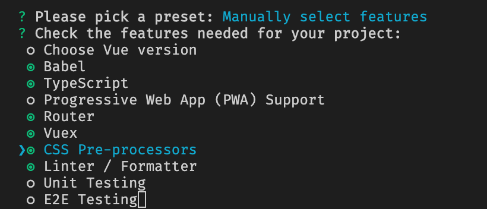

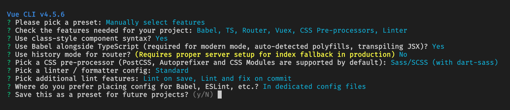

```bash
cd edu-boss-fed
yarn serve
```

## 二、加入 Git 版本管理

创建一个 GitHub 空仓库，将本地项目同步到 GitHub 上

```bash
git init
git add .
git commit -m"vue2+ts项目初始化"
git remote add origin git@github.com:2604150210/edu-boss-fed.git
git branch -M master
git push -u origin master
```

## 三、初始目录结构说明

main.ts 入口文件

App.vue 项目根组件

shims-tsx.d.ts 和 shims-vue.d.ts TypeScript 配置文件

view/Home.vue 首页组件

view/About.vue about 页面组件

store/index.ts 容器模块

router/index.ts 路由模块，配置了路由表

components 文件夹，放公共组件

.browserslistrc 浏览器兼容配置

.editorconfig 编辑器配置

.eslintrc.js ESLint 的配置

.gitignore Git 忽略文件

babel.config.js Babel 配置文件

package.json 依赖清单

package-lock.json 第三方包具体版本号

tsconfig.json TS 相关配置文件

## 四、调整初始目录结构

### 1. 删除默认示例文件

- App.vue 文件删除样式内容，删除路由链接，但是不能删除 vue-router 组件
- router/index.ts 清空路由表数组
- 删除 views 文件夹里的 Home.vue 和 About.vue，删除 components 文件里的 HelloWorld.vue，删除 assets 里的 logo.png

### 2. 新增一些文件或目录

- 在 src 里面创建文件夹 utils(放工具函数)、styles(放全局样式)、services(放请求接口)

## 五、TS 相关配置

### 1. TS 相关依赖

- vue-class-component 提供使用 class 语法写 Vue 组件
- vue-property-decorator 在 Class 语法基础之上提供了一些辅助装饰器
- @typescript-eslint/eslint-plugin 使用 ESLint 校验 TS 代码
- @typescript-eslint/parser 将 TS 转为 AST 供 ESLint 校验使用
- @vue/cli-plugin-typescript 使用 TS + ts-loader-fork-ts-checker-webpack-plugin 进行更快的类型检查
- @vue/eslint-config-typescript 兼容 ESLint 的 TS 校验规则
- typescript TS 编译器，提供类型校验和转换 JavaScript 功能

### 2. TS 相关配置文件

ts.config.js

```js
{
  "compilerOptions": {
    "target": "esnext",
    "module": "esnext",
    "strict": true,
    "jsx": "preserve",
    "importHelpers": true,
    "moduleResolution": "node",
    "experimentalDecorators": true,
    "skipLibCheck": true,
    "esModuleInterop": true,
    "allowSyntheticDefaultImports": true,
    "sourceMap": true,
    "baseUrl": ".",
    "types": [
      "webpack-env"
    ],
    "paths": {
      "@/*": [
        "src/*"
      ]
    },
    "lib": [
      "esnext",
      "dom",
      "dom.iterable",
      "scripthost"
    ]
  },
  "include": [
    "src/**/*.ts",
    "src/**/*.tsx",
    "src/**/*.vue",
    "tests/**/*.ts",
    "tests/**/*.tsx"
  ],
  "exclude": [
    "node_modules"
  ]
}
```

### 3. Shims-vue.d.ts

`ts`识别不了`.vue`结尾的文件，所以声明它的类型为`Vue`构造函数，在这个文件中做了适配。

```ts
declare module "*.vue" {
  import Vue from "vue";
  export default Vue;
}
```

### 4. shims-tsx.d.ts

补充了一些类型声明，否则在`JSX`中使用这些成员时，会找不到类型，在这个文件中做了适配。

```ts
import Vue, { VNode } from "vue";

declare global {
  namespace JSX {
    // tslint:disable no-empty-interface
    interface Element extends VNode {}
    // tslint:disable no-empty-interface
    interface ElementClass extends Vue {}
    interface IntrinsicElements {
      [elem: string]: any;
    }
  }
}
```

### 5. 在 ts 模块中文件扩展名为`.ts`

## 六、使用 TS 开发 Vue 项目

### 1. 使用`OptionsAPI`定义`Vue`组件

原始写法不支持类型推断：

```html
<script>
  // 1. 编译器给的类型提示
  // 2. TypeScript 编译期间的类型验证
  export default {
    data() {
      return {
        a: 1,
        b: "jal",
        d: {
          a: 1,
          b: 2,
        },
      };
    },
    methods: {
      test() {
        // this.a
        // this.b
        // this.a.tet()
      },
    },
  };
</script>
```

指定`script`标签的`lang`属性为`ts`，则控制台会有 ts 类型推断检测

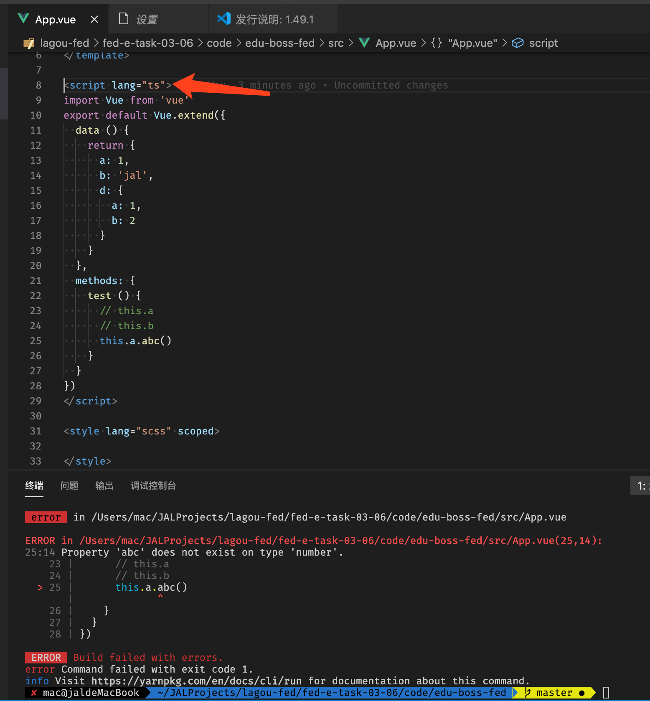

### 3. 使用`ClassAPI`定义`Vue`组件

使用教程：https://class-component.vuejs.org/

```html
<template>
  <div id="app">
    <h1>大前端学习</h1>
    <p>{{a}}</p>
    <button @click="test">test</button>
    <router-view />
  </div>
</template>

<script lang="ts">
  import Vue from "vue";
  import Component from "vue-class-component";

  @Component
  export default class App extends Vue {
    a = 1;
    b = "2";
    c = {
      a: 1,
      b: "2",
    };

    test() {
      console.log(this.a);
    }
  }
</script>
<style lang="scss" scoped></style>
```

### 3. 关于装饰器语法

装饰器是 ES 草案中的一个新特性，不过这个草案最近有可能发生重大调整，所以不建议在生产环境中使用

类装饰器：

```js
function testable(target) {
  target.isTestable = true;
}

@testable
class MyTestableClass {
  // ...
}

console.log(MyTestableClass.isTestable); // true
```

装饰器就是扩展类的属性。

### 4. 使用`VuePropertyDecorator`创建`Vue`组件

装饰器语法不稳定

### 5. 总结创建组件的方式

- Options APIs
- Class APIs
- Class + decorator

个人建议： No `Class APIs`， 只用 `Options APIs`.

> `Class`语法仅仅是一种写法而已，最终还是要转换成普通的组件数据结构。
>
> 装饰器语法还没有正式定稿发布，建议了解即可，正式发布以后再选择使用也可以。

使用`Options APIs` 最好是使用`export default Vue.extend({...})`，而不是`export default {...}`

## 七、代码格式规范

### 1. 标准是什么

- [Standard Style](https://standardjs.com/) 宽松一点，适合个人或小团队
- [Airbnb](https://github.com/airbnb/javascript) 更严格，适合大型团队
- [google](http://google.github.io/) 更严格，适合大型团队

### 2. 如果约束代码规范

只靠口头约定肯定是不行的，所以要利用工具来强制执行

- JSLint （不推荐，快被淘汰了）
- JSHint （不推荐，快被淘汰了）
- ESLint （主流）

.eslintrc.js

```js
module.exports = {
  root: true,
  env: {
    node: true,
  },
  // 使用插件的编码校验规则
  extends: [
    "plugin:vue/essential",
    "@vue/standard",
    "@vue/typescript/recommended",
  ],
  parserOptions: {
    ecmaVersion: 2020,
  },
  // 自定义编码校验规则
  rules: {
    "no-console": process.env.NODE_ENV === "production" ? "warn" : "off",
    "no-debugger": process.env.NODE_ENV === "production" ? "warn" : "off",
  },
};
```

### 3. 自定义校验规则

ESLint 官网：[https://cn.eslint.org/](https://cn.eslint.org/)

Error 级别的警告会显示到页面上，Warning 级别的警告会输出到控制台


如果想屏蔽掉这个规则，则去`.eslintrc.js`文件中配置,在`rules`数组里配置了`'semi': 'off'`，然后重启服务，这个报错就没有了

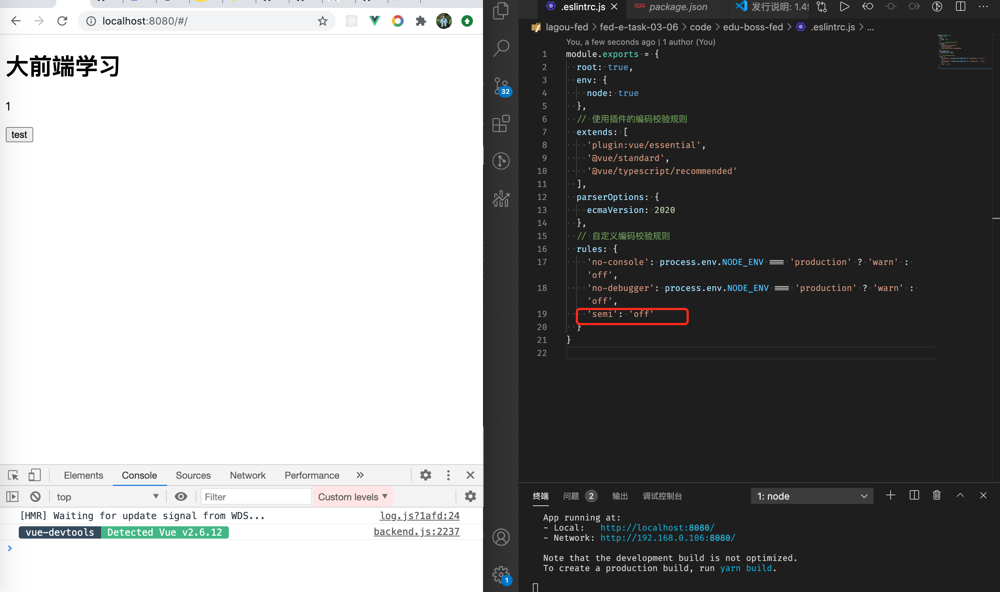

如果必须要有分号，则配置为`semi: ['error', 'always']`

然后删除`node_modules/.cache`文件，再重启项目，就可以看到效果了，报错缺少分号

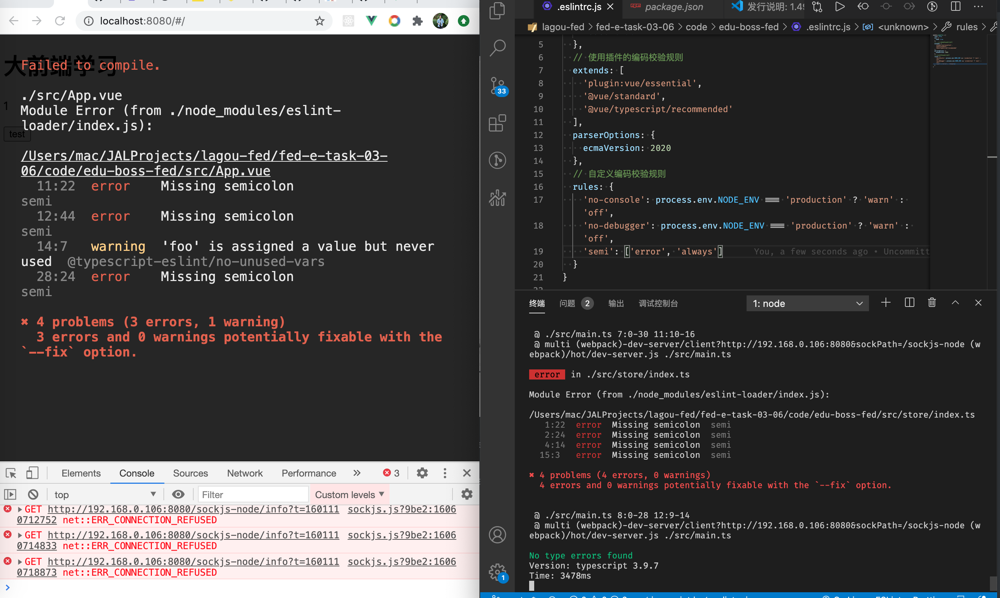

Typescript 的 interface 会要有分号分割要求，为了与 standard 分割保持一致，我们期望去掉这个规则

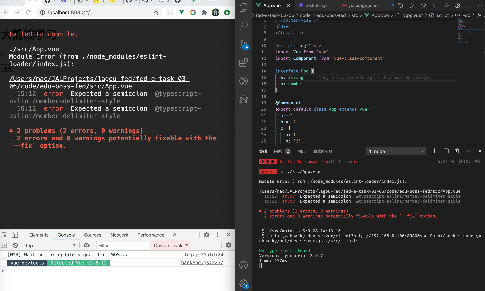

从 package.json 里找到`@vue/eslint-config-typescript`依赖的地址：https://github.com/vuejs/eslint-config-typescript#readme

然后在[这里](https://github.com/typescript-eslint/typescript-eslint/tree/master/packages/eslint-plugin)查到这个规则，在[规则详细配置](https://github.com/typescript-eslint/typescript-eslint/blob/master/packages/eslint-plugin/docs/rules/member-delimiter-style.md)查看怎么配置，在`.eslintrc.js`里增加规则：

```js
'@typescript-eslint/member-delimiter-style': ['error', {
  "multiline": {
    "delimiter": "none",
    "requireLast": true
  }
}]
```

然后重启项目，`interface`里面不写分号分割也不报错了：

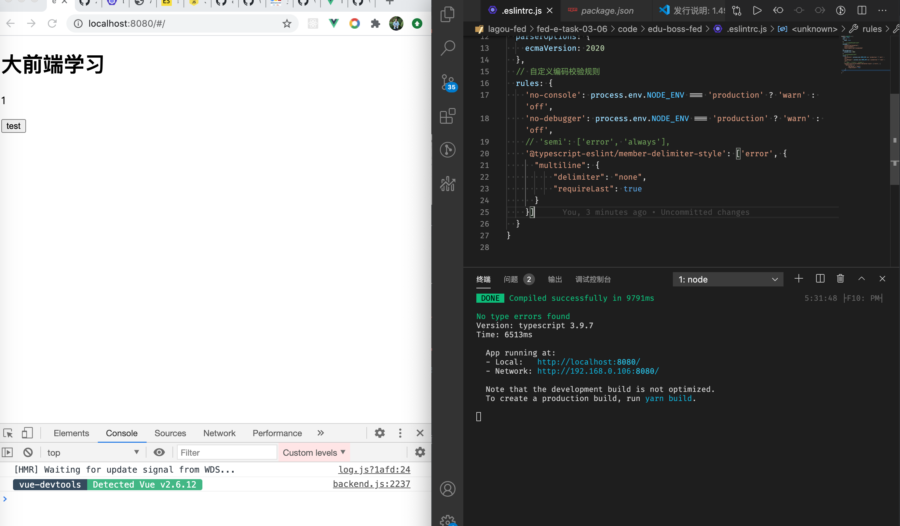

如果写上分号反而会报错。

## 八、导入 Element 组件库

`ElementUI`官方文档：[https://element.eleme.cn/](https://element.eleme.cn/)

```bash
npm i element-ui -S
```

`main.js`中增加`ElementUI`的导入和使用：

```js
import Vue from "vue";
import ElementUI from "element-ui";
import "element-ui/lib/theme-chalk/index.css";
import App from "./App.vue";
import router from "./router";
import store from "./store";

Vue.use(ElementUI);

Vue.config.productionTip = false;

new Vue({
  router,
  store,
  render: (h) => h(App),
}).$mount("#app");
```

然后在`App.vue`文件中就可以使用了

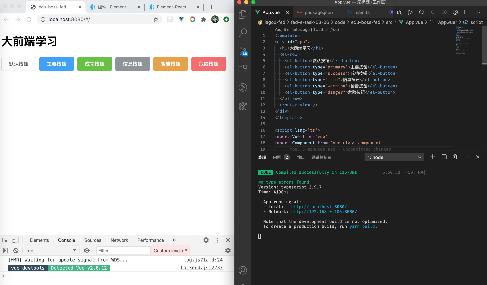

## 九、样式处理

```shell
src/styles
|-- index.scss # 全局样式（在入口模块被加载生效）
|-- mixin.scss # 公共的 mixin 混入（可以把重复的样式封装为 mixin 混入到复用的地方）
|-- reset.scss # 重置基础样式
|-- variables.scss # 公共样式变量
```

elementUI 的样式就不需要导入了，改为导入全局样式文件，main.js

```js
import Vue from "vue";
import ElementUI from "element-ui";
// import 'element-ui/lib/theme-chalk/index.css'
import App from "./App.vue";
import router from "./router";
import store from "./store";

// 加载全局样式
import "./styles/index.scss";

Vue.use(ElementUI);

Vue.config.productionTip = false;

new Vue({
  router,
  store,
  render: (h) => h(App),
}).$mount("#app");
```

## 十、共享全局样式变量

[向预处理器 Loader 传递选项](https://cli.vuejs.org/zh/guide/css.html#%E5%90%91%E9%A2%84%E5%A4%84%E7%90%86%E5%99%A8-loader-%E4%BC%A0%E9%80%92%E9%80%89%E9%A1%B9)

有的时候你想要向 webpack 的预处理器 loader 传递选项。你可以使用 `vue.config.js` 中的 `css.loaderOptions` 选项。比如你可以这样向所有 Sass/Less 样式传入共享的全局变量：

```js
// vue.config.js
// vue.config.js
module.exports = {
  css: {
    loaderOptions: {
      // 默认情况下 `sass` 选项会同时对 `sass` 和 `scss` 语法同时生效
      // 因为 `scss` 语法在内部也是由 sass-loader 处理的
      // 但是在配置 `prependData` 选项的时候
      // `scss` 语法会要求语句结尾必须有分号，`sass` 则要求必须没有分号
      // 在这种情况下，我们可以使用 `scss` 选项，对 `scss` 语法进行单独配置
      scss: {
        prependData: `@import "~@/styles/variables.scss";`, // css 里要加~符号才能使用@目录
      },
    },
  },
};
```

然后就可以在任意组件中使用全局样式变量了，

App.vue

```html
<template>
  <div id="app">
    <h1>大前端学习</h1>
    <p class="text">Hello world</p>
    <router-view />
  </div>
</template>

<style lang="scss" scoped>
  // @import "~@/styles/variables.scss";

  .text {
    color: $success-color;
  }
</style>
```

## 十一、接口处理

### 1. 配置接口文档

解决跨域问题：如果你的前端应用和后端 API 服务器没有运行在同一个主机上，你需要在开发环境下将 API 请求代理到 API 服务器。这个问题可以通过 `vue.config.js` 中的 `devServer.proxy` 选项来配置。

```js
devServer: {
  proxy: {
    '/boss': {
      target: 'http://eduboss.lagou.com',
      changeOrigin: true // 把请求头中的 host 配置为 target
    },
    '/front': {
      target: 'http://edufront.lagou.com',
      changeOrigin: true // 把请求头中的 host 配置为 target
    }
  }
}
```

重启项目，然后在浏览器上访问`http://localhost:8080/boss`，就可以看到页面上出现了`Unauthorized`，说明请求已经被正确代理到了`http://eduboss.lagou.com/boss`

### 2. 封装请求模块

```shell
yarn add axios
```

tils/request.ts

```ts
import axios from "axios";

const request = axios.create({
  // 配置选项
  // baseURL,
  // timeout,
});

// 请求拦截器

// 响应拦截器

export default request;
```

测试请求成功：

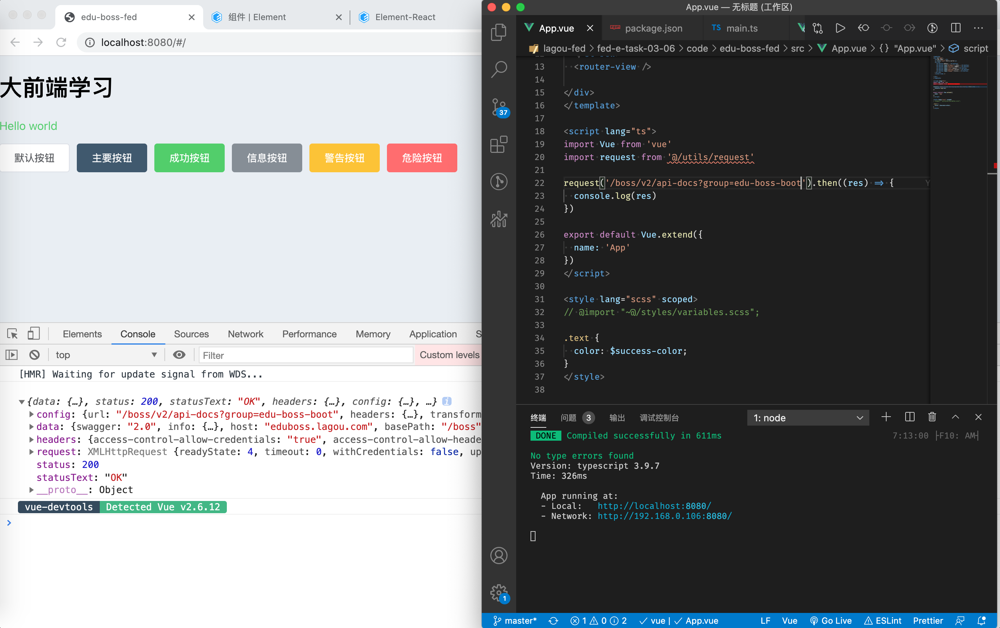

## 十二、布局

### 1. 初始化路由页面组件

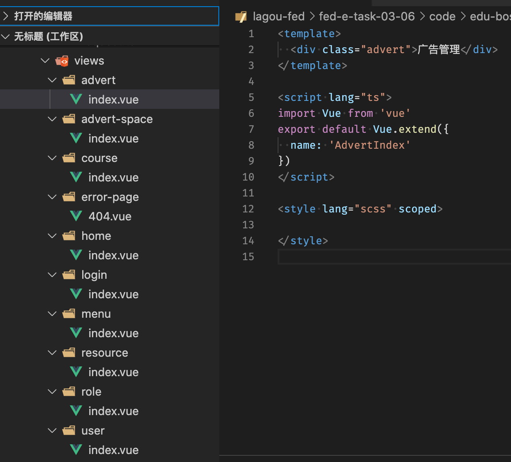

路由表配置：router/index.ts

```ts
import Vue from "vue";
import VueRouter, { RouteConfig } from "vue-router";

Vue.use(VueRouter);

const routes: Array<RouteConfig> = [
  {
    path: "/",
    name: "home",
    component: () =>
      import(/* webpackChunkName: 'home' */ "@/views/home/index.vue"),
  },
  {
    path: "/login",
    name: "login",
    component: () =>
      import(/* webpackChunkName: 'login' */ "@/views/login/index.vue"),
  },
  {
    path: "/user",
    name: "user",
    component: () =>
      import(/* webpackChunkName: 'user' */ "@/views/user/index.vue"),
  },
  {
    path: "/role",
    name: "role",
    component: () =>
      import(/* webpackChunkName: 'role' */ "@/views/role/index.vue"),
  },
  {
    path: "/advert",
    name: "advert",
    component: () =>
      import(/* webpackChunkName: 'advert' */ "@/views/advert/index.vue"),
  },
  {
    path: "/advert-space",
    name: "advert-space",
    component: () =>
      import(
        /* webpackChunkName: 'advert-space' */ "@/views/advert-space/index.vue"
      ),
  },
  {
    path: "/menu",
    name: "menu",
    component: () =>
      import(/* webpackChunkName: 'menu' */ "@/views/menu/index.vue"),
  },
  {
    path: "/resource",
    name: "resource",
    component: () =>
      import(/* webpackChunkName: 'resource' */ "@/views/resource/index.vue"),
  },
  {
    path: "/course",
    name: "course",
    component: () =>
      import(/* webpackChunkName: 'course' */ "@/views/course/index.vue"),
  },
  {
    path: "*",
    name: "404",
    component: () =>
      import(/* webpackChunkName: '404' */ "@/views/error-page/404.vue"),
  },
];

const router = new VueRouter({
  routes,
});

export default router;
```

### 2. 布局组件 Layout

layout/index.vue

```html
<template>
  <el-container>
    <el-aside width="200px">Aside</el-aside>
    <el-container>
      <el-header>Header</el-header>
      <el-main>Main</el-main>
    </el-container>
  </el-container>
</template>

<script lang="ts">
  import Vue from "vue";

  export default Vue.extend({
    name: "LayoutIndex",
  });
</script>

<style lang="scss" scoped>
  .el-container {
    min-height: 100vh;
    min-width: 980px;
  }
  .el-aside {
    background: #d3dce6;
  }
  .el-header {
    background: #b3c0d1;
  }
  .el-main {
    background: #e9eef3;
  }
</style>
```

### 3. 侧边栏组件

layout/components/app-aside.vue

```html
<template>
  <div class="aside">
    <el-menu
      router
      default-active="4"
      @open="handleOpen"
      @close="handleClose"
      background-color="#545c64"
      text-color="#fff"
      active-text-color="#ffd04b"
    >
      <el-submenu index="1">
        <template slot="title">
          <i class="el-icon-location"></i>
          <span>权限管理</span>
        </template>
        <el-menu-item index="/role">
          <i class="el-icon-setting"></i>
          <span slot="title">角色管理</span>
        </el-menu-item>
        <el-menu-item index="/menu">
          <i class="el-icon-setting"></i>
          <span slot="title">菜单管理</span>
        </el-menu-item>
        <el-menu-item index="/resource">
          <i class="el-icon-setting"></i>
          <span slot="title">资源管理</span>
        </el-menu-item>
      </el-submenu>
      <el-menu-item index="/course">
        <i class="el-icon-menu"></i>
        <span slot="title">课程管理</span>
      </el-menu-item>
      <el-menu-item index="/user">
        <i class="el-icon-document"></i>
        <span slot="title">用户管理</span>
      </el-menu-item>
      <el-submenu index="4">
        <template slot="title">
          <i class="el-icon-location"></i>
          <span>广告管理</span>
        </template>
        <el-menu-item index="/advert">
          <i class="el-icon-setting"></i>
          <span slot="title">广告列表</span>
        </el-menu-item>
        <el-menu-item index="/advert-space">
          <i class="el-icon-setting"></i>
          <span slot="title">广告位列表</span>
        </el-menu-item>
      </el-submenu>
    </el-menu>
  </div>
</template>

<script lang="ts">
  import Vue from "vue";

  export default Vue.extend({
    name: "AppAside",
    methods: {
      handleOpen(key: string, keyPath: string): void {
        console.log(key, keyPath);
      },
      handleClose(key: string, keyPath: string): void {
        console.log(key, keyPath);
      },
    },
  });
</script>

<style lang="scss" scoped>
  .aside {
    .el-menu {
      min-height: 100vh;
    }
  }
</style>
```

开启`router`属性就是以`index`作为导航链接。

然后在`layout/index.vue`里引入`app-aside`组件，然后将路由出口放到`el-main`里面

Layout/index.vue

```html
<template>
  <el-container>
    <el-aside width="200px">
      <app-aside />
    </el-aside>
    <el-container>
      <el-header> 头部 </el-header>
      <el-main>
        <!-- 路由出口 -->
        <router-view />
      </el-main>
    </el-container>
  </el-container>
</template>

<script lang="ts">
  import Vue from "vue";
  import AppAside from "./components/app-aside.vue";

  export default Vue.extend({
    name: "LayoutIndex",
    components: {
      AppAside,
    },
  });
</script>

<style lang="scss" scoped>
  .el-container {
    min-height: 100vh;
    min-width: 980px;
  }
  .el-aside {
    background: #d3dce6;
  }
  .el-header {
    background: #b3c0d1;
  }
  .el-main {
    background: #e9eef3;
  }
</style>
```

### 3. 头部 header

ayout/components/app-header.vue

```html
<template>
  <div class="header">
    <el-breadcrumb separator-class="el-icon-arrow-right">
      <el-breadcrumb-item :to="{ path: '/' }">首页</el-breadcrumb-item>
      <el-breadcrumb-item>活动管理</el-breadcrumb-item>
      <el-breadcrumb-item>活动列表</el-breadcrumb-item>
      <el-breadcrumb-item>活动详情</el-breadcrumb-item>
    </el-breadcrumb>
    <el-dropdown>
      <span class="el-dropdown-link">
        <el-avatar
          shape="square"
          :size="30"
          src="https://cube.elemecdn.com/9/c2/f0ee8a3c7c9638a54940382568c9dpng.png"
        ></el-avatar>
        <i class="el-icon-arrow-down el-icon--right"></i>
      </span>
      <el-dropdown-menu slot="dropdown">
        <el-dropdown-item>用户ID</el-dropdown-item>
        <el-dropdown-item divided>退出</el-dropdown-item>
      </el-dropdown-menu>
    </el-dropdown>
  </div>
</template>

<script lang="ts">
  import Vue from "vue";

  export default Vue.extend({
    name: "AppHeader",
  });
</script>

<style lang="scss" scoped>
  .header {
    height: 100%;
    display: flex;
    align-items: center;
    justify-content: space-between;
    .el-dropdown-link {
      display: flex;
      align-items: center;
    }
  }
</style>
```

layout/index.vue 引入 app-header 组件

```html
<template>
  <el-container>
    <el-aside width="200px">
      <app-aside />
    </el-aside>
    <el-container>
      <el-header>
        <app-header />
      </el-header>
      <el-main>
        <router-view />
      </el-main>
    </el-container>
  </el-container>
</template>

<script lang="ts">
  import Vue from "vue";
  import AppAside from "./components/app-aside.vue";
  import AppHeader from "./components/app-header.vue";

  export default Vue.extend({
    name: "LayoutIndex",
    components: {
      AppAside,
      AppHeader,
    },
  });
</script>

<style lang="scss" scoped>
  .el-container {
    min-height: 100vh;
    min-width: 980px;
  }
  .el-aside {
    background: #d3dce6;
  }
  .el-header {
    background: #fff;
  }
  .el-main {
    background: #e9eef3;
  }
</style>
```

App.vue

```html
<template>
  <div id="app">
    <router-view />
  </div>
</template>

<script lang="ts">
  import Vue from "vue";

  export default Vue.extend({
    name: "App",
  });
</script>

<style lang="scss" scoped>
  // @import "~@/styles/variables.scss";

  .text {
    color: $success-color;
  }
</style>
```

路由表配置：

```js
import Vue from "vue";
import VueRouter, { RouteConfig } from "vue-router";
import Layout from "@/layout/index.vue";

const routes: Array<RouteConfig> = [
  {
    path: "/login",
    name: "login",
    component: () =>
      import(/* webpackChunkName: 'login' */ "@/views/login/index.vue"),
  },
  {
    path: "/",
    component: Layout,
    children: [
      {
        path: "",
        name: "home",
        component: () =>
          import(/* webpackChunkName: 'home' */ "@/views/home/index.vue"),
      },
      {
        path: "/user",
        name: "user",
        component: () =>
          import(/* webpackChunkName: 'user' */ "@/views/user/index.vue"),
      },
      {
        path: "/role",
        name: "role",
        component: () =>
          import(/* webpackChunkName: 'role' */ "@/views/role/index.vue"),
      },
      {
        path: "/advert",
        name: "advert",
        component: () =>
          import(/* webpackChunkName: 'advert' */ "@/views/advert/index.vue"),
      },
      {
        path: "/advert-space",
        name: "advert-space",
        component: () =>
          import(
            /* webpackChunkName: 'advert-space' */ "@/views/advert-space/index.vue"
          ),
      },
      {
        path: "/menu",
        name: "menu",
        component: () =>
          import(/* webpackChunkName: 'menu' */ "@/views/menu/index.vue"),
      },
      {
        path: "/resource",
        name: "resource",
        component: () =>
          import(
            /* webpackChunkName: 'resource' */ "@/views/resource/index.vue"
          ),
      },
      {
        path: "/course",
        name: "course",
        component: () =>
          import(/* webpackChunkName: 'course' */ "@/views/course/index.vue"),
      },
    ],
  },
  {
    path: "*",
    name: "404",
    component: () =>
      import(/* webpackChunkName: '404' */ "@/views/error-page/404.vue"),
  },
];
export default router;
```

## 十三、登录

### 1. 页面布局

views/login/index.vue

```html
<template>
  <div class="login">
    <el-form
      ref="form"
      :model="form"
      label-width="80px"
      label-position="top"
      class="login-form"
    >
      <el-form-item label="手机号">
        <el-input v-model="form.name"></el-input>
      </el-form-item>
      <el-form-item label="密码">
        <el-input v-model="form.name"></el-input>
      </el-form-item>
      <el-form-item>
        <el-button class="login-btn" type="primary" @click="onSubmit"
          >登录</el-button
        >
      </el-form-item>
    </el-form>
  </div>
</template>

<script lang="ts">
  import Vue from "vue";

  export default Vue.extend({
    name: "LoginIndex",
    data() {
      return {
        form: {
          name: "",
          region: "",
          date1: "",
          date2: "",
          delivery: false,
          type: [],
          resource: "",
          desc: "",
        },
      };
    },
    methods: {
      onSubmit() {
        console.log("submit!");
      },
    },
  });
</script>

<style lang="scss" scoped>
  .login {
    height: 100vh;
    display: flex;
    justify-content: center;
    align-items: center;
    .login-form {
      width: 300px;
      padding: 20px;
      background: #fff;
      border-radius: 5px;
    }
    .login-btn {
      width: 100%;
    }
  }
</style>
```

### 2. 接口测试

PostMan 高能使用：

创建接口集合：

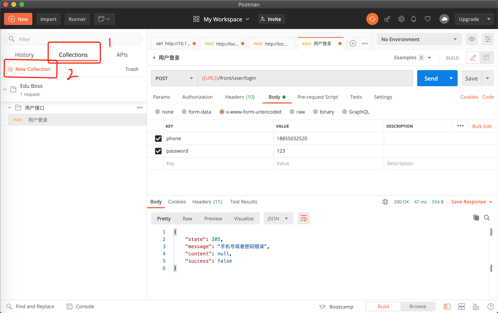

创建文件夹：

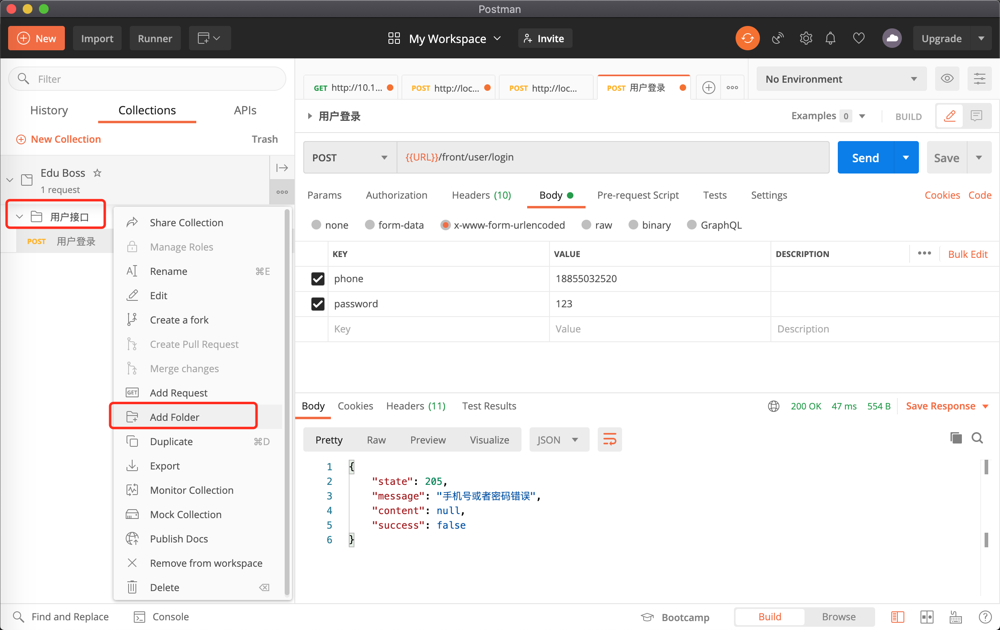

将接口保存到刚才创建的用户接口文件夹，并且重命名这个接口为用户登录

创建集合变量：


变量名为`URL`，变量值为`http://eduboss.lagounews.com`

然后在接口中就可以使用这个变量了，写成这样：`{{URL}}/front/user/login`

### 3. 请求登录

```bash
npm install qs
```

```js
// 2. 验证通过 -> 提交表单
const { data } = await request({
  method: "POST",
  url: "/front/user/login", // 此处要走代理，否则无法跨域请求
  headers: { "content-type": "application/x-www-form-urlencoded" },
  data: qs.stringify(this.form), // axios 默认发送是 application/json 格式的数据
});
```

### 4. 处理请求结果

```js
// 3. 处理请求结果
if (data.state !== 1) {
  // 失败：给出提示
  return this.$message.error(data.message);
}
// 成功：跳转到首页
this.$message.success("登录成功");
this.$router.push({
  name: "home",
});
```

### 5. 表单验证

```
model="form"
:rules="rules"
ref="ruleForm"
el-form-item 绑定 prop 属性
```

```js
rules: {
  phone: [
    { required: true, message: '请输入手机号', trigger: 'blur' },
    { pattern: /^1\d{10}$/, message: '请输入正确的手机号', trigger: 'blur' }
  ],
    password: [
      { required: true, message: '请输入密码', trigger: 'blur' },
      { min: 6, max: 18, message: '长度在 6 到 18 个字符', trigger: 'blur' }
    ]
}
```

指定类型：

```ts
import { Form } from "element-ui";
await (this.$refs.form as Form).validate();
```

### 6. 请求期间禁用按钮点击

给`el-button`增加一个属性`:loading="isLoginLoading"`

`data`里`isLoginLoading`默认为`false`，在表单通过验证时`this.isLoginLoading = true`，将按钮设为`loading`状态，在完成提交无论请求结果是成功还是失败，将表单`loading`状态去掉`this.isLoginLoading = false`

### 7. 封装请求方法

services/user.ts

```ts
/**
 * 用户相关请求模块
 */
import qs from "qs";
import request from "@/utils/request";

interface User {
  phone: string;
  password: string;
}

export const login = (data: User) => {
  return request({
    method: "POST",
    url: "/front/user/login", // 此处要走代理，否则无法跨域请求
    headers: { "content-type": "application/x-www-form-urlencoded" },
    data: qs.stringify(data), // axios 默认发送是 application/json 格式的数据
  });
};
```

iews/login/index.vue

```html
<template>
  <div class="login">
    <el-form
      ref="form"
      :model="form"
      :rules="rules"
      label-width="80px"
      label-position="top"
      class="login-form"
    >
      <el-form-item label="手机号" prop="phone">
        <el-input v-model="form.phone"></el-input>
      </el-form-item>
      <el-form-item label="密码" prop="password">
        <el-input v-model="form.password" type="password"></el-input>
      </el-form-item>
      <el-form-item>
        <el-button
          class="login-btn"
          :loading="isLoginLoading"
          type="primary"
          @click="onSubmit"
          >登录</el-button
        >
      </el-form-item>
    </el-form>
  </div>
</template>

<script lang="ts">
  import Vue from "vue";
  import { Form, Loading } from "element-ui";
  import { login } from "@/services/user";

  export default Vue.extend({
    name: "LoginIndex",
    data() {
      return {
        isLoginLoading: false,
        form: {
          phone: "18201288771",
          password: "111111",
        },
        rules: {
          phone: [
            { required: true, message: "请输入手机号", trigger: "blur" },
            {
              pattern: /^1\d{10}$/,
              message: "请输入正确的手机号",
              trigger: "blur",
            },
          ],
          password: [
            { required: true, message: "请输入密码", trigger: "blur" },
            {
              min: 6,
              max: 18,
              message: "长度在 6 到 18 个字符",
              trigger: "blur",
            },
          ],
        },
      };
    },
    methods: {
      async onSubmit() {
        // 1. 表单验证
        // await (this.$refs.form as Form).validate() // 如果验证不通过，会抛出一个 Promise 异常，阻断后面程序的运行
        try {
          // 1. 表单验证
          await (this.$refs.form as Form).validate();

          // 表单按钮 loading
          this.isLoginLoading = true;

          // 2. 验证通过 -> 提交表单
          const { data } = await login(this.form);
          console.log(data);
          // 3. 处理请求结果
          if (data.state !== 1) {
            this.isLoginLoading = false;
            // 失败：给出提示
            return this.$message.error(data.message);
          }
          // 成功：跳转到首页
          this.$message.success("登录成功");
          this.$router.push({
            name: "home",
          });
        } catch (err) {
          console.log("登录失败", err);
        }

        // 结束登录按钮的 Loading
        this.isLoginLoading = false;
      },
    },
  });
</script>

<style lang="scss" scoped>
  .login {
    height: 100vh;
    display: flex;
    justify-content: center;
    align-items: center;
    .login-form {
      width: 300px;
      padding: 20px;
      background: #fff;
      border-radius: 5px;
    }
    .login-btn {
      width: 100%;
    }
  }
</style>
```

### 8. 关于请求体 data 和 ContentType 的问题

axios 中，

如果 data 是 qs.stringify(data) 格式，则 content-type 是 application/x-www-form-urlencoded

如果 data 是 json 格式，则 content-type 是 application/json

如果 data 是 FormData 格式，则 content-type 是 multipart/form-data

## 十四、身份认证

### 1. 把登录状态存储到 Vuex 容器中

登录成功时，记录登录状态，状态需要能够全局访问（放到 Vuex 容器中）。然后在访问需要登录的页面的时候，判断有没有登录状态（路由拦截器）

容器的状态实现了数据共享，在组件里面访问方便，但是没有持久化的功能。为了防止页面刷新数据丢失，我们需要把 user 数据持久化。

store/index.ts

```ts
import Vue from "vue";
import Vuex from "vuex";

Vue.use(Vuex);

export default new Vuex.Store({
  state: {
    user: JSON.parse(window.localStorage.getItem("user") || "null"), // 当前登录用户状态
  },
  mutations: {
    // 修改容器数据，必须使用mutation函数
    setUser(state, payload) {
      state.user = JSON.parse(payload);
      window.localStorage.setItem("user", payload);
    },
  },
  actions: {},
  modules: {},
});
```

iew/login/index.vue

```js
// 成功：跳转到首页
this.$message.success("登录成功");
this.$store.commit("setUser", data.content);
```

### 2. 校验页面访问权限

[前置路由守卫](https://router.vuejs.org/zh/guide/advanced/navigation-guards.html#%E5%85%A8%E5%B1%80%E5%89%8D%E7%BD%AE%E5%AE%88%E5%8D%AB)

```js
const router = new VueRouter({ ... })

router.beforeEach((to, from, next) => {
  // ...
})
```

在路由表中配置前置路由拦截守卫

router/index.js

```ts
import Vue from "vue";
import VueRouter, { RouteConfig } from "vue-router";
import Layout from "@/layout/index.vue";
import store from "@/store";

Vue.use(VueRouter);

const routes: Array<RouteConfig> = [
  {
    path: "/login",
    name: "login",
    component: () =>
      import(/* webpackChunkName: 'login' */ "@/views/login/index.vue"),
  },
  {
    path: "/",
    component: Layout,
    meta: {
      // 父路由写过了 requiresAuth ，子路由就可以不用写了
      requiresAuth: true, // 自定义数据
    }, // meta 默认就是一个空对象，不写也行
    children: [
      {
        path: "",
        name: "home",
        component: () =>
          import(/* webpackChunkName: 'home' */ "@/views/home/index.vue"),
        // meta: {
        //   requiresAuth: true // 自定义数据
        // } // meta 默认就是一个空对象，不写也行
      },
      {
        path: "/user",
        name: "user",
        component: () =>
          import(/* webpackChunkName: 'user' */ "@/views/user/index.vue"),
      },
      {
        path: "/role",
        name: "role",
        component: () =>
          import(/* webpackChunkName: 'role' */ "@/views/role/index.vue"),
      },
      {
        path: "/advert",
        name: "advert",
        component: () =>
          import(/* webpackChunkName: 'advert' */ "@/views/advert/index.vue"),
      },
      {
        path: "/advert-space",
        name: "advert-space",
        component: () =>
          import(
            /* webpackChunkName: 'advert-space' */ "@/views/advert-space/index.vue"
          ),
      },
      {
        path: "/menu",
        name: "menu",
        component: () =>
          import(/* webpackChunkName: 'menu' */ "@/views/menu/index.vue"),
      },
      {
        path: "/resource",
        name: "resource",
        component: () =>
          import(
            /* webpackChunkName: 'resource' */ "@/views/resource/index.vue"
          ),
      },
      {
        path: "/course",
        name: "course",
        component: () =>
          import(/* webpackChunkName: 'course' */ "@/views/course/index.vue"),
      },
    ],
  },
  {
    path: "*",
    name: "404",
    component: () =>
      import(/* webpackChunkName: '404' */ "@/views/error-page/404.vue"),
  },
];

const router = new VueRouter({
  routes,
});

// 路由前置守卫
router.beforeEach((to, from, next) => {
  if (to.matched.some((record) => record.meta.requiresAuth)) {
    // 只要有一级路由需要身份认证，就需要验证登录状态
    if (!store.state.user) {
      next({
        name: "login",
        query: {
          redirect: to.fullPath, // 把登录成功需要返回的页面告诉登录页面
        },
      });
    } else {
      next(); // 允许通过
    }
  } else {
    next(); // 确保一定要调用 next()
  }
});

export default router;
```

### 3. 登录成功后跳转回原页面

在路由拦截器中的 query 参数中带着返回路由

```js
query: {
  redirect: to.fullPath; // 把登录成功需要返回的页面告诉登录页面
}
```

在登录成功跳转时，跳转到 query 参数中的返回路由，没有的话，则进入首页

```ts
this.$router.push((this.$route.query.redirect as string) || "/");
```

### 4. 测试获取当前登录用户信息接口

在 Postman 的接口集合里统一设置 Authorization


携带 Token 获取用户信息

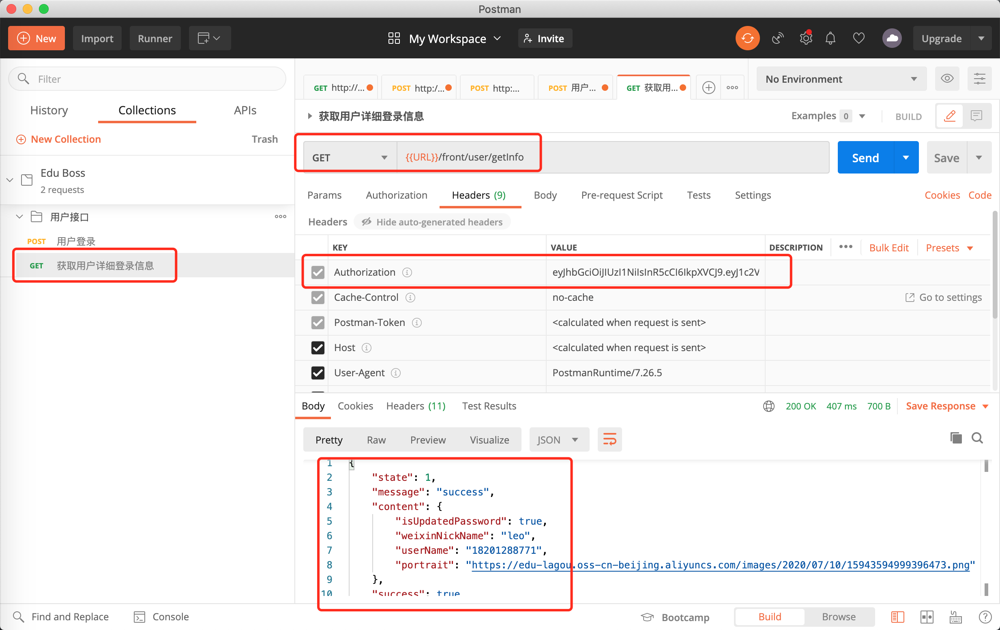

### 5. 展示当前登录用户信息

```js
:src="userInfo.portrait || require('../../assets/default-avatar.png')"
```

使用`require`获取默认图片，动态`src`要用`require`方法获取，图片作为 js 模块解析。

layout/app-header.vue

```html
<template>
  <div class="header">
    <el-breadcrumb separator-class="el-icon-arrow-right">
      <el-breadcrumb-item :to="{ path: '/' }">首页</el-breadcrumb-item>
      <el-breadcrumb-item>活动管理</el-breadcrumb-item>
      <el-breadcrumb-item>活动列表</el-breadcrumb-item>
      <el-breadcrumb-item>活动详情</el-breadcrumb-item>
    </el-breadcrumb>
    <el-dropdown>
      <span class="el-dropdown-link">
        <el-avatar
          shape="square"
          :size="30"
          :src="userInfo.portrait || require('../../assets/default-avatar.png')"
        ></el-avatar>
        <i class="el-icon-arrow-down el-icon--right"></i>
      </span>
      <el-dropdown-menu slot="dropdown">
        <el-dropdown-item>{{userInfo.userName}}</el-dropdown-item>
        <el-dropdown-item divided>退出</el-dropdown-item>
      </el-dropdown-menu>
    </el-dropdown>
  </div>
</template>

<script lang="ts">
  import Vue from "vue";
  import { getUserInfo } from "@/services/user";

  export default Vue.extend({
    name: "AppHeader",
    data() {
      return {
        userInfo: {}, // 当前登录用户信息
      };
    },
    created() {
      this.loadUserInfo();
    },
    methods: {
      async loadUserInfo() {
        const { data } = await getUserInfo();
        this.userInfo = data.content;
      },
    },
  });
</script>

<style lang="scss" scoped>
  .header {
    height: 100%;
    display: flex;
    align-items: center;
    justify-content: space-between;
    .el-dropdown-link {
      display: flex;
      align-items: center;
    }
  }
</style>
```

其中`getUserInfo`来自于`services`

`services/user.ts`

```js
export const getUserInfo = () => {
  return request({
    method: "GET",
    url: "/front/user/getInfo",
    headers: {
      Authorization: store.state.user.access_token,
    },
  });
};
```

### 6. 使用请求拦截器统一设置 Token

utils/request.ts

```ts
// 请求拦截器
request.interceptors.request.use(
  function (config) {
    // 这里是拦截的接口
    // 改写 config 对象
    const { user } = store.state;
    if (user && user.access_token) {
      config.headers.Authorization = user.access_token;
    }
    return config;
  },
  function (error) {
    return Promise.reject(error);
  }
);
```

原本写在`services/user.ts`里面的接口中的`Authorization`请求头就可以去掉了

### 7. 用户退出登录

`@click.native="handleLogout"`给组件注册原生事件到组件内部的根元素上。

```html
<el-dropdown-item divided @click.native="handleLogout">退出</el-dropdown-item>
```

```js
handleLogout () {
  this.$confirm('确认退出吗?', '退出提示', {
    confirmButtonText: '确定',
    cancelButtonText: '取消',
    type: 'warning'
  }).then(() => { // 确认执行
    // 清除登录状态
    this.$store.commit('setUser', null) // 此时清空了容器中的数据，也清空了本地存储
    // 跳转到登录页
    this.$router.push({
      name: 'login'
    })
    this.$message({
      type: 'success',
      message: '退出成功!'
    })
  }).catch(() => {
    this.$message({
      type: 'info',
      message: '已取消退出'
    })
  })
}
```

## 十五、处理 Token 过期

### 1. 概念介绍

`access_token: 获取需要授权的接口数据

`expires_in`: 过期时间

`refresh_token`: 刷新获取新的 `access_token`

为什么`access_token` 需要有过期时间以及为什么比较短？为了安全。

方法一：在请求发起前拦截每个请求，判断 token 的有效时间是否已经过期，若已过期，则将请求挂起，先刷新`token`后再继续请求。

优点：在请求前拦截，能节省请求，省流量。

缺点：需要后端额外提供一个 token 过期时间的字段；使用本地时间判断，若本地时间被篡改，特别是本地时间比服务器时间慢时，拦截会失败。

方法二：不在请求前拦截，而是拦截返回后的数据，先发起请求，接口返回过期后，先刷新 token，再进行一次重试。

优点：不需要额外的`token`过期字段，不需要判断时间。

缺点：会消耗多一次请求，耗流量。

综上，方法一和二优缺点是互补的，方法一有校验失败的风险（本地时间被篡改），方法二更简单粗暴，等知道服务器已经过期了再重试一次，只是会耗多一次请求。

使用方式二处理刷新 Token 的操作。

### 2. 分析响应拦截器

request/index.ts

```js
// 响应拦截器 request
request.interceptors.response.use(
  function (response) {
    // 状态码为 2xx 都会进入这里
    console.log("请求响应成功了", response);
    return response;
  },
  function (error) {
    // 超过 2xx 状态码都在这里
    console.dir("请求响应失败了", error);
    // 如果使用的 HTTP 状态码，错误处理就写到这里
    return Promise.reject(error);
  }
);
```

### 3. 实现基本流程逻辑

无痛刷新：先请求接口，如果是 401，判断容器中是否有 user，如果没有的话，直接进入登录页，如果有 user，则请求 refresh_token 接口，然后重新设置接口的返回值给容器的 user，再重新请求接口。

```js
// 响应拦截器 request
request.interceptors.response.use(
  function (response) {
    // 状态码为 2xx 都会进入这里
    console.log("请求响应成功了", response);
    return response;
  },
  async function (error) {
    // 超过 2xx 状态码都在这里
    console.dir("请求响应失败了", error);
    // 如果使用的 HTTP 状态码，错误处理就写到这里
    if (error.response) {
      // 请求收到响应了，但是状态码超过了 2xx 范围
      // 400
      // 401
      // 403
      // 404
      // 500
      const { status } = error.response;
      if (status === 400) {
        Message.error("请求参数错误");
      } else if (status === 401) {
        // token 无效 （没有提供 token, token 是无效的, token 过期了）
        // 如果有 refresh_token 则尝试使用 refresh_token 获取新的 access_token
        if (!store.state.user) {
          redirectLogin();
          return Promise.reject(error);
        }
        // 尝试刷新获取新的 token
        try {
          const { data } = await axios.create()({
            // 创建一个新的 axios 实例发送请求，因为如果使用request会可能发生 401 死循环
            method: "POST",
            url: "/front/user/refresh_token",
            data: qs.stringify({
              refreshtoken: store.state.user.refresh_token,
            }),
          });
          // 成功了 -> 把本次失败的请求重新发出去
          // 把成功刷新拿到的 access_token 更新到容器和本地存储中
          store.commit("setUser", data.content);
          // 把本地失败的请求重新发出去
          return request(error.config); // 失败请求的配置信息
        } catch (err) {
          // 把当前登录用户状态清除
          store.commit("setUser", null);
          // 失败了 -> 直接去跳转到登录页
          redirectLogin();
          return Promise.reject(error);
        }
      } else if (status === 403) {
        Message.error("没有权限，请联系管理员");
      } else if (status === 404) {
        Message.error("请求资源不存在");
      } else if (status >= 500) {
        Message.error("服务端错误，请联系管理员");
      }
    } else if (error.request) {
      // 请求发出去了，但是没有收到响应（请求超时，网络断开）
      Message.error("请求超时，请刷新重试");
    } else {
      // 在设置请求时发生了一些事情，触发了一个错误
      Message.error("请求失败: " + error.message);
    }
    // 把请求失败的错误对象继续抛出，扔给下一个调用者
    return Promise.reject(error);
  }
);
```

### 4. 关于多次请求问题

使用变量 `isRefreshing` 控制刷新 token 的状态。使用`requests` 存储刷新 token 期间过来的 401 请求。`requests`数组存储调用`resolve`的方法。在刷新 token 完毕后循环遍历`requests`方法。

最终`utils/request.ts`内容如下:

```ts
import axios from "axios";
import { Message } from "element-ui";
import store from "@/store";
import router from "@/router";
import qs from "qs";

function redirectLogin() {
  return router.push({
    name: "login",
    query: {
      redirect: router.currentRoute.fullPath,
    },
  });
}

function refreshToken() {
  return axios.create()({
    // 创建一个新的 axios 实例发送请求，因为如果使用request会可能发生 401 死循环
    method: "POST",
    url: "/front/user/refresh_token",
    data: qs.stringify({
      // refreshtoken 只能使用一次
      refreshtoken: store.state.user.refresh_token,
    }),
  });
}

const request = axios.create({
  // 配置选项
  // baseURL,
  // timeout,
});

// 请求拦截器 request
request.interceptors.request.use(
  function (config) {
    // 这里是拦截的接口
    // 改写 config 对象
    const { user } = store.state;
    if (user && user.access_token) {
      config.headers.Authorization = user.access_token;
    }
    return config;
  },
  function (error) {
    return Promise.reject(error);
  }
);

// 响应拦截器 request
let isRefreshing = false; // 控制刷新 token 的状态
let requests: (() => void)[] = []; // 存储刷新 token 期间过来的 401 请求
request.interceptors.response.use(
  function (response) {
    // 状态码为 2xx 都会进入这里
    console.log("请求响应成功了", response);
    return response;
  },
  async function (error) {
    // 超过 2xx 状态码都在这里
    console.dir("请求响应失败了", error);
    // 如果使用的 HTTP 状态码，错误处理就写到这里
    if (error.response) {
      // 请求收到响应了，但是状态码超过了 2xx 范围
      // 400
      // 401
      // 403
      // 404
      // 500
      const { status } = error.response;
      if (status === 400) {
        Message.error("请求参数错误");
      } else if (status === 401) {
        // token 无效 （没有提供 token, token 是无效的, token 过期了）
        // 如果有 refresh_token 则尝试使用 refresh_token 获取新的 access_token
        if (!store.state.user) {
          redirectLogin();
          return Promise.reject(error);
        }
        if (!isRefreshing) {
          // 解决多次请求重新刷新 Token 的问题
          isRefreshing = true;
          // 尝试刷新获取新的 token
          return refreshToken()
            .then((res) => {
              if (!res.data.success) {
                throw new Error("刷新 Token 失败");
              }
              // 成功了 -> 把本次失败的请求重新发出去
              // 把成功刷新拿到的 access_token 更新到容器和本地存储中
              store.commit("setUser", res.data.content);
              // 把本地失败的请求重新发出去
              requests.forEach((cb) => cb());
              requests = []; // 重置 requests 数组
              return request(error.config); // 失败请求的配置信息
            })
            .catch((err) => {
              // 把当前登录用户状态清除
              store.commit("setUser", null);
              // 失败了 -> 直接去跳转到登录页
              redirectLogin();
              return Promise.reject(err);
            })
            .finally(() => {
              isRefreshing = false; // 重置状态
            });
        }
        // 刷新状态下，把请求挂起，放到 requests 数组中
        return new Promise((resolve) => {
          requests.push(() => {
            resolve(request(error.config));
          });
        });
      } else if (status === 403) {
        Message.error("没有权限，请联系管理员");
      } else if (status === 404) {
        Message.error("请求资源不存在");
      } else if (status >= 500) {
        Message.error("服务端错误，请联系管理员");
      }
    } else if (error.request) {
      // 请求发出去了，但是没有收到响应（请求超时，网络断开）
      Message.error("请求超时，请刷新重试");
    } else {
      // 在设置请求时发生了一些事情，触发了一个错误
      Message.error("请求失败: " + error.message);
    }
    // 把请求失败的错误对象继续抛出，扔给下一个调用者
    return Promise.reject(error);
  }
);

export default request;
```
