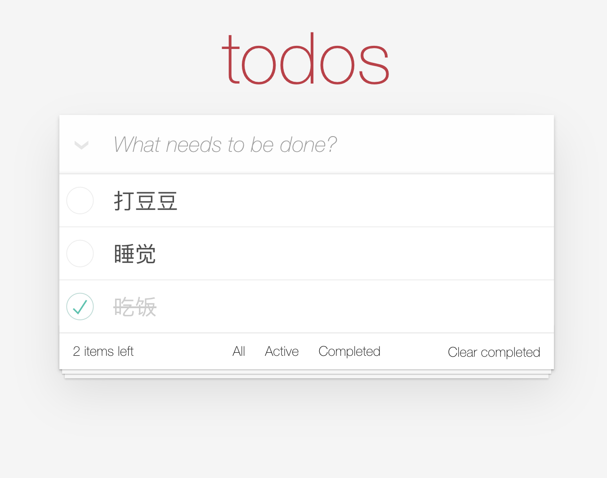
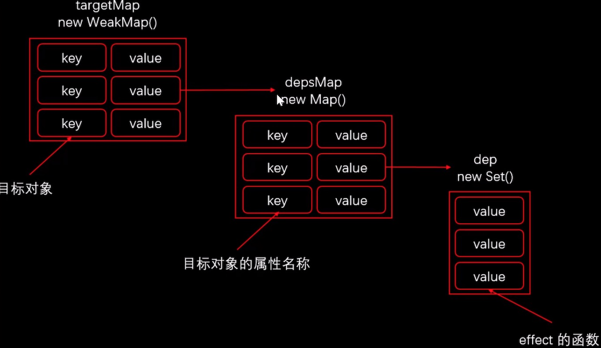
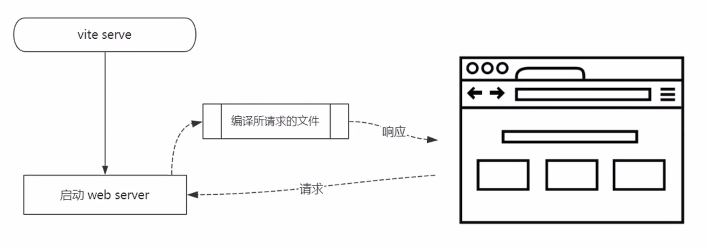
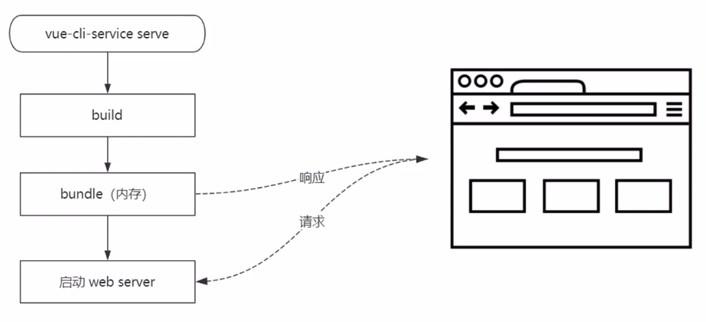
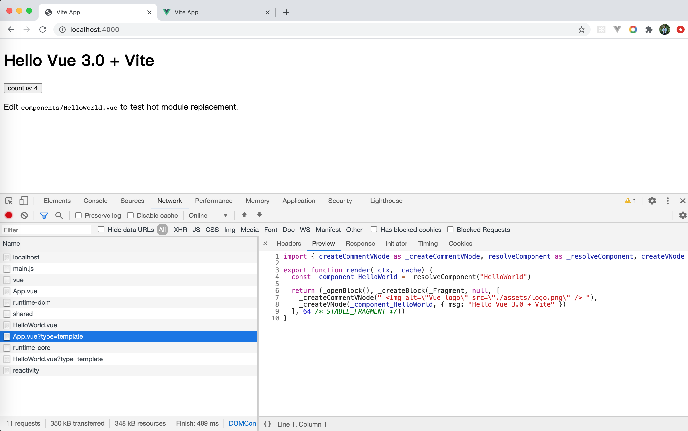

# Vue.js 3.0 Composition APIs 及 3.0 原理剖析

## Vue.js 3.0 介绍

### 一、Vue.js 源码组织方式

#### 1. 源码采用 TypeScript 重写

提高了代码的可维护性。大型项目的开发都推荐使用类型化的语言，在编码的过程中检查类型的问题。

#### 2. 使用 Monorepo 管理项目结构

使用一个项目管理多个包，把不同功能的代码放到不同的 package 中管理，每个功能模块都可以单独发布，单独测试，单独使用。

#### 3. 不同构建版本

Vue3 中不再构建 UMD 模块化的方式，因为 UMD 会让代码有更多的冗余，它要支持多种模块化的方式。Vue3 中将 CJS、ESModule 和自执行函数的方式分别打包到了不同的文件中。在 packages/vue 中有 Vue3 的不同构建版本。

- cjs（两个版本都是完整版，包含编译器）
  - vue.cjs.js
  - vue.cjs.prod.js（开发版，代码进行了压缩）
- global（这四个版本都可以在浏览器中直接通过 scripts 标签导入，导入之后会增加一个全局的 Vue 对象）
  - vue.global.js（完整版，包含编译器和运行时）
  - vue.global.prod.js（完整版，包含编译器和运行时，这是开发版本，代码进行了压缩）
  - vue.runtime.global.js
  - vue.runtime.global.prod.js
- browser（四个版本都包含 esm，浏览器的原生模块化方式，可以直接通过`<script type="module" />`的方式来导入模块）
  - vue.esm-browser.js
  - vue.esm-browser.prod.js
  - vue.runtime.esm-browser.js
  - vue.runtime.esm-browser.prod.js
- bundler（这两个版本没有打包所有的代码，只会打包使用的代码，需要配合打包工具来使用，会让 Vue 体积更小）
  - vue.esm-bundler.js
  - bue.runtime.esm-bundler.js

#### 二、Composition API

- RFC (Request For Coments)
  - Https://github.com/vuejs/rfcs
- Composition API RFC
  - Https://composition-api.vuejs.org

#### 1. 设计动机

- Options API
  - 包含一个描述组件选项(data、methods、props 等)的对象
  - Options API 开发复杂组件，同一个功能逻辑的代码被拆分到不同选项
- Composition API
  - Vue.js 3.0 新增的一组 API
  - 一组基于函数的 API
  - 可以更灵活的组织组件的逻辑

### 三、性能提升

#### 1. 响应式系统升级

Vue3 使用 Proxy 对象重写了响应式系统。

- Vue.js 2.x 中响应式系统的核心 `defineProperty`，初始化的时候递归遍历所有的属性，转化为 getter、setter
- Vue.js 3.0 中使用`Proxy`对象重写响应式系统
  - 可监听动态新增的属性
  - 可以监听删除的属性
  - 可以监听数组的索引和 length 属性

#### 2. 编译优化

重写了 DOM 提高渲染的性能。

- Vue.js 2.x 中通过标记静态根节点，优化 diff 的过程
- Vue.js 3.0 中标记和提升所有的静态根节点，diff 的时候只需要对比动态节点内容
  - Fragments（升级 vetur 插件）
  - 静态提升
  - Patch flag
  - 缓存事件处理函数

#### 3.源码体积的优化

通过优化源码的体积和更好的 TreeShaking 的支持，减少大打包的体积

- Vue.js 3.0 中移除了一些不常用的 API
  - 例如：inline-template、filter 等
- Tree-shaking
  - 例如：Vue3 中的没用到的模块不会被打包，但是核心模块会打包。Keep-Alive、transition 等都是按需引入的。

### 四、Vite

Vue 的打包工具。Vite 是法语中的"快"的意思

#### 1. ES Module

- 现代浏览器都支持 ES Module（IE 不支持）

- 通过下面的方式加载模块
- `<script type="module" src="..."></script>`
- 支持模块的 script 默认延迟加载
- 有了 type="module"的模块是延迟加载的，类似于 script 标签设置 defer
  - 在文档解析完成后，也就是 DOM 树生成之后，触发 DOMContentLoaded 事件前执行

#### 2. Vite as Vue-CLI

- Vite 在开发模式下不需要打包可以直接运行
- Vue-CLI 开发模式下必须对项目打包才可以运行
- Vite 在生产环境下使用 Rollup 打包
  - 基于 ES Module 的方式打包
- Vue-CLI 使用 Webpack 打包

#### 3. Vite 特点

- 快速冷启动
- 按需编译
- 模块热更新

#### 4. Vite 创建项目

- Vite 创建项目

  ```shell
  npm init vite-app <project-name>
  cd <project-name>
  npm install
  npm run dev
  ```

- 基于模板创建项目

  ```shell
  npm init vite-app --template react
  npm init vite-app --template preact
  ```

---

## Compositon API

### 一、Composition API 使用

#### 1. 使用 Vue3.0

先创建一个空文件夹，然后进入文件夹执行`npm init -y`，再执行`npm install vue@3.0.0-rc.1`安装 vue3.0

创建 index.html，vue3.0 的使用

```html
<body>
  <div id="app">
    x: {{ position.x }} <br />
    y: {{ position.y }} <br />
  </div>
  <script type="module">
    import { createApp } from "./node_modules/vue/dist/vue.esm-browser.js";

    const app = createApp({
      data() {
        return {
          position: {
            x: 0,
            y: 0,
          },
        };
      },
    });
    console.log(app);

    app.mount("#app");
  </script>
</body>
```

#### 2. setup、reactive 的使用

- createAPP：创建 Vue 对象
- setup：CompositionAPI 的入口
- reactive：创建响应式对象

```html
<body>
  <div id="app">
    x: {{ position.x }} <br />
    y: {{ position.y }} <br />
  </div>
  <script type="module">
    import {
      createApp,
      reactive,
    } from "./node_modules/vue/dist/vue.esm-browser.js";

    const app = createApp({
      setup() {
        // 第一个参数 props，响应式对象，不能被解构
        // 第二个参数 context， attrs、emit、slots
        const position = reactive({
          x: 0,
          y: 0,
        });
        return {
          position,
        };
      },
      mounted() {
        this.position.x = 2;
      },
    });
    console.log(app);

    app.mount("#app");
  </script>
</body>
```

### 二、 setup 中的生命周期钩子函数

只需要在 vue 钩子函数首字母大写，并且钩子函数前面加上 on，就可以了。特殊：原本的生命周期中的 destroy 对应的是 onUnmounted。

```html
<body>
  <div id="app">
    x: {{ position.x }} <br />
    y: {{ position.y }} <br />
  </div>
  <script type="module">
    import {
      createApp,
      reactive,
      onMounted,
      onUnmounted,
    } from "./node_modules/vue/dist/vue.esm-browser.js";

    function useMousePosition() {
      const position = reactive({
        x: 0,
        y: 0,
      });

      const update = (e) => {
        position.x = e.pageX;
        position.y = e.pageY;
      };

      onMounted(() => {
        window.addEventListener("mousemove", update);
      });

      onUnmounted(() => {
        window.removeEventListener("mousemove", update);
      });

      return position;
    }

    const app = createApp({
      setup() {
        const position = useMousePosition();
        return {
          position,
        };
      },
      mounted() {
        this.position.x = 2;
      },
    });
    console.log(app);

    app.mount("#app");
  </script>
</body>
```

### 三、reactive-toRefs-ref

reactive 创建的响应式数据解构后不再是响应式，toRefs 可以把响应式对象的所有属性也转化成响应式的，所以可以解构 toRefs 返回的对象，解构之后还是响应式数据。

reactive 是将普通对象转化成响应式对象，而 ref 是将基本类型数据包装成了响应式对象。

ref 的使用：

```html
<body>
  <div id="app">
    <button @click="increase">Button</button>
    <span>{{count}}</span>
  </div>
  <script type="module">
    import { createApp, ref } from "./node_modules/vue/dist/vue.esm-browser.js";

    function useCount() {
      const count = ref(0); // 将基本类型数据转化成响应式对象
      return {
        count,
        increase: () => {
          count.value++;
        },
      };
    }

    createApp({
      setup() {
        return {
          ...useCount(),
        };
      },
    }).mount("#app");
  </script>
</body>
```

### 四、Computed

computed 可以创建一个响应式数据，这个响应式数据依赖于其他响应式数据，就是计算属性。

- 第一种用法

  - computed(() => count.value + 1)

- 第二种用法

  ```js
  const count = ref(1);
  const plusOne = computed({
    get: () => count.value + 1,
    set: (val) => {
      count.value = val - 1;
    },
  });
  ```

使用：

```html
<body>
  <div id="app">
    <button @click="push">Button</button>
    <span>未完成：{{activeCount}}</span>
  </div>
  <script type="module">
    import {
      createApp,
      reactive,
      computed,
    } from "./node_modules/vue/dist/vue.esm-browser.js";
    const data = [
      { text: "看书", complated: false },
      { text: "敲代码", complated: false },
      { text: "约会", complated: true },
    ];

    createApp({
      setup() {
        const todos = reactive(data);
        const activeCount = computed(() => {
          return todos.filter((item) => !item.complated).length;
        });
        return {
          activeCount,
          push: () => {
            todos.push({
              text: "开会",
              complated: false,
            });
          },
        };
      },
    }).mount("#app");
  </script>
</body>
```

### 五、watch

#### 1. watch 的三个参数

- 第一个参数：要监听的数据，得是 reactive 或 ref 返回的对象
- 第二个参数：监听到数据变化后执行的函数，这个函数有两个参数分别是新值和旧值
- 第三个参数：选项对象，deep 和 immediate

#### 2. watch 的返回值

- 取消监听的函数

使用：

```html
<body>
  <div id="app">
    请选择一个yes/no的问题：
    <input v-model.lazy="question" />
    <p>{{answer}}</p>
  </div>
  <script type="module">
    import {
      createApp,
      ref,
      watch,
    } from "./node_modules/vue/dist/vue.esm-browser.js";

    createApp({
      setup() {
        const question = ref("");
        const answer = ref("");
        watch(question, async (newValue, oldValue) => {
          const response = await fetch("https://www.yesno.wtf/api");
          const data = await response.json();
          answer.value = data.answer;
        });
        return {
          question,
          answer,
        };
      },
    }).mount("#app");
  </script>
</body>
```

#### 六、WatchEffect

- 是 watch 函数的简化版本，也用来监视数据的变化
- 接受一个函数作为参数，监听函数内响应式数据的变化

```html
<body>
  <div id="app">
    <button @click="increase">increase</button>
    <button @click="stop">stop</button>
    <p>{{count}}</p>
  </div>
  <script type="module">
    import {
      createApp,
      ref,
      watchEffect,
    } from "./node_modules/vue/dist/vue.esm-browser.js";

    createApp({
      setup() {
        const count = ref(0);
        const stop = watchEffect(() => {
          console.log(count.value);
        });
        return {
          count,
          stop,
          increase: () => count.value++,
        };
      },
    }).mount("#app");
  </script>
</body>
```

### 六、实现 todolist 案例

#### 1. ToDoList 功能列表

- 添加待办事项
- 删除待办事项
- 编辑待办事项
- 切换待办事项
- 存储待办事项

#### 2. 项目结构

使用 vue 脚手架创建 Vue 项目，先升级 vue-cli，4.5.6 版本的 vue-cli 创建项目时可以选择 vue 版本。

Vue CLI 的包名称由 `vue-cli` 改成了 `@vue/cli`。 如果已经全局安装了旧版本的 `vue-cli` (1.x 或 2.x)，你需要先通过 `npm uninstall vue-cli -g` 或 `yarn global remove vue-cli` 卸载它

可以使用下列任一命令安装这个新的包：

```bash
npm install -g @vue/cli
# OR
yarn global add @vue/cli
```

先使用 vue create 创建项目，创建的时候选择 3.0。

```bash
vue create 04-todolist
```

然后选择`Default (Vue 3 Preview) ([Vue 3] babel, eslint)`

就会自动创建项目了。

#### 3. 添加待办事项

在输入框输入文本按下 enter 键提交待办事项

```js
// 1. 添加待办事项
const useAdd = (todos) => {
  const input = ref("");
  const addTodo = () => {
    const text = input.value?.trim();
    if (text.length === 0) return;
    todos.value.unshift({
      text,
      completed: false,
    });
    input.value = "";
  };
  return {
    input,
    addTodo,
  };
};
```

#### 4. 删除待办事项

点击待办事项右侧的叉号可以删除待办事项

```js
// 2. 删除待办事项
const useRemove = (todos) => {
  const remove = (todo) => {
    const index = todos.value.indexOf(todo);
    todos.value.splice(index, 1);
  };
  return {
    remove,
  };
};
```

#### 5. 编辑待办事项

双击进入编辑状态，按 esc 退出编辑，按 enter 提交编辑，如果删光了文本，则为删除这一项。

- 双击待办事项，展示编辑文本框
- 按回车或者编辑文本框失去焦点，修改数据
- 按 esc 取消编辑
- 把编辑文本框清空按回车，删除这一项
- 显示编辑文本框的时候获取焦点

```js
// 3. 编辑待办事项
const useEdit = (remove) => {
  let beforeEditingText = "";
  const editingTodo = ref(null);

  const editTodo = (todo) => {
    beforeEditingText = todo.text;
    editingTodo.value = todo;
  };
  const doneEdit = (todo) => {
    if (!editingTodo.value) return;
    todo.text = todo.text.trim();
    if (todo.text === "") remove(todo);
    editingTodo.value = null;
  };
  const cancelEdit = (todo) => {
    editingTodo.value = null;
    todo.text = beforeEditingText;
  };
  return {
    editingTodo,
    editTodo,
    doneEdit,
    cancelEdit,
  };
};
```

模板中：

```html
<ul class="todo-list">
  <li
    v-for="todo in todos"
    :key="todo"
    :class="{editing: todo === editingTodo}"
  >
    <div class="view">
      <input type="checkbox" class="toggle" />
      <label @dblclick="editTodo(todo)">{{ todo.text }}</label>
      <button class="destroy" @click="remove(todo)"></button>
    </div>
    <input
      type="text"
      class="edit"
      v-model="todo.text"
      @keyup.enter="doneEdit(todo)"
      @blur="doneEdit(todo)"
      @keyup.esc="cancelEdit(todo)"
    />
  </li>
</ul>
```

#### 6. 编辑文本框获取焦点 - vue3.0 自定义指令

传对象形式：

- Vue 2.x

  ```js
  Vue.directive('editingFocus', {
    bind(el, binding, vnode, prevVnode) {},
    inserted() {},
    update() {} // remove,
    componentUpdated() {},
    unbind() {}
  })
  ```

- Vue 3.0

  ```js
  app.directive("editingFocus", {
    beforeMount(el, binding, vnode, prevVnode) {},
    mounted() {},
    breforeUpdate() {}, // new
    updated() {},
    beforeUnmount() {}, // new
    unmounted() {},
  });
  ```

传函数形式：

- Vue 2.x

  ```js
  Vue.directive("editingFocus", (el, binding) => {
    binding.value && el.focus();
  });
  ```

- Vue 3.0

  ```js
  app.directive("editingFocus", (el, binding) => {
    binding.value && el.focus();
  });
  ```

代码实现自定义事件获取正在编辑的文本框焦点：

```js
export default {
  name: "App",

  // 省略了setup() {},

  directives: {
    editingFocus: (el, binding) => {
      // binding可以获取到一些参数
      binding.value && el.focus();
    },
  },
};
```

使用：

```html
<input
  v-editing-focus="todo === editingTodo"
  type="text"
  class="edit"
  v-model="todo.text"
  @keyup.enter="doneEdit(todo)"
  @blur="doneEdit(todo)"
  @keyup.esc="cancelEdit(todo)"
/>
```

#### . 切换待办事项

- 点击 CheckBox 可以改变所有代办项状态
- All/Active/Completed
- 其他
  - 显示未完成代办项个数
  - 移除所有完成的项目
  - 如果没有待办项，隐藏 main 和 footer

```js
// 4. 切换待办项完成状态
const useFilter = (todos) => {
  const allDone = computed({
    get: () => {
      return !todos.value.filter((item) => !item.completed).length;
    },
    set: (value) => {
      todos.value.forEach((todo) => {
        todo.completed = value;
      });
    },
  });

  const filter = {
    all: (list) => list,
    active: (list) => list.filter((todo) => !todo.completed),
    completed: (list) => list.filter((todo) => todo.completed),
  };

  const type = ref("all");
  const filteredTodos = computed(() => filter[type.value](todos.value));

  const remainingCount = computed(() => filter.active(todos.value).length);

  const count = computed(() => todos.value.length);

  const onHashChange = () => {
    const hash = window.location.hash.replace("#/", "");
    if (filter[hash]) {
      type.value = hash;
    } else {
      type.value = "all";
      window.location.hash = "";
    }
  };

  onMounted(() => {
    window.addEventListener("hashchange", onHashChange);
    onHashChange();
  });

  onUnmounted(() => {
    window.removeEventListener("hashchange", onHashChange);
  });

  return {
    allDone,
    filteredTodos,
    remainingCount,
    count,
  };
};
```

#### 8. 本地存储

```js
import useLocalStorage from "./utils/useLocalStorage";
const storage = useLocalStorage();

// 5. 存储待办事项
const useStorage = () => {
  const KEY = "TODOKEYS";
  const todos = ref(storage.getItem(KEY) || []);
  watchEffect(() => {
    storage.setItem(KEY, todos.value);
  });
  return todos;
};
```

utils/useLocalStorage.js

```js
function parse(str) {
  let value;
  try {
    value = JSON.parse(str);
  } catch {
    value = null;
  }
  return value;
}

function stringify(obj) {
  let value;
  try {
    value = JSON.stringify(obj);
  } catch {
    value = null;
  }
  return value;
}

export default function useLocalStorage() {
  function setItem(key, value) {
    value = stringify(value);
    window.localStorage.setItem(key, value);
  }
  function getItem(key) {
    let value = window.localStorage.getItem(key);
    if (value) {
      value = parse(value);
    }
    return value;
  }
  return {
    setItem,
    getItem,
  };
}
```

#### 9. 完整代码

代码地址：https://gitee.com/jiailing/lagou-fed/tree/master/fed-e-task-03-05/code/04-todolist



```js
<template>
<section id="app" class="todoapp">
  <header class="header">
    <h1>todos</h1>
    <input type="text" class="new-todo" placeholder="What needs to be done?" autocomplete="off" autofocus v-model="input" @keyup.enter="addTodo">
  </header>
  <section class="main" v-show="count">
    <input id="toggle-all" class="toggle-all" type="checkbox" v-model="allDone">
    <label for="toggle-all">Mark all as complete</label>
    <ul class="todo-list">
      <li v-for="todo in filteredTodos" :key="todo" :class="{editing: todo === editingTodo, completed: todo.completed}">
        <div class="view">
          <input type="checkbox" class="toggle" v-model="todo.completed">
          <label @dblclick="editTodo(todo)">{{ todo.text }}</label>
          <button class="destroy" @click="remove(todo)"></button>
        </div>
        <input v-editing-focus="todo === editingTodo" type="text" class="edit" v-model="todo.text" @keyup.enter="doneEdit(todo)" @blur="doneEdit(todo)" @keyup.esc="cancelEdit(todo)">
      </li>
    </ul>
  </section>
  <footer class="footer" v-show="count">
    <span class="todo-count">
      <strong>{{ remainingCount }}</strong> {{remainingCount > 1 ? 'items' : 'item'}} left
    </span>
    <ul class="filters">
      <li><a href="#/all">All</a></li>
      <li><a href="#/active">Active</a></li>
      <li><a href="#/completed">Completed</a></li>
    </ul>
    <button class="clear-completed" @click="removeCompleted" v-show="count > remainingCount">Clear completed</button>
  </footer>
</section>
</template>

<script>
import './assets/index.css'
import useLocalStorage from './utils/useLocalStorage'
import {
  ref,
  computed,
  onMounted,
  onUnmounted,
  watchEffect
} from 'vue'

const storage = useLocalStorage()

// 1. 添加待办事项
const useAdd = todos => {
  const input = ref('')
  const addTodo = () => {
    const text = input.value?.trim()
    if (text.length === 0) return
    todos.value.unshift({
      text,
      completed: false
    })
    input.value = ''
  }
  return {
    input,
    addTodo
  }
}

// 2. 删除待办事项
const useRemove = todos => {
  const remove = todo => {
    const index = todos.value.indexOf(todo)
    todos.value.splice(index, 1)
  }

  const removeCompleted = () => {
    todos.value = todos.value.filter(todo => !todo.completed)
  }
  return {
    remove,
    removeCompleted
  }
}

// 3. 编辑待办事项
const useEdit = (remove) => {
  let beforeEditingText = ''
  const editingTodo = ref(null)

  const editTodo = todo => {
    beforeEditingText = todo.text
    editingTodo.value = todo
  }
  const doneEdit = todo => {
    if (!editingTodo.value) return
    todo.text = todo.text.trim()
    if (todo.text === '') remove(todo)
    editingTodo.value = null
  }
  const cancelEdit = todo => {
    editingTodo.value = null
    todo.text = beforeEditingText
  }
  return {
    editingTodo,
    editTodo,
    doneEdit,
    cancelEdit
  }
}

// 4. 切换待办项完成状态
const useFilter = todos => {
  const allDone = computed({
    get: () => {
      return !todos.value.filter(item => !item.completed).length
    },
    set: (value) => {
      todos.value.forEach(todo => {
        todo.completed = value
      })
    }
  })

  const filter = {
    all: list => list,
    active: list => list.filter(todo => !todo.completed),
    completed: list => list.filter(todo => todo.completed)
  }

  const type = ref('all')
  const filteredTodos = computed(() => filter[type.value](todos.value))

  const remainingCount = computed(() => filter.active(todos.value).length)

  const count = computed(() => todos.value.length)

  const onHashChange = () => {
    const hash = window.location.hash.replace('#/', '')
    if (filter[hash]) {
      type.value = hash
    } else {
      type.value = 'all'
      window.location.hash = ''
    }
  }

  onMounted(() => {
    window.addEventListener('hashchange', onHashChange)
    onHashChange()
  })

  onUnmounted(() => {
    window.removeEventListener('hashchange', onHashChange)
  })

  return {
    allDone,
    filteredTodos,
    remainingCount,
    count
  }
}

// 5. 存储待办事项
const useStorage = () => {
  const KEY = 'TODOKEYS'
  const todos = ref(storage.getItem(KEY) || [])
  watchEffect(() => {
    storage.setItem(KEY, todos.value)
  })
  return todos
}

export default {
  name: 'App',
  setup() {
    const todos = useStorage()
    const {
      remove,
      removeCompleted
    } = useRemove(todos)
    return {
      todos,
      remove,
      removeCompleted,
      ...useAdd(todos),
      ...useEdit(remove),
      ...useFilter(todos)
    }
  },
  directives: {
    editingFocus: (el, binding) => { // binding可以获取到一些参数
      binding.value && el.focus()
    }
  },
}
</script>

<style>
</style>

```

---

## Vue.js 3.0 响应式系统原理

### 一、介绍

#### 1. Vue.js 响应式回顾

- Proxy 对象实现属性监听
- 多层属性嵌套，在访问属性过程中处理下一级属性
- 默认监听动态添加的属性
- 默认监听属性的删除操作
- 默认监听数组索引和 length 属性
- 可以作为单独的模块使用

#### 2. 核心函数

- eactive/ref/toRefs/computed
- effect
- track
- trigger

### 二、Proxy 对象回顾

#### 1. 在严格模式下，Proxy 的函数得返回布尔类型的值，否则会报 TypeError

> Uncaught TypeError: 'set' on proxy: trap returned falsish for property 'foo'

```js
"use strict";
// 问题1： set和deleteProperty中需要返回布尔类型的值
// 严格模式下，如果返回false的话，会出现TypeError的异常
const target = {
  foo: "xxx",
  bar: "yyy",
};
// Reflect.getPrototypeOf()
// Object.getPrototypeOf()
const proxy = new Proxy(target, {
  get(target, key, receiver) {
    // return target[key]
    return Reflect.get(target, key, receiver);
  },
  set(target, key, value, receiver) {
    // target[key] = value
    return Reflect.set(target, key, value, receiver); // 这里得写return
  },
  deleteProperty(target, key) {
    // delete target[key]
    return Reflect.deleteProperty(target, key); // 这里得写return
  },
});

proxy.foo = "zzz";
```

#### 2. Proxy 和 Reflect 中使用 receiver

Proxy 中 receiver：Proxy 或者继承 Proxy 的对象
React 中 receiver：如果 target 对象设置了 getter，getter 中的 this 指向 receiver

```js
const obj = {
  get foo() {
    console.log(this);
    return this.bar;
  },
};

const proxy = new Proxy(obj, {
  get(target, key, receiver) {
    if (key === "bar") {
      return "value - bar";
    }
    return Reflect.get(target, key, receiver); // 执行this.bar的时候，this指向代理对象，也就是获取target.bar
  },
});
console.log(proxy.foo); // value - bar
```

如果`return Reflect.get(target, key, receiver)`写成`return Reflect.get(target, key)`的话，则响应式属性 foo 里面的 this 还是指向原本的对象 obj，this.bar 就是 undefined，而传入了 receiver 之后，响应式属性里的 this 就指向新的响应式对象 proxy，this.bar 返回`value - bar`。

### 三、reactive

- 接受一个参数，判断这个参数是否是对象
- 创建拦截器对象 handler，设置 get/set/deleteProperty
- 返回 Proxy 对象

自己实现 reactive

```js
function isObject(value) {
  return value !== null && typeof value === "object";
}

function convert(target) {
  return isObject(target) ? reactive(target) : target;
}

const hasOwnProperty = Object.prototype.hasOwnProperty;

function hasOwn(target, key) {
  return hasOwnProperty.call(target, key);
}

export function reactive(target) {
  if (!isObject(target)) return target;

  const handler = {
    get(target, key, receiver) {
      // 收集依赖
      // track(target, key) // 稍后解注释
      console.log("get", key);
      const ret = Reflect.get(target, key, receiver);
      return convert(ret);
    },
    set(target, key, value, receiver) {
      const oldValue = Reflect.get(target, key, receiver);
      let ret = true;
      if (oldValue !== value) {
        ret = Reflect.set(target, key, value, receiver);
        // 触发更新
        // trigger(target, key) // 稍后解注释
        console.log("set", key, value);
      }
      return ret;
    },
    deleteProperty(target, key) {
      const hasKey = hasOwn(target, key);
      const ret = Reflect.deleteProperty(target, key);
      if (hasKey && ret) {
        // 触发更新
        // trigger(target, key) // 稍后解注释
        console.log("detele", key);
      }
      return ret;
    },
  };

  return new Proxy(target, handler);
}
```

使用：

```html
<body>
  <script type="module">
    import { reactive } from "./reactivity/index.js";
    const obj = reactive({
      name: "zs",
      age: 18,
    });
    obj.name = "lisi";
    delete obj.age;
    console.log(obj);
  </script>
</body>
```

输出结果为：

> set name lisi
> index.js:39 detele age
> index.html:17 Proxy {name: "lisi"}

### 四、收集依赖



### 五、effect、track

```js
let activeEffect = null;
export function effect(callback) {
  activeEffect = callback;
  callback(); // 访问响应式对象的属性，去收集依赖
  activeEffect = null;
}

let targetMap = new WeakMap();
export function track(target, key) {
  // 收集依赖
  if (!activeEffect) return;
  let depsMap = targetMap.get(target);
  if (!depsMap) {
    targetMap.set(target, (depsMap = new Map()));
  }
  let dep = depsMap.get(key);
  if (!dep) {
    depsMap.set(key, (dep = new Set()));
  }
  dep.add(activeEffect);
}
```

### 六、trigger

```js
export function trigger(target, key) {
  // 触发依赖
  const depsMap = targetMap.get(target);
  if (!depsMap) return;
  const dept = depsMap.get(key);
  if (dept) {
    dept.forEach((effect) => {
      effect();
    });
  }
}
```

使用：

```html
<body>
  <script type="module">
    import { reactive, effect } from "./reactivity/index.js";
    const product = reactive({
      name: "iPhone",
      price: 5000,
      count: 3,
    });
    let total = 0;
    effect(() => {
      total = product.price * product.count;
    });
    console.log(total); // 15000

    product.price = 4000;
    console.log(total); // 12000

    product.count = 1;
    console.log(total); // 4000
  </script>
</body>
```

### 七、ref

eactive vs ref

- ref 可以把基本数据类型数据转换成响应式对象

- ref 返回的对象，重新赋值成对象也是响应式的

- reactive 返回的对象，重新赋值丢失响应式

- reactive 返回的对象不可解构

- reactive

  ```js
  const product = reactive({
    name: "iPhone",
    price: 5000,
    count: 3,
  });
  ```

- ref

  ```js
  const price = ref(5000);
  const count = ref(3);
  ```

实现 ref：

```js
export function ref(raw) {
  // 判断raw是否是ref创建的对象，如果是的话直接返回
  if (isObject(raw) && raw.__v_isRef) return;

  let value = convert(raw);
  const r = {
    __v_isRef: true,
    get value() {
      track(r, "value");
      return value;
    },
    set value(newValue) {
      if (newValue !== value) {
        raw = newValue;
        value = convert(raw);
        trigger(r, "value");
      }
    },
  };
  return r;
}
```

使用：

```html
<body>
  <script type="module">
    import { reactive, effect, ref } from "./reactivity/index.js";
    const price = ref(5000);
    const count = ref(3);
    let total = 0;
    effect(() => {
      total = price.value * count.value;
    });
    console.log(total); // 15000

    price.value = 4000;
    console.log(total); // 12000

    count.value = 1;
    console.log(total); // 4000
  </script>
</body>
```

### 八、toRefs

```js
export function toRefs(proxy) {
  const ret = proxy instanceof Array ? new Array(proxy.length) : {};
  for (const key in proxy) {
    ret[key] = toProxyRef(proxy, key);
  }
  return ret;
}

function toProxyRef(proxy, key) {
  const r = {
    __v_isRef: true,
    get value() {
      return proxy[key];
    },
    set value(newValue) {
      proxy[key] = newValue;
    },
  };
  return r;
}
```

使用

```html
<body>
  <script type="module">
    import { reactive, effect, toRefs } from "./reactivity/index.js";
    function useProduct() {
      const product = reactive({
        name: "iPhone",
        price: 5000,
        count: 3,
      });
      return toRefs(product); // 直接返回解构的product不是响应式对象，所以调用toRefs将reactive对象的每个属性都转化成ref对象
    }

    const { price, count } = useProduct();

    let total = 0;
    effect(() => {
      total = price.value * count.value;
    });
    console.log(total); // 15000

    price.value = 4000;
    console.log(total); // 12000

    count.value = 1;
    console.log(total); // 4000
  </script>
</body>
```

### 九、computed

```js
export function computed(getter) {
  const result = ref();
  effect(() => (result.value = getter()));
  return result;
}
```

使用

```html
<body>
  <script type="module">
    import { reactive, effect, computed } from "./reactivity/index.js";
    const product = reactive({
      name: "iPhone",
      price: 5000,
      count: 3,
    });
    let total = computed(() => {
      return product.price * product.count;
    });
    console.log(total.value); // 15000

    product.price = 4000;
    console.log(total.value); // 12000

    product.count = 1;
    console.log(total.value); // 4000
  </script>
</body>
```

> 备注：trigger/track/effct 是低层的函数，一般不用。使用 computed 代替 effect 的使用

---

## Vite 实现原理

### 一、Vite 介绍

#### 1. Vite 概念：

- Vite 是一个面向现代浏览器的一个更轻更快的 web 应用开发工具
- 它基于 ECMAScript 标准原生模块系统（ES Modules）实现

#### 2. Vite 项目依赖：

- Vite
- @vue/compiler-sfc

#### 3. 基础使用：

vite serve / vite build



在运行`vite serve`的时候不需要打包，直接开启一个 web 服务器，当浏览器请求服务器，比如请求一个单文件组件，这个时候在服务器端编译单文件组件，然后把编译的结果返回给浏览器，注意这里的编译是在服务器端，另外模块的处理是在请求到服务器端处理的。

而`vue-cli-service serve`：



当运行 vue-cli-service serve 的时候，它内部会使用 webpack，首先去打包所有的模块，如果模块数量比较多的话，打包速度会非常的慢，把打包的结果存储到内存中，然后才会开启开发的 web 服务器，浏览器请求 web 服务器，把内存中打包的结果直接返回给浏览器，像 webpack 这种工具，它的做法是将所有的模块提前编译打包进 bundle 里，也就是不管模块是否被执行，是否使用到，都要被编译和打包到 bundle。随着项目越来越大，打包后的 bundle 也越来越大，打包的速度自然也就越来越慢。

Vite 利用现代浏览器原生支持的 ESModule 这个模块化的特性省略了对模块的打包，对于需要编译的文件，比如单文件组件、样式模块等，vite 采用的另一种模式即时编译，也就是说只有具体去请求某个文件的时候，才会在服务端编译这个文件，所以这种即时编译的好处主要体现在按需编译，速度会更快。

#### 4. HMR:

- Vite HMR
  - 立即变异当前所修改的文件
- Webpack HMR
  - 会自动以这个文件位入口重新 build 一次，所有的涉及到的依赖也会被重新加载一次，所以反应速度会慢一些

#### 5. Build：

- Vite build
  - Rollup
  - Dynamic import
    - polyfill

#### 6. 打包 OR 不打包：

- 使用 Webpack 打包的两个原因：
  - 浏览器环境并不支持模块化（而现在大部分浏览器都支持 ESM 模块化了）
  - 零散的模块文件会产生大量的 HTTP 请求（HTTP2 可以长连接）

#### 7. 浏览器对 ESModule 的支持：

#### 8. 开箱即用：

- TypeScript - 内置支持
- less/sass/stylus/postcss - 内置支持（需要单独安装）
- JSX
- Web Assembly

#### 9. Vite 特性

- 快速冷启动
- 模块热更新
- 按需编译
- 开箱即用

### 二、静态 Web 服务器

#### 1. Vite 核心功能

- 静态 web 服务器
- 编译单文件组件：拦截浏览器不识别的模块，并处理
- HMR

### 三、修改第三方模块的路径

创建两个中间件，一个中间件是把加载第三方模块中的 import 中的路径改变，改成加载`@modules/模块文件名`，另一个中间件是当请求过来之后，判断请求路径中是否有`@modules/模块名称`，如果有的话，去 node_modules 加载对应的模块

### 四、加载第三方模块

当请求过来之后，判断请求路径中是否以`@modules`开头，如果是的话，去 node_modules 加载对应的模块

### 五、编译单文件组件

发送两次请求，第一次请求是把单文件组件编译成一个对象，第二次请求是编译单文件组件的模板，返回一个 render 函数，并且把 render 函数挂载到对象的 render 方法上。

最终代码

```js
#!/usr/bin/env node
const path = require("path");
const { Readable } = require("stream");
const Koa = require("koa");
const send = require("koa-send");
const compilerSFC = require("@vue/compiler-sfc");

const app = new Koa();

// 将流转化成字符串
const streamToString = (stream) =>
  new Promise((resolve, reject) => {
    const chunks = [];
    stream.on("data", (chunk) => chunks.push(chunk));
    stream.on("end", () => resolve(Buffer.concat(chunks).toString("utf-8")));
    stream.on("error", reject);
  });

// 将字符串转化成流
const stringToStream = (text) => {
  const stream = new Readable();
  stream.push(text);
  stream.push(null);
  return stream;
};

// 3. 加载第三方模块。判断请求路径中是否以`@modules`开头，如果是的话，去node_modules加载对应的模块
app.use(async (ctx, next) => {
  // ctx.path --> /@modules/vue
  if (ctx.path.startsWith("/@modules/")) {
    const moduleName = ctx.path.substr(10);
    const pkgPath = path.join(
      process.cwd(),
      "node_modules",
      moduleName,
      "package.json"
    );
    const pkg = require(pkgPath);
    ctx.path = path.join("/node_modules", moduleName, pkg.module);
  }
  await next();
});

// 1. 开启静态文件服务器
app.use(async (ctx, next) => {
  await send(ctx, ctx.path, {
    root: process.cwd(),
    index: "index.html",
  });
  await next();
});

// 4. 处理单文件组件
app.use(async (ctx, next) => {
  if (ctx.path.endsWith(".vue")) {
    const contents = await streamToString(ctx.body);
    const { descriptor } = compilerSFC.parse(contents); // 返回一个对象，成员descriptor、errors
    let code;
    if (!ctx.query.type) {
      // 第一次请求，把单文件组件编译成一个对象
      code = descriptor.script.content;
      // console.log('code', code)
      code = code.replace(/export\s+default\s+/g, "const __script = ");
      code += `
import { render as __render } from "${ctx.path}?type=template"
__script.render = __render
export default __script
      `;
    } else if (ctx.query.type === "template") {
      const templateRender = compilerSFC.compileTemplate({
        source: descriptor.template.content,
      });
      code = templateRender.code;
    }
    ctx.type = "application/javascript";
    ctx.body = stringToStream(code); // 转化成流
  }
  await next();
});

// 2. 修改第三方模块的路径
app.use(async (ctx, next) => {
  if (ctx.type === "application/javascript") {
    const contents = await streamToString(ctx.body);
    // import vue from 'vue'
    // import App from './App.vue'
    ctx.body = contents
      .replace(/(from\s+['"])(?![\.\/])/g, "$1/@modules/") // 分组匹配，第一个分组中，from原样匹配form，\s+匹配一至多个空格，['"]匹配单引号或双引号。第二个分组中，?!标识不匹配这个分组的结果,也就是排除点开头或者\开头的情况
      .replace(/process\.env\.NODE_ENV/g, '"development"'); // 替换process对象
  }
});

app.listen(4000);
console.log("Server running @ http://localhost:4000");
```

使用时先将 cli 项目 link 到全局，`npm link`

然后在 vue3 项目中执行`my-vite-cli`运行项目。vue3 中的图片和样式模块导入代码注释掉了。


