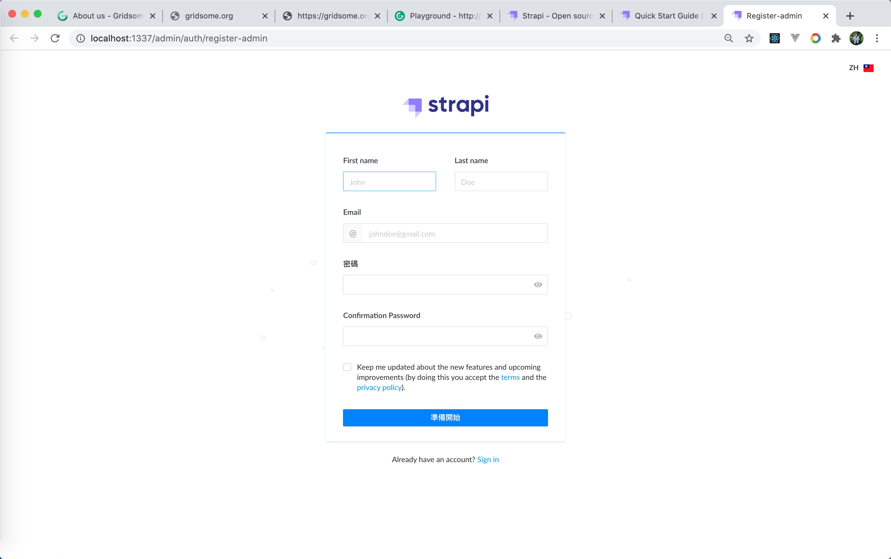
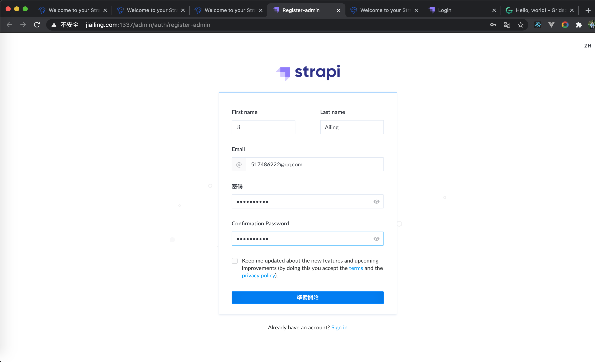
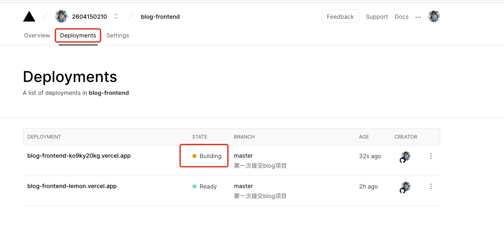
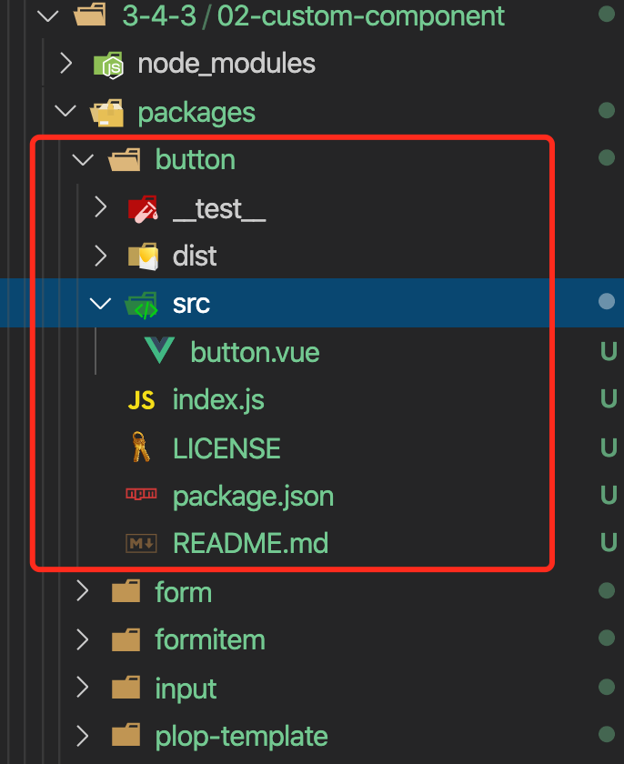

# 搭建自己的 SSR、静态站点生成（SSG）及封装 Vue.js 组件库

## 搭建自己的 SSR

### 一、渲染一个 Vue 实例

- `mkdir vue-ssr`

- `cd vue-ssr`

- `npm init -y`

- `npm i vue vue-server-renderder`

- server.js

  ```js
  const Vue = require("vue");
  const renderer = require("vue-server-renderer").createRenderer();
  const app = new Vue({
    template: `
      <div id="app">
        <h1>{{message}}</h1>
      </div>
    `,
    data: {
      message: "拉钩教育",
    },
  });

  renderer.renderToString(app, (err, html) => {
    if (err) throw err;
    console.log(html);
  });
  ```

- `node server.js`，运行结果：

  ```html
  <div id="app" data-server-rendered="true"><h1>拉钩教育</h1></div>
  ```

  `data-server-rendered="true"`这个属性是为了将来客户端渲染激活接管的接口

### 二、结合到 Web 服务器中

server.js

```js
const Vue = require("vue");
const express = require("express");

const renderer = require("vue-server-renderer").createRenderer();

const server = express();

server.get("/", (req, res) => {
  const app = new Vue({
    template: `
      <div id="app">
        <h1>{{message}}</h1>
      </div>
    `,
    data: {
      message: "拉钩教育",
    },
  });
  renderer.renderToString(app, (err, html) => {
    if (err) {
      return res.status(500).end("Internal Server Error.");
    }
    res.setHeader("Content-Type", "text/html; charset=utf8"); // 设置编码，防止乱码
    res.end(`
      <!DOCTYPE html>
      <html lang="en">
      <head>
        <meta charset="UTF-8">
        <meta name="viewport" content="width=device-width, initial-scale=1.0">
        <title>Document</title>
      </head>
      <body>
        ${html}
      </body>
      </html>
    `);
  });
});

server.listen(3000, () => {
  console.log("server running at port 3000...");
});
```

### 三、使用 HTML 模板

#### 1. 创建 HTML 模板文件

```html
<!DOCTYPE html>
<html lang="en">
  <head>
    <meta charset="UTF-8" />
    <meta name="viewport" content="width=device-width, initial-scale=1.0" />
    <title>Document</title>
  </head>
  <body>
    <!--vue-ssr-outlet-->
  </body>
</html>
```

> `<!--vue-ssr-outlet-->`是占位符，为了接收将来要渲染的变量，不能写错，不能有多余的空格

#### 2. js 代码中的 createRenderer 方法指定模板文件

server.js

```js
const Vue = require("vue");
const express = require("express");
const fs = require("fs");

const renderer = require("vue-server-renderer").createRenderer({
  // 这里指定模板文件
  template: fs.readFileSync("./index.template.html", "utf-8"),
});

const server = express();

server.get("/", (req, res) => {
  const app = new Vue({
    template: `
      <div id="app">
        <h1>{{message}}</h1>
      </div>
    `,
    data: {
      message: "拉钩教育",
    },
  });
  renderer.renderToString(app, (err, html) => {
    // 此处的html参数是被模板文件处理过了的，可以直接输出到用户的页面上
    if (err) {
      return res.status(500).end("Internal Server Error.");
    }
    res.setHeader("Content-Type", "text/html; charset=utf8"); // 设置编码，防止乱码
    res.end(html);
  });
});

server.listen(3000, () => {
  console.log("server running at port 3000...");
});
```

### 四、在模板中使用外部数据

Index.template.html

```html
<!DOCTYPE html>
<html lang="en">
  <head>
    <meta charset="UTF-8" />
    <meta name="viewport" content="width=device-width, initial-scale=1.0" />
    {{{ meta }}}
    <title>{{ title }}</title>
  </head>
  <body>
    <!--vue-ssr-outlet-->
  </body>
</html>
```

> 使用两个花括号可以数据外部数据变量，而标签也会进行转义后输出在页面上。此时可以使用三个花括号原样输出数据，不会对标签进行转义处理

在 js 代码中给`renderer.renderToString`增加第二个参数为外部数据对象

```js
renderer.renderToString(
  app,
  {
    title: "拉勾教育",
    meta: `
      <meta name="description" content="拉勾教育" >
    `,
  },
  (err, html) => {
    if (err) {
      return res.status(500).end("Internal Server Error.");
    }
    res.setHeader("Content-Type", "text/html; charset=utf8"); // 设置编码，防止乱码
    res.end(html);
  }
);
```

### 五、构建配置

#### 1. 基本思路


#### 2. 源码结构

```bash
src
├── components
│   ├── Foo.vue
│   ├── Bar.vue
│   └── Baz.vue
├── App.vue
├── app.js # 通用 entry(universal entry)
├── entry-client.js # 仅运行于浏览器
└── entry-server.js # 仅运行于服务器
```

`App.vue`

```html
<template>
  <div id="app">
    <h1>{{message}}</h1>
    <h2>客户端动态交互</h2>
    <div>
      <input v-model="message" />
    </div>
    <div>
      <button @click="onClick">点击测试</button>
    </div>
  </div>
</template>

<script>
  export default {
    name: "App",
    data: function () {
      return {
        message: "拉勾教育",
      };
    },
    methods: {
      onClick() {
        console.log("Hello World！");
      },
    },
  };
</script>
```

`app.js` 是我们应用程序的「通用 entry」。在纯客户端应用程序中，我们将在此文件中创建根 Vue 实例，并直接挂载到 DOM。但是，对于服务器端渲染(SSR)，责任转移到纯客户端 entry 文件。`app.js` 简单地使用 export 导出一个 `createApp` 函数：

```js
import Vue from "vue";
import App from "./App.vue";

// 导出一个工厂函数，用于创建新的
// 应用程序、router 和 store 实例
export function createApp() {
  const app = new Vue({
    // 根实例简单的渲染应用程序组件。
    render: (h) => h(App),
  });
  return { app };
}
```

`entry-client.js` 客户端 entry 只需创建应用程序，并且将其挂载到 DOM 中：

```js
import { createApp } from "./app";

// 客户端特定引导逻辑……

const { app } = createApp();

// 这里假定 App.vue 模板中根元素具有 `id="app"`
app.$mount("#app");
```

`entry-server.js` 服务器 entry 使用 default export 导出函数，并在每次渲染中重复调用此函数。此时，除了创建和返回应用程序实例之外，它不会做太多事情 - 但是稍后我们将在此执行服务器端路由匹配 (server-side route matching) 和数据预取逻辑 (data pre-fetching logic)。

```js
import { createApp } from "./app";

export default (context) => {
  const { app } = createApp();
  return app;
};
```

#### 3. 安装依赖

(1) 安装生产依赖

```sh
npm i vue vue-server-renderer express cross-env
```

| 包                  | 说明                                |
| ------------------- | ----------------------------------- |
| vue                 | Vue.js 核心库                       |
| vue-server-renderer | Vue 服务端渲染工具                  |
| express             | 基于 Node 的 webpack 服务框架       |
| cross-env           | 通过 npm scripts 设置跨平台环境变量 |

(2) 安装开发依赖

```sh
npm i -D webpack webpack-cli webpack-merge webpack-node-externals @babel/core @babel/plugin-transform-runtime @babel/preset-env babel-loader css-loader url-loader file-loader rimraf vue-loader vue-template-compiler friendly-errors-webpack-plugin
```

| 包                                                                                     | 说明                                   |
| -------------------------------------------------------------------------------------- | -------------------------------------- |
| webpack                                                                                | webpack 核心包                         |
| webpack-cli                                                                            | webpack 的命令行工具                   |
| webpack-merge                                                                          | webpack 配置信息合并工具               |
| webpack-node-externals                                                                 | 排除 webpack 中的 Node 模块            |
| rimraf                                                                                 | 基于 Node 封装的一个跨平台 rm -rf 工具 |
| friendly-errors-webpack-plugin                                                         | 友好的 webpack 错误提示                |
| @babel/core<br/>@babel/plugin-transform-runtime<br/>@babel/preset-env<br/>babel-loader | Babel 相关工具                         |
| vue-loader<br/>vue-template-compiler                                                   | 处理.vue 资源                          |
| file-loader                                                                            | 处理字体资源                           |
| css-loader                                                                             | 处理 CSS 资源                          |
| url-loader                                                                             | 处理图片资源                           |

#### 4. webpack 配置文件及打包命令

(1) 初始化 webpack 打包配置文件

```bash
build
|---webpack.base.config.js # 公共配置
|---webpack.client.config.js # 客户端打包配置文件
|---webpack.server.config.js # 服务端打包配置文件
```

webpack.base.config.js

```js
/**
 * 公共配置
 */
const VueLoaderPlugin = require("vue-loader/lib/plugin");
const path = require("path");
const FriendlyErrorsWebpackPlugin = require("friendly-errors-webpack-plugin");
const resolve = (file) => path.resolve(__dirname, file);

const isProd = process.env.NODE_ENV === "production";

module.exports = {
  mode: isProd ? "production" : "development",
  output: {
    path: resolve("../dist/"),
    publicPath: "/dist/",
    filename: "[name].[chunkhash].js",
  },
  resolve: {
    alias: {
      // 路径别名，@ 指向 src
      "@": resolve("../src/"),
    },
    // 可以省略的扩展名
    // 当省略扩展名的时候，按照从前往后的顺序依次解析
    extensions: [".js", ".vue", ".json"],
  },
  devtool: isProd ? "source-map" : "cheap-module-eval-source-map",
  module: {
    rules: [
      // 处理图片资源
      {
        test: /\.(png|jpg|gif)$/i,
        use: [
          {
            loader: "url-loader",
            options: {
              limit: 8192,
            },
          },
        ],
      },

      // 处理字体资源
      {
        test: /\.(woff|woff2|eot|ttf|otf)$/,
        use: ["file-loader"],
      },

      // 处理 .vue 资源
      {
        test: /\.vue$/,
        loader: "vue-loader",
      },

      // 处理 CSS 资源
      // 它会应用到普通的 `.css` 文件
      // 以及 `.vue` 文件中的 `<style>` 块
      {
        test: /\.css$/,
        use: ["vue-style-loader", "css-loader"],
      },

      // CSS 预处理器，参考：https://vue-loader.vuejs.org/zh/guide/pre-processors.html
      // 例如处理 Less 资源
      // {
      //   test: /\.less$/,
      //   use: [
      //     'vue-style-loader',
      //     'css-loader',
      //     'less-loader'
      //   ]
      // },
    ],
  },
  plugins: [new VueLoaderPlugin(), new FriendlyErrorsWebpackPlugin()],
};
```

webpack.client.config.js

```js
/**
 * 客户端打包配置
 */
const { merge } = require("webpack-merge");
const baseConfig = require("./webpack.base.config.js");
const VueSSRClientPlugin = require("vue-server-renderer/client-plugin");

module.exports = merge(baseConfig, {
  entry: {
    app: "./src/entry-client.js",
  },

  module: {
    rules: [
      // ES6 转 ES5
      {
        test: /\.m?js$/,
        exclude: /(node_modules|bower_components)/,
        use: {
          loader: "babel-loader",
          options: {
            presets: ["@babel/preset-env"],
            cacheDirectory: true,
            plugins: ["@babel/plugin-transform-runtime"],
          },
        },
      },
    ],
  },

  // 重要信息：这将 webpack 运行时分离到一个引导 chunk 中，
  // 以便可以在之后正确注入异步 chunk。
  optimization: {
    splitChunks: {
      name: "manifest",
      minChunks: Infinity,
    },
  },

  plugins: [
    // 此插件在输出目录中生成 `vue-ssr-client-manifest.json`。
    new VueSSRClientPlugin(),
  ],
});
```

webpack.server.config.js

```js
/**
 * 服务端打包配置
 */
const { merge } = require("webpack-merge");
const nodeExternals = require("webpack-node-externals");
const baseConfig = require("./webpack.base.config.js");
const VueSSRServerPlugin = require("vue-server-renderer/server-plugin");

module.exports = merge(baseConfig, {
  // 将 entry 指向应用程序的 server entry 文件
  entry: "./src/entry-server.js",

  // 这允许 webpack 以 Node 适用方式处理模块加载
  // 并且还会在编译 Vue 组件时，
  // 告知 `vue-loader` 输送面向服务器代码(server-oriented code)。
  target: "node",

  output: {
    filename: "server-bundle.js",
    // 此处告知 server bundle 使用 Node 风格导出模块(Node-style exports)
    libraryTarget: "commonjs2",
  },

  // 不打包 node_modules 第三方包，而是保留 require 方式直接加载
  externals: [
    nodeExternals({
      // 白名单中的资源依然正常打包
      allowlist: [/\.css$/],
    }),
  ],

  plugins: [
    // 这是将服务器的整个输出构建为单个 JSON 文件的插件。
    // 默认文件名为 `vue-ssr-server-bundle.json`
    new VueSSRServerPlugin(),
  ],
});
```

#### 5. 配置构建命令

```json
"scripts": {
    "build:client": "cross-env NODE_ENV=production webpack --config build/webpack.client.config.js",
    "build:server": "cross-env NODE_ENV=production webpack --config build/webpack.server.config.js",
    "build": "rimraf dist && npm run build:client && npm run build:server"
  }
```

#### 6. 启动应用

erver.js

```js
const Vue = require("vue");
const express = require("express");
const fs = require("fs");

const serverBundle = require("./dist/vue-ssr-server-bundle.json");
const clientManifest = require("./dist/vue-ssr-client-manifest.json");
const { static } = require("express");
const template = fs.readFileSync("./index.template.html", "utf-8");
const renderer = require("vue-server-renderer").createBundleRenderer(
  serverBundle,
  {
    template,
    clientManifest,
  }
);

const server = express();

// 请求前缀，使用express中间件的static处理
server.use("/dist", express.static("./dist"));

server.get("/", (req, res) => {
  renderer.renderToString(
    {
      title: "拉勾教育",
      meta: `
      <meta name="description" content="拉勾教育" >
    `,
    },
    (err, html) => {
      if (err) {
        return res.status(500).end("Internal Server Error.");
      }
      res.setHeader("Content-Type", "text/html; charset=utf8"); // 设置编码，防止乱码
      res.end(html);
    }
  );
});

server.listen(3001, () => {
  console.log("server running at port 3001...");
});
```

#### 7. 解析渲染流程

### 六、构建配置开发模式

#### 1. 基本思路

生产模式直接渲染，开发模式监视打包构建，重新生成 Renderer 渲染器

#### 2. 提取处理模块

server.js

```js
const Vue = require("vue");
const express = require("express");
const fs = require("fs");
const createBundleRenderer = require("vue-server-renderer");
const setupDevServer = require("./build/setup-dev-server");

const server = express();

// 请求前缀，使用express中间件的static处理
server.use("/dist", express.static("./dist"));

const isProd = process.env.NODE_ENV === "production";

let renderer;
let onReady;
if (isProd) {
  const serverBundle = require("./dist/vue-ssr-server-bundle.json");
  const clientManifest = require("./dist/vue-ssr-client-manifest.json");
  const { static } = require("express");
  const template = fs.readFileSync("./index.template.html", "utf-8");
  renderer = createBundleRenderer(serverBundle, {
    template,
    clientManifest,
  });
} else {
  // 开发模式 -> 监视打包构建 -> 重新生成Renderer渲染器
  onReady = setupDevServer(server, (serverBundle, template, clientManifest) => {
    renderer = createBundleRenderer(serverBundle, {
      template,
      clientManifest,
    });
  });
}

// render 是路由函数
const render = (req, res) => {
  // renderer是Vue SSR的渲染器
  renderer.renderToString(
    {
      title: "拉勾教育",
      meta: `
      <meta name="description" content="拉勾教育" >
    `,
    },
    (err, html) => {
      if (err) {
        return res.status(500).end("Internal Server Error.");
      }
      res.setHeader("Content-Type", "text/html; charset=utf8"); // 设置编码，防止乱码
      res.end(html);
    }
  );
};

server.get(
  "/",
  isProd
    ? render
    : async (req, res) => {
        // 等待有了Renderer渲染器以后，调用render进行渲染
        await onReady;
        render();
      }
);

server.listen(3001, () => {
  console.log("server running at port 3001...");
});
```

build/setup-dev-server.js

```js
module.exports = (server, callback) => {
  let ready; // ready就是promise中的resolve
  const onReady = new Promise((r) => (ready = r));

  // 监视构建 -> 更新 Renderer

  let template;
  let serverBundle;
  let clientManifest;

  return onReady;
};
```

#### 3. update 更新函数

```js
const update = () => {
  if (template && serverBundle && clientManifest) {
    ready();
    callback(serverBundle, template, clientManifest);
  }
};
```

#### 4. 处理模板文件

```js
// 监视构建 template -> 调用 update -> 更新 Renderer 渲染器
const templatePath = path.resolve(__dirname, "../index.template.html");
template = fs.readFileSync(templatePath, "utf-8");
update();
// fs.watch、fs.watchFile
chokidar.watch(templatePath).on("change", () => {
  template = fs.readFileSync(templatePath, "utf-8");
  update();
});
```

#### 5. 服务端监视打包

```js
// 监视构建 serverBundle -> 调用 update -> 更新 Renderer 渲染器
const serverConfig = require("./webpack.server.config");
// serverCompiler是一个webpack编译器，直接监听资源改变，进行打包构建
const serverCompiler = webpack(serverConfig);
serverCompiler.watch({}, (err, stats) => {
  if (err) throw err;
  if (stats.hasErrors()) return;
  serverBundle = JSON.parse(
    fs.readFileSync(resolve("../dist/vue-ssr-server-bundle.json"), "utf-8")
  );
  console.log(serverBundle);
  update();
});
```

#### 6. 把数据写到内存中

```js
// 监视构建 serverBundle -> 调用 update -> 更新 Renderer 渲染器
const serverConfig = require("./webpack.server.config");
const serverCompiler = webpack(serverConfig);
const serverDevMiddleware = devMiddleware(serverCompiler, {
  logLevel: "silent", // 关闭日志输出，由 FriendlyErrorsWebpackPlugin 处理
});
serverCompiler.hooks.done.tap("server", () => {
  serverBundle = JSON.parse(
    serverDevMiddleware.fileSystem.readFileSync(
      resolve("../dist/vue-ssr-server-bundle.json"),
      "utf-8"
    )
  );
  update();
});
```

#### 7. 客户端构建

```js
// 监视构建 clientManifest -> 调用 update -> 更新 Renderer 渲染器
const clientConfig = require("./webpack.client.config");
clientConfig.plugins.push(new webpack.HotModuleReplacementPlugin());
clientConfig.entry.app = [
  "webpack-hot-middleware/client?quiet=true&reload=true", // 和服务端交互处理热更新一个客户端脚本
  clientConfig.entry.app,
];
clientConfig.output.filename = "[name].js"; // 热更新模式下确保一致的 hash
const clientCompiler = webpack(clientConfig);
const clientDevMiddleware = devMiddleware(clientCompiler, {
  publicPath: clientConfig.output.publicPath,
  logLevel: "silent", // 关闭日志输出，由 FriendlyErrorsWebpackPlugin 处理
});
clientCompiler.hooks.done.tap("client", () => {
  clientManifest = JSON.parse(
    clientDevMiddleware.fileSystem.readFileSync(
      resolve("../dist/vue-ssr-client-manifest.json"),
      "utf-8"
    )
  );
  update();
});
```

#### 8. 热更新

```js
clientConfig.plugins.push(new webpack.HotModuleReplacementPlugin());

clientConfig.entry.app = [
  "webpack-hot-middleware/client?quiet=true&reload=true", // 和服务端交互处理热更新一个客户端脚本
  clientConfig.entry.app,
];
clientConfig.output.filename = "[name].js"; // 热更新模式下确保一致的 hash

const hotMiddleware = require("webpack-hot-middleware");

server.use(
  hotMiddleware(clientCompiler, {
    log: false, // 关闭它本身的日志输出
  })
);
```

### 七、编写通用应用注意事项

### 八、路由处理

#### 1. 配置 Vue-Router

router/index.js

```js
import Vue from "vue";
import VueRouter from "vue-router";
import Home from "@/src/pages/Home";

Vue.use(VueRouter);

export const createRouter = () => {
  const router = new VueRouter({
    mode: "history", // 兼容前后端,
    routes: [
      {
        path: "/",
        name: "home",
        component: Home,
      },
      {
        path: "/about",
        name: "about",
        component: () => import("@/src/pages/About"),
      },
      {
        path: "*",
        name: "error404",
        component: () => import("@/src/pages/404"),
      },
    ],
  });
  return router; // 千万别忘了返回router
};
```

#### 2. 将路由注册到根实例

app.js

```js
/**
 * 同构应用通用启动入口
 */
import Vue from "vue";
import App from "./App.vue";
import { createRouter } from "./router/";

// 导出一个工厂函数，用于创建新的
// 应用程序、router 和 store 实例
export function createApp() {
  const router = createRouter();
  const app = new Vue({
    router, // 把路由挂载到Vue根实例当中
    // 根实例简单的渲染应用程序组件。
    render: (h) => h(App),
  });
  return { app, router };
}
```

#### 3. 适配服务端入口

拷贝官网上提供的 entry-server.js

```js
// entry-server.js
import { createApp } from "./app";

export default (context) => {
  // 因为有可能会是异步路由钩子函数或组件，所以我们将返回一个 Promise，
  // 以便服务器能够等待所有的内容在渲染前，
  // 就已经准备就绪。
  return new Promise((resolve, reject) => {
    const { app, router } = createApp();

    // 设置服务器端 router 的位置
    router.push(context.url);

    // 等到 router 将可能的异步组件和钩子函数解析完
    router.onReady(() => {
      const matchedComponents = router.getMatchedComponents();
      // 匹配不到的路由，执行 reject 函数，并返回 404
      if (!matchedComponents.length) {
        return reject({ code: 404 });
      }

      // Promise 应该 resolve 应用程序实例，以便它可以渲染
      resolve(app);
    }, reject);
  });
};
```

路由表里已经配置过 404 页面了，所以不用额外判断 404，然后将 Promise 改成 async/await 的形式，最终如下：

```js
// entry-server.js
import { createApp } from "./app";

export default async (context) => {
  // 因为有可能会是异步路由钩子函数或组件，所以我们将返回一个 Promise，
  // 以便服务器能够等待所有的内容在渲染前，
  // 就已经准备就绪。
  const { app, router } = createApp();

  // 设置服务器端 router 的位置
  router.push(context.url);

  // 等到 router 将可能的异步组件和钩子函数解析完
  await new Promise(router.onReady.bind(router));

  return app;
};
```

#### 4. 服务端 server 适配

我们的服务器代码使用了一个 `*` 处理程序，它接受任意 URL。这允许我们将访问的 URL 传递到我们的 Vue 应用程序中，然后对客户端和服务器复用相同的路由配置！

server.js 处理

```js
// ...

// render 是路由函数
const render = async (req, res) => {
  // renderer是Vue SSR的渲染器
  try {
    const html = await renderer.renderToString({
      title: "拉勾教育",
      meta: `
        <meta name="description" content="拉勾教育" >
      `,
      url: req.url,
    });
    res.setHeader("Content-Type", "text/html; charset=utf8"); // 设置编码，防止乱码
    res.end(html);
  } catch (err) {
    res.status(500).end("Internal Server Error.");
  }
};

// 服务端路由匹配为*，意味着所有的路由都会进入这里
server.get(
  "*",
  isProd
    ? render
    : async (req, res) => {
        // 等待有了Renderer渲染器以后，调用render进行渲染
        await onReady;
        render(req, res);
      }
);

// ...
```

#### 5. 适配客户端入口

需要注意的是，你仍然需要在挂载 app 之前调用 `router.onReady`，因为路由器必须要提前解析路由配置中的异步组件，才能正确地调用组件中可能存在的路由钩子。这一步我们已经在我们的服务器入口 (server entry) 中实现过了，现在我们只需要更新客户端入口 (client entry)：

```js
// entry-client.js

import { createApp } from "./app";

const { app, router } = createApp();

router.onReady(() => {
  app.$mount("#app");
});
```

#### 6. 处理完成

路由出口：

App.vue

```html
<div id="app">
  <ul>
    <li>
      <router-link to="/">Home</router-link>
    </li>
    <li>
      <router-link to="/about">About</router-link>
    </li>
  </ul>

  <!-- 路由出口 -->
  <router-view />
</div>
```

### 八、管理页面

#### 1. Head 内容

```
npm install vue-meta
```

在 src/app.js 里面，增加代码

```js
import VueMeta from "vue-meta";

Vue.use(VueMeta);

Vue.mixin({
  metaInfo: {
    titleTemplate: "%s - 拉勾教育",
  },
});
```

在 entry-server.js 的导出函数里，增加代码：

```js
const meta = app.$meta();
context.meta = meta;
```

将 meta 数据注入到模板页面 index.template.html 中：

```html
<!DOCTYPE html>
<html lang="en">
  <head>
    <meta charset="UTF-8" />
    <meta name="viewport" content="width=device-width, initial-scale=1.0" />
    {{{ meta.inject().title.text() }}} {{{ meta.inject().meta.text() }}}
  </head>
  <body>
    <!--vue-ssr-outlet-->
  </body>
</html>
```

在 vue 页面中的应用：

```js
export default {
  name: "Home",
  metaInfo: {
    title: "首页",
  },
};
```

```js
export default {
  name: "About",
  metaInfo: {
    title: "关于",
  },
};
```

### 九、数据预取和状态管理

#### 1. 思路分析

在服务器端渲染(SSR)期间，我们本质上是在渲染我们应用程序的"快照"，所以如果应用程序依赖于一些异步数据，**那么在开始渲染过程之前，需要先预取和解析好这些数据**。

另一个需要关注的问题是在客户端，在挂载 (mount) 到客户端应用程序之前，需要获取到与服务器端应用程序完全相同的数据 - 否则，客户端应用程序会因为使用与服务器端应用程序不同的状态，然后导致混合失败。

为了解决这个问题，获取的数据需要位于视图组件之外，即放置在专门的数据预取存储容器(data store)或"状态容器(state container)）"中。首先，在服务器端，我们可以在渲染之前预取数据，并将数据填充到 store 中。此外，我们将在 HTML 中序列化(serialize)和内联预置(inline)状态。这样，在挂载(mount)到客户端应用程序之前，可以直接从 store 获取到内联预置(inline)状态。

#### 2. 数据预取

```
npm install vuex
```

创建 src/store/index.js

```js
import Vue from "vue";
import Vuex from "vuex";
import axios from "axios";

Vue.use(Vuex);

export const createStore = () => {
  return new Vuex.Store({
    state: () => ({
      posts: [],
    }),
    mutations: {
      setPosts(state, data) {
        state.posts = data;
      },
    },
    actions: {
      // 在服务端渲染期间，务必让action返回一个promise
      async getPosts({ commit }) {
        // async默认返回Promise
        // return new Promise()
        const { data } = await axios.get("https://cnodejs.org/api/v1/topics");
        commit("setPosts", data.data);
      },
    },
  });
};
```

将容器注入到入口文件 src/app.js

```js
/**
 * 同构应用通用启动入口
 */
import Vue from "vue";
import App from "./App.vue";
import { createRouter } from "./router/";
import VueMeat from "vue-meta";
import { createStore } from "./store";

Vue.use(VueMeta);

Vue.mixin({
  metaInfo: {
    titleTemplate: "%s - 拉勾教育",
  },
});

// 导出一个工厂函数，用于创建新的
// 应用程序、router 和 store 实例
export function createApp() {
  const router = createRouter();
  const store = createStore();
  const app = new Vue({
    router, // 把路由挂载到Vue根实例当中
    store, // 把容器挂载到Vue根实例中
    // 根实例简单的渲染应用程序组件。
    render: (h) => h(App),
  });
  return { app, router, store };
}
```

页面 pages/Posts.vue，使用 serverPrefetch 方法在服务端发起异步请求。

```html
<template>
  <div>
    <h1>Post List</h1>
    <ul>
      <li v-for="post in posts" :key="post.id">{{ post.title }}</li>
    </ul>
  </div>
</template>

<script>
  // import axios from 'axios'
  import { mapState, mapActions } from "vuex";

  export default {
    name: "PostList",
    metaInfo: {
      title: "Posts",
    },
    data() {
      return {
        // posts: []
      };
    },
    computed: {
      ...mapState(["posts"]),
    },

    // Vue SSR 特殊为服务端渲染提供的一个生命周期钩子函数
    serverPrefetch() {
      // 发起 action，返回 Promise
      // this.$store.dispatch('getPosts')
      return this.getPosts();
    },
    methods: {
      ...mapActions(["getPosts"]),
    },

    // 服务端渲染
    //     只支持 beforeCreate 和 created
    //     不会等待 beforeCreate 和 created 中的异步操作
    //     不支持响应式数据
    // 所有这种做法在服务端渲染中是不会工作的！！！
    // async created () {
    //   console.log('Posts Created Start')
    //   const { data } = await axios({
    //     method: 'GET',
    //     url: 'https://cnodejs.org/api/v1/topics'
    //   })
    //   this.posts = data.data
    //   console.log('Posts Created End')
    // }
  };
</script>

<style></style>
```

#### 3. 将数据预取同步到客户端

entry-server.js

```js
// entry-server.js
import { createApp } from "./app";

export default async (context) => {
  // 因为有可能会是异步路由钩子函数或组件，所以我们将返回一个 Promise，
  // 以便服务器能够等待所有的内容在渲染前，
  // 就已经准备就绪。
  const { app, router, store } = createApp();

  const meta = app.$meta();

  // 设置服务器端 router 的位置
  router.push(context.url);

  context.meta = meta;

  // 等到 router 将可能的异步组件和钩子函数解析完
  await new Promise(router.onReady.bind(router));

  // 这个rendered函数会在服务端渲染完毕之后被调用
  context.rendered = () => {
    // Renderer会把 context.state 数据对象内联到页面模板中
    // 最终发送到客户端的页面中会包含一段脚本：window.__INITIAL_STATE__ = context.state
    // 客户端就要把页面中的 window.__INITIAL_STATE__ 拿出来填充到客户端 store 容器中
    context.state = store.state;
  };

  return app;
};
```

entry-client.js

```js
// entry-client.js

import { createApp } from "./app";

const { app, router, store } = createApp();

if (window.__INITIAL_STATE__) {
  store.replaceState(window.__INITIAL_STATE__);
}

router.onReady(() => {
  app.$mount("#app");
});
```

## 静态站点生成

### 一、Gridsome 基础知识

#### 1. Gridsome 是什么

- 一个免费、开源、基于 VUE.js 技术栈的静态网站生成器
- 官方网址：https://gridsome.org
- GitHub: https://github.com/gridsome/gridsome


#### 2. 什么是静态网站生成器

- 静态网站生成器是使用一系列配置、模板以及数据，生成静态 HTML 文件及相关资源的工具
- 这个功能也叫做预渲染
- 生成的网站不需要类似 PHP 这样的服务器
- 只需要放到支持静态资源的 WebServer 或者 CDN 上即可运行

#### 3. 静态网站的好处

- 省钱：不需要专业的服务器，只要能托管静态文件的空间即可
- 快速：不经过后端服务器的处理，只传输内容
- 安全：没有后端程序的支持，自然会更安全

#### 4. 常见的静态网站生成器

- Jekyll(Ruby)
- Hexo(Node)
- Hugo(Golang)
- Gatsby(Node/React)
- Gridsome(Node/Vue)
- 另外，Next.js/Nuxt.js 也能生成静态网站，但它们更多被认为是 SSR（服务端渲染）框架

#### 5. JAMStack

- 这类静态网站生成器还有个漂亮的名字叫做 JAMStack
- JAMStack 的 JAM 是 JavaScript、API 和 Markup 的首字母组合
- 本质上是一种胖前端，通过调用各种 API 来实现更多的功能
- 其实也是一种前后端的模式，只不过离的比较开，甚至前后端来自多个不同的厂商。

#### 6. 静态应用的使用场景

- 不适合有大量路由页面的应用
  - 如果您的站点有成百上千条路由页面，则预渲染将非常缓慢。当然，您每次更新之需要做一次，但是可能要花一些时间。大多数人不会最终获得数千条静态路由页面，而只是以防万一。
- 不适合有大量动态内容的应用
  - 如果渲染路由中包含特定于用户查看其内容或其他动态源的内容，则应确保您具有可以显示的占位符组件，直到动态内容加载到客户端为止，否则可能有点怪异。

#### 7. Gridsome 学习建议

- 使用 Gridsome 需要有一定的 Vue 基础，如果有基础，看过文档，只会觉得它比 Vue 本身更简单一些。

### 二、Gridsome 基础

#### 1. 创建 Gridsome 项目

Gridsome 依赖 sharp，国内的用户很难安装成功 sharp，所以使用淘宝镜像安装 sharp。

```sh
npm config set sharp_binary_host "https://npm.taobao.org/mirrors/sharp"
npm config set sharp_libvips_binary_host "https://npm.taobao.org/mirrors/sharp-libvips"
```

sharp 是 C++语言编写的，所以还要安装 C++环境。

安装 node-gyp，编译 C++扩展包

根据 node-gyp 的官方文档 https://github.com/nodejs/node-gyp 的说明对不同操作系统进行安装命令：

On Unix

- Python v2.7, v3.5, v3.6, v3.7, or v3.8
- `make`
- A proper C/C++ compiler toolchain, like [GCC](https://gcc.gnu.org/)

On macOS

**ATTENTION**: If your Mac has been _upgraded_ to macOS Catalina (10.15), please read [macOS_Catalina.md](https://github.com/nodejs/node-gyp/blob/master/macOS_Catalina.md).

- Python v2.7, v3.5, v3.6, v3.7, or v3.8
- Xcode
  - You also need to install the `XCode Command Line Tools` by running `xcode-select --install`. Alternatively, if you already have the full Xcode installed, you can find them under the menu `Xcode -> Open Developer Tool -> More Developer Tools...`. This step will install `clang`, `clang++`, and `make`.

On Windows

Install the current version of Python from the [Microsoft Store package](https://docs.python.org/3/using/windows.html#the-microsoft-store-package).

然后根据 Gridsome 官网https://gridsome.org/docs/的教程安装gridsome，

```sh
npm install --global @gridsome/cli
```

拉取远程模板到本地：

```sh
gridsome create my-gridsome-site
```

安装依赖的时候比较慢，又没有进度条，可以按 ctrl+C 中断掉，然后进入已经生成的`my-gridsome-site`目录下，执行`rm -rf node_modules`删除半成品 node_modules，然后重新执行`npm install`，此时就能看到进度了。

安装好依赖之后，可以在 package.json 里查看命令。

执行`npm run develop`启动项目


访问 http://localhost:8080/看到以下页面就证明启动成功了。


#### 2. 预渲染

创建一个 Foo.vue 页面

```html
<template>
  <div>
    <h1>Foo Page</h1>
  </div>
</template>

<script>
  export default {
    name: "FooPage",
  };
</script>

<style></style>
```

然后执行`npm run build`进行打包，打包后生成了一个 dist 文件


然后在这个 dist 路径下起一个静态服务：`serve .`

然后访问 http://localhost:5000 就可以看到页面是由服务端渲染好了返回的，然后客户端的交互都是单页面应用形式。

#### 3. 目录结构


`src/main.js`是整个项目的启动入口，里面加载了`/layouts/Default.vue`

```js
// This is the main.js file. Import global CSS and scripts here.
// The Client API can be used here. Learn more: gridsome.org/docs/client-api

import DefaultLayout from "~/layouts/Default.vue";

export default function (Vue, { router, head, isClient }) {
  // Set default layout as a global component
  Vue.component("Layout", DefaultLayout);
}
```

`Default.vue`中有个特别之处：

```html
<static-query> query { metadata { siteName } } </static-query>
```

这个 query 是查询 gridsome 数据给组件用的。

`src/templates`文件夹是放集合的节点。

`src/pages`是路由页面。

`src/layouts`放布局组件。

`src/components`放公共组件。

`src/.temp`放打包过程生成的文件。

`.catch`是缓存的一些内容

`node_modules`放第三方包

`static`放不需要打包编译的文件，指静态的资源

`gridsome.config.js` gridsome 的配置文件

`gridsome.server.js` 也是 girdsome 的配置文件，是配置服务端的，Gridsome 内部的服务配置。

#### 4. 项目配置

在 https://gridsome.org/docs/config 可以查看 Gridsome 的配置

gridsome.config.js

```js
// This is where project configuration and plugin options are located.
// Learn more: https://gridsome.org/docs/config

// Changes here require a server restart.
// To restart press CTRL + C in terminal and run `gridsome develop`

module.exports = {
  siteName: "拉钩教育",
  siteDescription: "大前端",
  plugins: [],
};
```

#### 5. Pages

(1) 基于文件形式

直接在 src/pages 目录下创建一个文件

(2) 基于编程方式

gridsome.server.js

```js
api.createPages(({ createPage }) => {
  // Use the Pages API here: https://gridsome.org/docs/pages-api/
  createPage({
    path: "/my-page",
    component: "./src/templates/MyPage.vue",
  });
});
```

src/templates/MyPage.vue

```html
<template>
  <div>
    <h1>MyPage</h1>
  </div>
</template>

<script>
  export default {
    name: "MyPage",
    metaInfo: {
      title: "MyPage", // 配置header中的title
    },
  };
</script>

<style></style>
```

重启项目后访问`http://localhost:8080/my-page`就可以看到 MyPage 页面。

#### 6. 动态路由

(1) pages 下面创建的页面文件名称用方括号括起来，作为动态路由参数

src/pages/user/[id].vue

```html
<template>
  <div>
    <h1>User {{ $route.params.id }} Page</h1>
  </div>
</template>

<script>
  export default {
    name: "UserPage",
  };
</script>

<style></style>
```

重启后访问：`http://localhost:8080/user/1`

就可以看到 User 1 Page 这个内容了

(2) 编程方式

gridsome.server.js

```js
api.createPages(({ createPage }) => {
  createPage({
    path: "/user/:id(\\d+)",
    component: "./src/templates/User.vue",
  });
});
```

#### 7. 添加集合

定义一个页面 Posts1.vue

```html
<template>
  <Layout>
    <h1>Posts1</h1>
    <ul>
      <li v-for="post in posts" :key="post.id">{{ post.title }}</li>
    </ul>
  </Layout>
</template>

<script>
  import axios from "axios";
  export default {
    name: "Posts1",
    data() {
      return {
        posts: [],
      };
    },
    async created() {
      const { data } = await axios.get(
        "https://jsonplaceholder.typicode.com/posts"
      );
      this.posts = data;
    },
  };
</script>

<style></style>
```

数据是在客户端动态加载请求过来的，不是预渲染生成的。

想要数据预渲染，得使用 Gridsome 中的集合 Collections

```js
// gridsome.server.js
const axios = require("axios");

module.exports = function (api) {
  api.loadSource(async (actions) => {
    const collection = actions.addCollection("Post");

    const { data } = await axios.get("https://api.example.com/posts");

    for (const item of data) {
      collection.addNode({
        id: item.id,
        title: item.title,
        content: item.content,
      });
    }
  });
};
```

#### 8. 在 GraphQL 中查询数据


#### 9. 在页面中查询 GraphQL 查询数据

Posts2.vue，静态页面，服务端渲染的

```html
<template>
  <Layout>
    <h1>Posts2</h1>
    <ul>
      <li v-for="edge in $page.posts.edges" :key="edge.node.id">
        <g-link to="/">{{edge.node.title}}</g-link>
      </li>
    </ul>
  </Layout>
</template>

<script>
  export default {
    name: "Posts2",
  };
</script>

<style></style>

<page-query>
  query { posts: allPost { edges { node { id title } } } }
</page-query>
```

#### 10. 使用模板渲染结点

配置动态路由模板

```js
// gridsome.config.js
module.exports = {
  siteName: "拉钩教育",
  siteDescription: "大前端",
  plugins: [],
  templates: {
    Post: [
      {
        path: "/posts/:id",
        component: "./src/templates/Post.vue",
      },
    ],
  },
};
```

模板页面 src/template/Post.vue，预渲染页面，从 GraphQL 获取的数据

```html
<template>
  <Layout>
    <h1>{{$page.post.title}}</h1>
    <p>{{$page.post.content}}</p>
  </Layout>
</template>

<page-query>
  query($id: ID!) { # 动态路由参数会自动传入进来 post(id: $id) { id title
  content } }
</page-query>
<script>
  export default {
    name: "PostPage",
    metaInfo() {
      return {
        title: this.$page.post.title,
      };
    },
  };
</script>

<style></style>
```

metaInfo 写成函数形式可以通过`this.$page`获取到 graphQL 返回的数据。

### 三、Gridsome 案例

#### 1. 创建项目

```sh
gridsome create blog-with-gridsome
```

当进入 install 的时候按 ctrl C 中断，然后进入文件夹执行 npm install 来安装第三方包

```sh
cd blog-with-gridsome
npm install
```

#### 2. 处理首页模板

Fork `Bootstrap`的一个模板：https://github.com/StartBootstrap/startbootstrap-clean-blog

然后执行`git clone https://github.com/2604150210/startbootstrap-clean-blog --depth=1`，只克隆最后一个版本就行了。

然后回到我们的项目中，安装需要的依赖

```sh
npm i bootstrap
npm i @fortawesome/fontawesome-free
```

创建 src/assets/css/index.css

```css
@import url("https://fonts.googleapis.com/css?family=Lora:400,700,400italic,700italic");
@import url("https://fonts.googleapis.com/css?family=Open+Sans:300italic,400italic,600italic,700italic,800italic,400,300,600,700,800"); /* 下面将startbootstrap-clean-blog里面的css/clean-blog.css里面的内容复制到此处 */
```

在 src/main.js 中开始位置增加：

```js
import "bootstrap/dist/css/bootstrap.min.css";
import "@fortawesome/fontawesome-free/css/all.min.css";

import "./assets/css/index.css";
```

把 startbootstrap-clean-blog 中的 img 文件夹拷贝到我们的项目中的 static 中，作为静态资源使用。

把 startbootstrap-clean-blog 中的 index.html 里面的 body 部分的 HTML 代码拷贝到我们的项目中的 src/pages/Index.vue 中

#### 3. 处理其他页面模板

将 Index.vue 中的头部、尾部代码剪切到 layouts/Default.vue 中，注意头尾代码块中间要放一个`<slot/>`插槽

然后将 Index.vue 的最外层组件由 div 改为 Layout。Layout 已经在全局注册过了，可以直接使用

然后写 Post.vue、About.vue、Contact.vue 页面，把 startbootstrap-clean-blog 中的 post.html、about.html、contact.html 中的代码拿过来即可。

#### 4. 使用本地 md 文件管理文章内容

```sh
npm i @gridsome/source-filesystem
npm i @gridsome/transformer-remark # 转换MD文件
```

创建两个 md 文件， content/blog/article1.md、contetn/blog/artcle2.md

在 GraphQL 中查询数据：


#### 5. Strapi 介绍

网址：https://strapi.io/

strapi 是一个通用的内容管理系统。

执行创建 strapi 命令

```sh
yarn create strapi-app my-project --quickstart
```



创建一个 Content Type


#### 6. 使用 strapi 数据接口

默认是 Restful API

https://strapi.io/documentation/v3.x/content-api/api-endpoints.html#get-an-entry


给用户配置权限：


使用 Postman 进行接口测试：


#### 7. 访问受保护的 API


创建一个用户：admin, 123456


注册、登录的 API：https://strapi.io/documentation/v3.x/plugins/users-permissions.html#concept

使用 Postman 测试登录接口


请求其他接口时，http 头部要增加授权信息 Authorization: `Bearer ${token}`


#### 8. 将 Strapi 数据预取到 Gridsome 应用中

安装

```sh
npm install @gridsome/source-strapi
```

使用

```js
// gridsome.config.js
export default {
  plugins: [
    {
      use: "@gridsome/source-strapi",
      options: {
        apiURL: "http://localhost:1337",
        queryLimit: 1000, // Defaults to 100
        contentTypes: ["article", "user"],
        singleTypes: ["impressum"],
        // Possibility to login with a Strapi user,
        // when content types are not publicly available (optional).
        loginData: {
          identifier: "",
          password: "",
        },
      },
    },
  ],
};
```

重启应用，才会拉取最新数据。

#### 9. 设计文章标签数据模型

删除原来的测试数据：


创建新的 Content Type，名称为 Post，有四个字段


再创建一个新的 Content Type，名称为 Tag，有两个字段，其中字段 posts 为引用类型，为多对多的关系


新增一个 Tag，标题为 HTML

然后修改 post 里面的标题为 post 1 的数据，选择 Tags 为 HTML


然后回到 Tags 表中的 HTML 数据的编辑屏，还可以再关联别的 Posts


#### 10. 展示文章列表、分页

src/pages/Index.vue

```html
<template>
  <Layout>
    <!-- Page Header -->
    <header class="masthead" style="background-image: url('/img/home-bg.jpg')">
      <div class="overlay"></div>
      <div class="container">
        <div class="row">
          <div class="col-lg-8 col-md-10 mx-auto">
            <div class="site-heading">
              <h1>Clean Blog</h1>
              <span class="subheading">A Blog Theme by Start Bootstrap</span>
            </div>
          </div>
        </div>
      </div>
    </header>

    <!-- Main Content -->
    <div class="container">
      <div class="row">
        <div class="col-lg-8 col-md-10 mx-auto">
          <div
            class="post-preview"
            v-for="edge in $page.posts.edges"
            :key="edge.node.id"
          >
            <g-link :to="'post/'+edge.node.id">
              <h2 class="post-title">{{edge.node.title}}</h2>
            </g-link>
            <p class="post-meta">
              Posted by
              <a href="#"
                >{{edge.node.created_by.firstname +
                edge.node.created_by.lastname}}</a
              >
              on {{edge.node.created_at}}
            </p>
            <p>
              <span v-for="tag in edge.node.tags" :key="tag.id">
                <a href="">{{tag.title}}</a>
                &nbsp;&nbsp;
              </span>
            </p>
            <hr />
          </div>
          <Pager :info="$page.posts.pageInfo" />
        </div>
      </div>
    </div>
  </Layout>
</template>

<page-query>
  query ($page: Int) { posts: allStrapiPost (perPage: 2, page: $page) @paginate
  { pageInfo { totalPages currentPage } edges { node { id title created_at
  created_by { id firstname lastname } tags { id title } } } } }
</page-query>
<script>
  import { Pager } from "gridsome";
  export default {
    name: "HomePage",
    components: {
      Pager,
    },
    metaInfo: {
      title: "Hello, world!",
    },
  };
</script>
```

#### 11. 展示文章详情

gridsome.config.js

```js
module.exports = {
  siteName: "Gridsome",
  plugins: [
    {
      use: "@gridsome/source-filesystem",
      options: {
        typeName: "BlogPost",
        path: "./content/blog/**/*.md",
      },
    },
    {
      use: "@gridsome/source-strapi",
      options: {
        apiURL: "http://localhost:1337",
        queryLimit: 1000, // Defaults to 100
        contentTypes: ["post", "tag"], // StrapiPost
        // typeName: 'Strapi,
        // singleTypes: ['impressum'],
        // Possibility to login with a Strapi user,
        // when content types are not publicly available (optional).
        // loginData: {
        //   identifier: '',
        //   password: ''
        // }
      },
    },
  ],
  templates: {
    // StrapiPost为上面Plugin中配置的typeName和contentTypes的组合
    StrapiPost: [
      {
        path: "/post/:id",
        component: "./src/templates/Post.vue",
      },
    ],
  },
};
```

src/templates/Post.vue

```html
<template>
  <Layout>
    <!-- Page Header -->
    <header
      class="masthead"
      :style="{backgroundImage: `url(http://localhost:1337${$page.post.cover.url})`}"
    >
      <div class="overlay"></div>
      <div class="container">
        <div class="row">
          <div class="col-lg-8 col-md-10 mx-auto">
            <div class="post-heading">
              <h1>{{$page.post.title}}</h1>
              <span class="meta"
                >Posted by
                <a href="#"
                  >{{$page.post.created_by.firstname +
                  $page.post.created_by.lastname}}</a
                >
                on {{$page.post.created_at}}</span
              >
            </div>
          </div>
        </div>
      </div>
    </header>

    <!-- Post Content -->
    <article>
      <div class="container">
        <div class="row">
          <div class="col-lg-8 col-md-10 mx-auto">{{$page.post.content}}</div>
        </div>
      </div>
    </article>
  </Layout>
</template>

<page-query>
  query($id: ID!) { post: strapiPost(id: $id) { id title content cover { url }
  tags { id title } created_at created_by { id firstname lastname } } }
</page-query>

<script>
  export default {
    name: "PostPage",
  };
</script>

<style></style>
```

#### 12. 处理 Markdown 格式的文章内容

安装 markdown 处理器：`npm install markdown-it`

src/templates/Post.vue

```html
<div
  class="col-lg-8 col-md-10 mx-auto"
  v-html="mdToHtml($page.post.content)"
></div>

<script>
  import MarkDownIt from "markdown-it";
  const md = new MarkDownIt();
  export default {
    name: "PostPage",
    methods: {
      mdToHtml(markdown) {
        return md.render(markdown);
      },
    },
  };
</script>
```

#### 13. 文章标签处理

src/templates/Tag.vue

```html
<template>
  <Layout>
    <!-- Page Header -->
    <header class="masthead" style="background-image: url('/img/home-bg.jpg')">
      <div class="overlay"></div>
      <div class="container">
        <div class="row">
          <div class="col-lg-8 col-md-10 mx-auto">
            <div class="site-heading">
              <h1># {{$page.tag.title}}</h1>
            </div>
          </div>
        </div>
      </div>
    </header>

    <!-- Main Content -->
    <div class="container">
      <div class="row">
        <div class="col-lg-8 col-md-10 mx-auto">
          <div
            class="post-preview"
            v-for="post in $page.tag.posts"
            :key="post.id"
          >
            <g-link :to="'post/'+post.id">
              <h2 class="post-title">{{post.title}}</h2>
            </g-link>
            <p class="post-meta">Posted by on {{post.created_at}}</p>
            <hr />
          </div>
        </div>
      </div>
    </div>
  </Layout>
</template>

<page-query>
  query($id: ID!) { tag: strapiTag(id: $id) { title id posts { id title
  created_at } } }
</page-query>

<script>
  export default {
    name: "TagPage",
  };
</script>

<style></style>
```

gridsome.config.js

```js
module.exports = {
  siteName: "Gridsome",
  plugins: [
    {
      use: "@gridsome/source-filesystem",
      options: {
        typeName: "BlogPost",
        path: "./content/blog/**/*.md",
      },
    },
    {
      use: "@gridsome/source-strapi",
      options: {
        apiURL: "http://localhost:1337",
        queryLimit: 1000, // Defaults to 100
        contentTypes: ["post", "tag"], // StrapiPost
      },
    },
  ],
  templates: {
    // StrapiPost为上面Plugin中配置的typeName和contentTypes的组合
    StrapiPost: [
      {
        path: "/post/:id",
        component: "./src/templates/Post.vue",
      },
    ],
    StrapiTag: [
      {
        path: "/tag/:id",
        component: "./src/templates/Tag.vue",
      },
    ],
  },
};
```

#### 14. 网站基本设置

创建 Single Type


创建一个名为 general 的 Single Type，有三个字段，如下：


配置 general 数据：


gridsome.config.js 的 source-strapi 插件增加`singleTypes: ['general']`配置，就可以获取 general 数据，重启项目就生效。

src/pages/Index.vue

```html
<!-- Page Header -->
<header
  class="masthead"
  :style="{
        backgroundImage: `url(http://localhost:1337${general.cover.url})`
      }"
>
  <div class="overlay"></div>
  <div class="container">
    <div class="row">
      <div class="col-lg-8 col-md-10 mx-auto">
        <div class="site-heading">
          <h1>{{general.title}}</h1>
          <span class="subheading">{{general.subtitle}}</span>
        </div>
      </div>
    </div>
  </div>
</header>
```

```html
<page-query>
  query ($page: Int) { # ---- general: allStrapiGeneral { edges { node { title
  subtitle cover { url } } } } }
</page-query>
```

```html
<script>
  import { Pager } from "gridsome";
  export default {
    // ----

    computed: {
      general() {
        return this.$page.general.edges[0].node;
      },
    },
  };
</script>
```

#### 15. 联系我 Contact 页面

创建一个 contact 的 Content Type


使用 Postman 创建一条数据


页面中使用传统客户端表单提交功能

src/pages/Contact.vue

```html
<input
  v-model="form.name"
  type="text"
  class="form-control"
  placeholder="Name"
  id="name"
  required
  data-validation-required-message="Please enter your name."
/>

<input
  v-model="form.email"
  type="email"
  class="form-control"
  placeholder="Email Address"
  id="email"
  required
  data-validation-required-message="Please enter your email address."
/>

<input
  v-model="form.phone"
  type="tel"
  class="form-control"
  placeholder="Phone Number"
  id="phone"
  required
  data-validation-required-message="Please enter your phone number."
/>

<textarea
  v-model="form.message"
  rows="5"
  class="form-control"
  placeholder="Message"
  id="message"
  required
  data-validation-required-message="Please enter a message."
></textarea>

<button
  type="submit"
  class="btn btn-primary"
  id="sendMessageButton"
  @click.prevent="onSubmit"
>
  Send
</button>
```

```html
<script>
  import axios from "axios";
  export default {
    name: "ContactPage",
    data() {
      return {
        form: {
          name: "",
          email: "",
          phone: "",
          message: "",
        },
      };
    },
    methods: {
      async onSubmit() {
        try {
          const { data } = await axios({
            method: "POST",
            url: "http://localhost:1337/contacts",
            data: this.form,
          });
          window.alert("发送成功");
        } catch (e) {
          alert("发送失败，请稍后重试");
        }
      },
    },
  };
</script>
```

#### 16. 部署 strapi

先部署 strapi、再部署 Gridsome。strapi 部署环境依赖于 node 环境的服务器，而 Gridsome 只需要支持静态网页的服务器就行。

##### (1) 配置为 strapi 后台服务配置数据库为 MySQL

其他数据库配置可以参考这里：https://strapi.io/documentation/v3.x/concepts/configurations.html#database

config/database.js

```js
module.exports = ({ env }) => ({
  defaultConnection: "default",
  connections: {
    default: {
      connector: "bookshelf",
      settings: {
        client: "mysql",
        host: env("DATABASE_HOST", "localhost"), // strapi部署的服务器与MySQL所在的服务器是同一个服务器，主机就直接写localhost
        port: env.int("DATABASE_PORT", 3306),
        database: env("DATABASE_NAME", "blog"),
        username: env("DATABASE_USERNAME", "blog"),
        password: env("DATABASE_PASSWORD", "oPqc0Am9lfhWKNuT"),
      },
      options: {},
    },
  },
});
```

安装 MySQL 数据的依赖

```sh
npm install mysql
```

##### (2) 将代码上传到 gitee 上

```sh
git init
echo node_modules > .gitignore
git add .
git commit -m"第一次提交"
git remote add origin git@gitee.com:jiailing/blog-backend.git
git push -u origin master
```

##### (3) 登录到服务器进行部署

先进入 MySQL

```sh
mysql -uroot -p
```

创建用户 blog，和数据库 blog，并且给该用户授权操作该数据库

```mysql
CREATE USER 'blog'@'%' IDENTIFIED BY 'oPqc0Am9lfhWKNuT';
CREATE DATABASE blog;
FLUSH PRIVILEGES;
GRANT ALL ON blog.* TO 'blog'@'%';
exit;
```

然后回到存放代码的目录下，拉取 gitee 上的代码，并且安装项目依赖

```sh
git clone https://gitee.com/jiailing/blog-backend
cd blog-backend
npm config set sharp_binary_host "https://npm.taobao.org/mirrors/sharp"
npm config set sharp_libvips_binary_host "https://npm.taobao.org/mirrors/sharp-libvips"
npm install
npm run build
npm run start
```

或者执行`npm run develop`也可以启动项目。

如果执行 build 时命令行卡在了 90%进度时，直接中断掉执行 start 就可以了。

然后就可以通过 主机地址+1337 端口号来访问页面了。

start 此时命令行被占用，退出命令行服务就会停止，所以使用 pm2 守护进程，让一个 node 应用启动在后台

```sh
pm2 start --name blog-backend npm -- run start
```

或者

```sh
pm2 start --name blog-backend npm -- run develop
```

依旧是通过 主机地址+1337 端口号来访问页面。




登录后别忘了给用户分配权限

#### 17. 把本地服务连通远程应用

grid.config.js 中的 strapi 插件的配置中的 URL 接口要改为线上接口，

```jso
apiURL: process.env.GRIDSOME_API_URL
```

为了区分开发接口和生产接口，可以配置环境变量

.env.production

```sh
GRIDSOME_API_URL=http://jiailing.com:1337
```

.env.development

```sh
GRIDSOME_API_URL=http://localhost:1337
```

在 src/main.js 中注入环境变量到页面模板中使用：

```js
export default function (Vue, { router, head, isClient }) {
  Vue.mixin({
    data() {
      return {
        GRIDSOME_API_URL: process.env.GRIDSOME_API_URL,
      };
    },
  });
  // Set default layout as a global component
  Vue.component("Layout", DefaultLayout);
}
```

将页面中之前用到 localhost:1337 的路径都替换掉，如背景图片：

```js
:style="{backgroundImage: `url(${GRIDSOME_API_URL+$page.post.cover.url})`}"
```

#### 18. 部署 Gridsome 应用

vercel 可以使得在 Gridsome 代码发生了改变，或者 strapi 的数据发生了改变时，都可以触发 Gridsome 的自动部署。

Vercel 网址：vercel.com

使用 GitHub 登录，GitHub 的邮箱是 QQ 邮箱会出问题，我改成了 163 邮箱就可以了。


导入 blog 前端仓库的地址，我已经将项目上传到了 GitHub 上了。


飘下了成功的彩带~


创建自动部署钩子


复制钩子到 strapi 里


在 strapi 的设置里添加 webHook，请求地址为刚才复制的 Vercel 的里部署钩子地址。


修改代码提交或者是 strapi 数据变化都会触发 Vercel 里的项目重新部署：



---

## 封装 Vue.js 组件库

### 一、组件库介绍

#### 1. 开源组件库

- Element-UI
- IView

#### 2. 组件开发方式 CDD

- 自下而上
- 从组件级别开始，到页面级别结束

#### 3. CDD 的好处

- 组件在最大程度上被重用
- 并行开发
- 可视化测试

### 二、处理组件边界情况

vue 中处理组件边界情况的 API

#### 1. `$root`

01-root.vue

```html
<template>
  <div>
    <!--
      小型应用中可以在 vue 根实例里存储共享数据
      组件中可以通过 $root 访问根实例
    -->
    $root.title：{{ $root.title }}
    <br />
    <button @click="$root.handle">获取 title</button>&nbsp;&nbsp;
    <button @click="$root.title = 'Hello $root'">改变 title</button>
  </div>
</template>

<script>
  export default {};
</script>

<style></style>
```

#### 2. `$parent /​ $children`

- `$parent`

01-parent.vue

```html
<template>
  <div class="parent">
    parent
    <child></child>
  </div>
</template>

<script>
  import child from "./02-child";
  export default {
    components: {
      child,
    },
    data() {
      return {
        title: "获取父组件实例",
      };
    },
    methods: {
      handle() {
        console.log(this.title);
      },
    },
  };
</script>

<style>
  .parent {
    border: palegreen 1px solid;
  }
</style>
```

02-child.vue

```html
<template>
  <div class="child">
    child<br />
    $parent.title：{{ $parent.title }}<br />
    <button @click="$parent.handle">获取 $parent.title</button>
    <button @click="$parent.title = 'Hello $parent.title'">
      改变 $parent.title
    </button>

    <grandson></grandson>
  </div>
</template>

<script>
  import grandson from "./03-grandson";
  export default {
    components: {
      grandson,
    },
  };
</script>

<style>
  .child {
    border: paleturquoise 1px solid;
  }
</style>
```

03-grandson.vue

```html
<template>
  <div class="grandson">
    grandson<br />
    $parent.$parent.title：{{ $parent.$parent.title }}<br />
    <button @click="$parent.$parent.handle">获取 $parent.$parent.title</button>
    <button @click="$parent.$parent.title = 'Hello $parent.$parent.title'">
      改变 $parent.$parent.title
    </button>
  </div>
</template>

<script>
  export default {};
</script>

<style>
  .grandson {
    border: navajowhite 1px solid;
  }
</style>
```

- `$children`

  通过数组索引获取对应的 children

#### 3. `$ref`

01-parent.vue

```html
<template>
  <div>
    <myinput ref="mytxt"></myinput>

    <button @click="focus">获取焦点</button>
  </div>
</template>

<script>
  import myinput from "./02-myinput";
  export default {
    components: {
      myinput,
    },
    methods: {
      focus() {
        this.$refs.mytxt.focus();
        this.$refs.mytxt.value = "hello";
      },
    },
    // mounted () {
    //   this.$refs.mytxt.focus()
    // }
  };
</script>

<style></style>
```

02-myinput.vue

```html
<template>
  <div>
    <input v-model="value" type="text" ref="txt" />
  </div>
</template>

<script>
  export default {
    data() {
      return {
        value: "default",
      };
    },
    methods: {
      focus() {
        this.$refs.txt.focus();
      },
    },
  };
</script>

<style></style>
```

#### 4. 依赖注入`provide/inject`

注意：inject 进来的数据是非响应式的。

01-parent.vue

```html
<template>
  <div class="parent">
    parent
    <child></child>
  </div>
</template>

<script>
  import child from "./02-child";
  export default {
    components: {
      child,
    },
    provide() {
      return {
        title: this.title,
        handle: this.handle,
      };
    },
    data() {
      return {
        title: "父组件 provide",
      };
    },
    methods: {
      handle() {
        console.log(this.title);
      },
    },
  };
</script>

<style>
  .parent {
    border: palegreen 1px solid;
  }
</style>
```

02-child.vue

```html
<template>
  <div class="child">
    child<br />
    title：{{ title }}<br />
    <button @click="handle">获取 title</button>
    <button @click="title='xxx'">改变 title</button>
    <grandson></grandson>
  </div>
</template>

<script>
  import grandson from "./03-grandson";
  export default {
    components: {
      grandson,
    },
    inject: ["title", "handle"],
  };
</script>

<style>
  .child {
    border: paleturquoise 1px solid;
  }
</style>
```

03-grandson.vue

```html
<template>
  <div class="grandson">
    grandson<br />
    title：{{ title }}<br />
    <button @click="handle">获取 title</button>
    <button @click="title='yyy'">改变 title</button>
  </div>
</template>

<script>
  export default {
    inject: ["title", "handle"],
  };
</script>

<style>
  .grandson {
    border: navajowhite 1px solid;
  }
</style>
```

### 三、`$attrs` / `$listeners`

`$attrs`：把父组件中非 prop 属性绑定到内部组件

`$listeners`：把父组件中的的 DOM 对象的原生事件绑定到内部组件

01-parent.vue

```html
<template>
  <div>
    <!-- <myinput
      required
      placeholder="Enter your username"
      class="theme-dark"
      data-test="test">
    </myinput> -->

    <myinput
      required
      placeholder="Enter your username"
      class="theme-dark"
      @focus="onFocus"
      @input="onInput"
      data-test="test"
    >
    </myinput>
    <button @click="handle">按钮</button>
  </div>
</template>

<script>
  import myinput from "./02-myinput";
  export default {
    components: {
      myinput,
    },
    methods: {
      handle() {
        console.log(this.value);
      },
      onFocus(e) {
        console.log(e);
      },
      onInput(e) {
        console.log(e.target.value);
      },
    },
  };
</script>

<style></style>
```

02-myinput.vue

```html
<template>
  <!--
    1. 从父组件传给自定义子组件的属性，如果没有 prop 接收
       会自动设置到子组件内部的最外层标签上
       如果是 class 和 style 的话，会合并最外层标签的 class 和 style 
  -->
  <!-- <input type="text" class="form-control" :placeholder="placeholder"> -->

  <!--
    2. 如果子组件中不想继承父组件传入的非 prop 属性，可以使用 inheritAttrs 禁用继承
       然后通过 v-bind="$attrs" 把外部传入的非 prop 属性设置给希望的标签上

       但是这不会改变 class 和 style
  -->
  <!-- <div>
    <input type="text" v-bind="$attrs" class="form-control">
  </div> -->

  <!--
    3. 注册事件
  -->

  <!-- <div>
    <input
      type="text"
      v-bind="$attrs"
      class="form-control"
      @focus="$emit('focus', $event)"
      @input="$emit('input', $event)"
    >
  </div> -->

  <!--
    4. $listeners
  -->

  <div>
    <input type="text" v-bind="$attrs" class="form-control" v-on="$listeners" />
  </div>
</template>

<script>
  export default {
    // props: ['placeholder', 'style', 'class']
    // props: ['placeholder']
    inheritAttrs: false,
  };
</script>

<style></style>
```

### 四、快速原型开发

- VueCLI 中提供了一个插件可以进行原型快速开发
- 需要先额外安装一个全局的扩展:`npm install -g @vue/cli-service-global`

#### 1. Vue serve

- Vue serve 如果不指定参数默认会在当前目录找一下的入口文件
  - main.js、index.js、App.vue、app.vue
- 可以指定要架子啊的组件
  - `vue serve ./src/login.vue`

写一个 vue 组件，App.vue

```html
<template>
  <div>Hello vue</div>
</template>

<script>
  export default {};
</script>

<style></style>
```

然后执行`vue serve`

启动了一个服务，打开终端给出的地址，就可以看到这个组件的页面了。

#### 2. ElementUI

安装 ElementUI

- 初始化 package.json：`npm init -y`
- 安装 ElementUI：`vue add element`
- 加载 ElementUI，使用 Vue.use()安装插件

### 五、组件开发

#### 1. 步骤条组件

- 第三方组件
- 基础组件
- 业务组件

Steps-test.vue

```html
<template>
  <div>
    <Steps :count="count" :active="active"></Steps>
    <button @click="next">下一步</button>
  </div>
</template>

<script>
  import Steps from "./Steps";
  export default {
    components: {
      Steps,
    },
    data() {
      return {
        count: 4,
        active: 0,
      };
    },
    methods: {
      next() {
        this.active++;
      },
    },
  };
</script>

<style></style>
```

Steps.vue

```html
<template>
  <div class="lg-steps">
    <div class="lg-steps-line"></div>
    <div
      class="lg-step"
      v-for="index in count"
      :key="index"
      :style="{
        color: active >= index ? activeColor: defaultColor
      }"
    >
      {{ index }}
    </div>
  </div>
</template>

<script>
  import "./steps.css";
  export default {
    name: "LgSteps",
    props: {
      count: {
        type: Number,
        default: 3,
      },
      active: {
        type: Number,
        default: 1,
      },
      activeColor: {
        type: String,
        default: "red",
      },
      defaultColor: {
        type: String,
        default: "green",
      },
    },
  };
</script>

<style></style>
```

steps.css

```css
.lg-steps {
  position: relative;
  display: flex;
  justify-content: space-between;
}

.lg-steps-line {
  position: absolute;
  height: 2px;
  top: 50%;
  left: 24px;
  right: 24px;
  transform: translateY(-50%);
  z-index: 1;
  background: rgb(223, 231, 239);
}

.lg-step {
  border: 2px solid;
  border-radius: 50%;
  height: 32px;
  width: 32px;
  display: flex;
  justify-content: center;
  align-items: center;
  font-weight: 700;
  z-index: 2;
  background-color: white;
  box-sizing: border-box;
}
```

#### 2. 表单组件

整体结构

- Form
- FormItem
- Input
- Button

Input 组件验证

- Input 组件中触发自定义事件 validate
- FormItem 渲染完毕注册自定义事件 validate

Form-test.vue

```html
<template>
  <lg-form class="form" ref="form" :model="user" :rules="rules">
    <lg-form-item label="用户名" prop="username">
      <!-- <lg-input v-model="user.username"></lg-input> -->
      <lg-input
        :value="user.username"
        @input="user.username=$event"
        placeholder="请输入用户名"
      ></lg-input>
    </lg-form-item>
    <lg-form-item label="密码" prop="password">
      <lg-input type="password" v-model="user.password"></lg-input>
    </lg-form-item>
    <lg-form-item>
      <lg-button type="primary" @click="login">登 录</lg-button>
    </lg-form-item>
  </lg-form>
</template>

<script>
  import LgForm from "./form/Form";
  import LgFormItem from "./form/FormItem";
  import LgInput from "./form/Input";
  import LgButton from "./form/Button";
  export default {
    components: {
      LgForm,
      LgFormItem,
      LgInput,
      LgButton,
    },
    data() {
      return {
        user: {
          username: "",
          password: "",
        },
        rules: {
          username: [
            {
              required: true,
              message: "请输入用户名",
            },
          ],
          password: [
            {
              required: true,
              message: "请输入密码",
            },
            {
              min: 6,
              max: 12,
              message: "请输入6-12位密码",
            },
          ],
        },
      };
    },
    methods: {
      login() {
        console.log("button");
        this.$refs.form.validate((valid) => {
          if (valid) {
            alert("验证成功");
          } else {
            alert("验证失败");
            return false;
          }
        });
      },
    },
  };
</script>

<style>
  .form {
    width: 30%;
    margin: 150px auto;
  }
</style>
```

form/Form.vue

```html
<template>
  <div>
    <form>
      <slot></slot>
    </form>
  </div>
</template>

<script>
  export default {
    name: "LgForm",
    provide() {
      return {
        form: this,
      };
    },
    props: {
      model: {
        type: Object,
      },
      rules: {
        type: Object,
      },
    },
    methods: {
      validate(cb) {
        const tasks = this.$children
          .filter((child) => child.prop)
          .map((child) => child.validate());

        Promise.all(tasks)
          .then(() => cb(true))
          .catch(() => cb(false));
      },
    },
  };
</script>

<style></style>
```

form/FormItem.vue

```html
<template>
  <div>
    <label :for="prop">{{label}}</label>
    <div>
      <slot></slot>
      <p v-if="errMessage">{{errMessage}}</p>
    </div>
  </div>
</template>

<script>
  import AsyncValidator from "async-validator";
  export default {
    name: "LgFormItem",
    inject: ["form"],
    props: {
      label: {
        type: String,
      },
      prop: {
        type: String,
      },
    },
    mounted() {
      this.$on("validator", () => {
        this.validate();
      });
    },
    data() {
      return {
        errMessage: "",
      };
    },
    methods: {
      validate() {
        if (!this.prop) return;
        const value = this.form.model[this.prop];
        const rules = this.form.rules[this.prop];
        const descriptor = { [this.props]: rules };
        const validator = new AsyncValidator(descriptor);
        return validator.validate({ [this.prop]: value }, (errors) => {
          if (errors) {
            this.errMessage = errors[0].message;
          } else {
            this.errMessage = "";
          }
        });
      },
    },
  };
</script>

<style></style>
```

form/Button.vue

```html
<template>
  <div>
    <button @click="handleClick">
      <slot></slot>
    </button>
  </div>
</template>

<script>
  export default {
    name: "LgFButton",
    methods: {
      handleClick(event) {
        this.$emit("click", event);
        event.preventDefault();
      },
    },
  };
</script>

<style></style>
```

form/Input.vue

```html
<template>
  <div>
    <input v-bind="$attrs" :type="type" :value="value" @input="handleInput" />
  </div>
</template>

<script>
  export default {
    name: "LgInput",
    inheritAttrs: false,
    props: {
      value: {
        type: String,
      },
      type: {
        type: String,
        default: "text",
      },
    },
    methods: {
      handleInput(event) {
        this.$emit("input", event.target.value);
        const findParent = (parent) => {
          while (parent) {
            if (parent.$options.name === "LgFormItem") {
              break;
            }
            parent = parent.$parent;
          }
          return parent;
        };
        const parent = findParent(this.$parent);
        if (parent) {
          parent.$emit("validator");
        }
      },
    },
  };
</script>

<style></style>
```

### 六、Monorepo

#### 1. 两种项目的组织方式

- Multirepo(Multiple Repository) 每一个包对应一个项目
- Monorepo(Monolithic Repository) 一个项目仓库中管理多个模块/包

#### 2. Monorepo 结构



### 七、Storybook

- 可视化的组件展示平台
- 在格力的开发环境中，以交互的方式展示组件
- 独立开发组件
- 支持的框架
  - React、React Native、Vue、Angular
  - Ember、HTML、Svelte、Mithril、Riot

#### 1. Storybook 安装

- 自动安装
  - `npx -p @storybook/cli sb init --type vue`
  - `yarn add vue` 使用 yarn 来安装依赖，因为后面会用到 yarn 的工作区
  - `yarn add vue-loader vue-template-compiler --dev`
- 手动安装

自动安装完成之后，执行`yarn storybook`启动项目


还可以执行`yarn build storybook`进行打包，生成 storybook-static 静态文件目录

#### 2. 使用 storybook 写组件

### 八、yarn workspaces

#### 1. 开启 yarn 的工作区

- 项目根目录的 package.json

  ```json
  "private": true,
  "workspaces": [
    "./packages/*"
  ]
  ```

#### 2. yarn workspaces 使用

- 给工作区根目录安装开发依赖: `yarn add jest -D -W`
- 给指定的工作区安装依赖: `yarn workspace lg-button add lodash@4`
- 给所有的工作区安装依赖: `yarn install`

Monorepo 项目都会结合 workspaces 来使用，workspaces 可以方便管理依赖，将每个工作区中的依赖提升到根目录中的 node_modules 中。workspaces 还可以管理 scripts 命令。

### 九、Lerna

#### 1. Lerna 介绍

- Lerna 是一个优化使用 git 和 npm 管理多宝仓库的工作流工具
- 用于管理具有多个包的 JavaScript 项目
- 它可以一键把代码提交到 Git 和 npm 仓库

#### 2. Lerna 使用

- 全局安装：`yarn global add lerna`
- 初始化：`lerna init`
- 发布：`lerna publish`

先执行：`yarn global add lerna`

然后在项目中执行`lerna init`

然后在 package.json 中 scripts 里增加: `"lerna": "lerna publish"`

然后创建一个`.gitignore`，提交 git 初始化

```sh
echo node_modules > .gitignore
git add .
git commit -m"init"
```

然后在 GitHub 创建一个空仓库，我已经创建好了，然后执行：

```sh
git remote add origin git@github.com:2604150210/lg-element.git
git push -u origin master
```

使用`npm whoami`查看当前登录 npm 的用户名

jiailing

使用`npm config get registry` 查看 npm 镜像源

https://registry.npm.taobao.org/

发现是淘宝镜像，那要改回来：

`npm config set registry http://registry.npmjs.org/`

执行`yarn lerna`

去 npm 上查看有没有发布成功：

发现没有发布成功，居然失败了。。。是因为 lg-xxx 这个名字已经被占用了，改个名字再次尝试一下，将每个组件里的 package.json 里面的 name 中的 lg-xxx 改为 -xxx 再试一次

重新 Git 提交，再执行 yarn lerna


401 未授权，那就根据命令行提示，输入 npm whoami 看看

> need auth You need to authorize this machine using `npm adduser`

使用 npm adduser 登录:


完成登录后再次执行 yarn lerna 发布


显示没有包发布上去，是因为刚才发布时没授权，所以要重新走一遍流程。

不要放弃，再改一下名字试试，把 jal 改为 jiailing，然后再试一次：

git add .

git commit -m"xx"

yarn lerna

提示发布了 5 个包，真不容易啊

### 十、Vue 组件的单元测试

使用单元测试工具对组件的状态和行为进行测试，确保组件发布之后，在项目中使用组件过程中不会出现错误。

#### 1. 组件单元测试的好处

- 提供描述组件行为的文档
- 节省手动测试的时间
- 减少研发新特性时产生的 bug
- 改进设计
- 促进重构

#### 2. 安装依赖

- Vue Test Utils
- Jest
- vue-jest
- babel-jest
- 安装
  - `yarn add jest @vue/test-utils vue-jest babel-jest -D -W`
  - -D 是开发依赖，-W 是安装在项目根目录下

#### 3. 配置测试脚本

- packge.json

  ```json
  "scripts": {
    "test": "jest"
  }
  ```

#### 4. Jest 配置文件

- jest.config.js

  ```js
  module.exports = {
    testMatch: ["**/__tests__/**/*.[jt]s?(x)"],
    moduleFileExtensions: [
      "js",
      "json",
      // 告诉Jest处理`*.vue`文件
      "vue",
    ],
    transform: {
      // 用`vue-jest`处理`*.vue`文件
      ".*\\.(vue)$": "vue-jest",
      // 用`babel-jest`处理js
      ".*\\.(js)$": "babel-jest",
    },
  };
  ```

#### 5. Babel 配置文件

- babel.config.js

  ```js
  module.exports = {
    presets: [["@babel/preset-env"]],
  };
  ```

  Babel 桥接

  `yarn add babel-core@bridge -D -W`

### 十一、Vue 组件单元测试--Jest

#### 1. Jest 常见 API

- 全局函数
  - describe(name, fn) 把相关测试组合在一起
  - test(name, fn) 测试方法
  - expect(value) 断言
- 匹配器
  - toBe(value) 判断值是否相等
  - toEqual(obj) 判断对象是否相等
  - toContain(value) 判断数组或者字符串是否包含
- 快照
  - toMatchSnapshot()

#### 2. Vue Test Utils 常用 API

- mount() 创建一个包含被挂载和渲染的 Vue 组件的 Wrapper
- Wrapper
  - vm : wrapper 包裹的组件实例
  - props() : 返回 Vue 实例选项中的 props 对象
  - html() : 组件生成的 HTML 标签
  - find() : 通过选择器返回匹配到的组件中的 DOM 元素
  - trigger() : 触发 DOM 原生事件，自定义事件 wrapper.vm.$emit()

执行`yarn test`进行测试

测试通过的情况：


测试不通过的情况：


增加密码框测试：


属性测试：


快照测试：

先生成快照


生成的快照会存到同级目录的`__snapshots__/input.test.js.snap`文件中


然后修改 34 行的 type 为`text`


再重新执行`yarn test`，此时将会进行快照对比


执行`yarn test -u`可以把快照文件删掉重新生成一个快照


之前的快照是 type="password"，现在就变成了 type="password"了。

### 十二、Rollup 打包

#### 1. Rollup

- Rollup 是一个模块打包器
- Rollup 支持 Tree-Shaking
- 打包的结果比 Webpack 要小
- 开发框架/组件库的时候使用 Rollup 更合适

#### 2. 安装依赖

- Rollup
- rollup-plugin-terser
- rollup-plugin-vue@5.1.9
- Vue-template-compiler

```sh
yarn add rollup rollup-plugin-terser rollup-plugin-vue@5.1.9 vue-template-compiler -D -W
```

rollup.config.js 写在每个组件的目录下

```js
import { terser } from "rollup-plugin-terser";
import vue from "rollup-plugin-vue";
module.exports = [
  {
    input: "index.js",
    output: [
      {
        file: "dist/index.js",
        format: "es",
      },
    ],
    plugins: [
      vue({
        css: true,
        compileTemplate: true,
      }),
      terser(),
    ],
  },
];
```

然后在每个组件的 package.json 中配置脚本命令`"build": "rollup -c"`

执行：

```sh
yarn workspace jiailing-button run build
```


一个一个组件打包太过繁琐，现在在根目录下配置统一打包

安装依赖:

```sh
yarn add @rollup/plugin-json rollup-plugin-postcss @rollup/plugin-node-resolve -D -W
```

配置文件：

根目录创建 rollup.config.js

```js
import fs from "fs";
import path from "path";
import json from "@rollup/plugin-json";
import vue from "rollup-plugin-vue";
import postcss from "rollup-plugin-postcss";
import { terser } from "rollup-plugin-terser";
import { nodeResolve } from "@rollup/plugin-node-resolve";

const isDev = process.env.NODE_ENV !== "production";

// 公共插件配置
const plugins = [
  vue({
    css: true,

    compileTemplate: true,
  }),
  json(),
  nodeResolve(),
  postcss({
    // 把css插入到style中
    // inject: true,
    // 把css放到和js同一级目录
    extract: true,
  }),
];

// 如果不是开发环境，开启压缩
isDev || plugins.push(terser());

// pacakges 文件夹路径
const root = path.resolve(__dirname, "packages");

module.exports = fs
  .readdirSync(root)
  // 过滤，只保留文件夹
  .filter((item) => fs.statSync(path.resolve(root, item)).isDirectory())
  // 为每一个文件夹创建对应额配置
  .map((item) => {
    const pkg = require(path.resolve(root, item, "package.json"));
    return {
      input: path.resolve(root, item, "index.js"),
      output: [
        {
          exports: "auto",
          file: path.resolve(root, item, pkg.main), // 读取package.json中的main属性
          format: "cjs",
        },
        {
          exports: "auto",
          file: path.resolve(root, item, pkg.module), // 读取package.json中的module属性
          format: "es",
        },
      ],
      plugins: plugins,
    };
  });
```

在 package.json 中配置脚本命令`"build": "rollup -c"`

在每个组件的 package.json 里配置 main 和 module 属性

```json
  "main": "dist/cjs/index.js",
  "module": "dist/es/index.js",
```

执行`yarn build`

每个组件里的 dist 路径下生成了 es 文件夹和 cjs 文件夹


### 十三、设置环境变量

安装 cross-env，可以跨平台配置环境变量

```sh
yarn add cross-env -D -W
```

修改 package.json 中的打包命令

```json
    "build:prod": "cross-env NODE_ENV=production rollup -c",
    "build:dev": "cross-env NODE_ENV=development rollup -c"
```

执行`yarn build:prod`生成的代码是压缩过的

执行`yarn build:dev`生成的代码是没有压缩过的

### 十四、清理

在 package.json 中配置命令`"clean": "lerna clean"`

可以删除组件中的 node_modules


现在要来安装 rimraf，来删除指定的目录，dist

```sh
yarn add rimraf -D -W
```

在每个组件的 package.json 中配置命令：

​ "del": "rimraf dist"

在终端中执行`yarn workspaces run del`来执行每个组件中的`del`命令

### 十五、基于模板生成组件基本结构

安装 plop

```sh
yarn add plop -W -D
```

### 十六、发布

```sh
yarn build:prod
npm whoami
git add .
git commit -m"最后发布"
yarn lerna
```

> 备注：执行 yarn lerna 之前必须先 commit 才会发布成功，否则被视为代码没有更新，则不发布包
