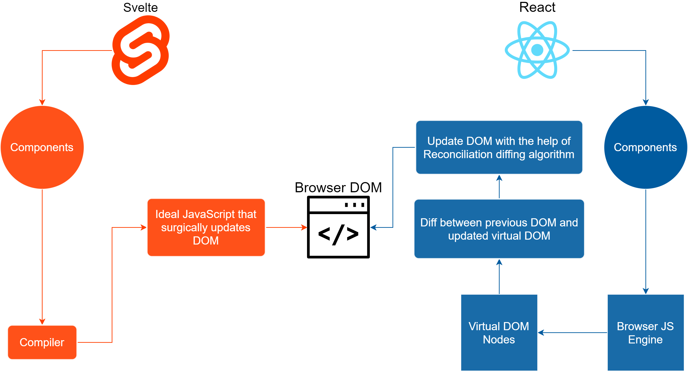

### 知识深度-原理和源码

::: tip
知识深度-原理和源码
:::

## JS 内存泄漏

### 题目

如何检测 JS 内存泄漏？内存泄漏的场景有哪些？

### 垃圾回收

正常情况下，一个函数执行完，其中的变量都会是会 JS 垃圾回收。

```js
function fn() {
    const a = 'aaa'
    console.log(a)

    const obj = {
        x: 100
    }
    console.log(obj)
}
fn()
```

但某些情况下，变量是销毁不了的，因为可能会被再次使用。

```js
function fn() {
    const obj = {
        x: 100
    }
    window.obj = obj // 引用到了全局变量，obj 销毁不了
}
fn()
```

```js
function genDataFns() {
    const data = {} // 闭包，data 销毁不了
    return {
        get(key) {
            return data[key]
        },
        set(key, val) {
            data[key] = val
        }
    }
}
const { get, set } = genDataFns()
```

变量销毁不了，一定就是内存泄漏吗？—— 不一定

### 垃圾回收算法 - 引用计数

早起的垃圾回收算法，以“数据是否被引用”来判断要不要回收。

```js
// 对象被 a 引用
let a = {
    b: {
        x: 10
    }
}

let a1 = a // 又被 a1 引用
let a = 0 // 不再被 a 引用，但仍然被 a1 引用
let a1 = null // 不再被 a1 引用

// 对象最终没有任何引用，会被回收
```

但这个算法有一个缺陷 —— 循环引用。例如

```js
function fn() {
    const obj1 = {}
    const obj2 = {}
    obj1.a = obj2
    obj2.a = obj1 // 循环引用，无法回收 obj1 和 obj2
}
fn()
```

此前有一个很著名的例子。IE6、7 使用引用计数算法进行垃圾回收，常常因为循环引用导致 DOM 对象无法进行垃圾回收。<br>
下面的例子，即便界面上删除了 div1 ，但在 JS 内存中它仍然存在，包括它的所有属性。但现代浏览器已经解决了这个问题。

```js
var div1
window.onload = function () {
    div1 = document.getElementById('div1')
    div1.aaa = div1
    div1.someBigData = { ... } // 一个体积很大的数据。
}
```

以上这个例子就是内存泄漏。即，**不希望它存在的，它却仍然存在**，这是不符合预期的。关键在于“泄漏”。

### 垃圾回收算法 - 标记清除

基于上面的问题，现代浏览器使用“标记-清除”算法。根据“是否是否可获得”来判断是否回收。

定期从根（即全局变量）开始向下查找，能找到的即保留，找不到的即回收。循环引用不再是问题。

### 检测内存变化

可使用 Chrome devTools Performance 来检测内存变化
- 刷新页面，点击“GC”按钮
- 点击“Record”按钮开始记录，然后操作页面
- 操作结束，点击“GC”按钮，点击“结束”按钮，看分析结果

代码参考 `memory-change.html`

### 内存泄漏的场景

拿 Vue 来举例说明。

组件中有全局变量、函数的引用。组件销毁时要记得清空。

```js
export default {
    data() {
        return {
            nums: [10, 20, 30]
        }
    },
    mounted() {
        window.printNums = () => {
            console.log(this.nums)
        }
    },
    // beforeUnmount() {
    //     window.printNums = null
    // },
}
```

组件有全局定时器。组件销毁时要记得清除。

```js
export default {
    data() {
        return {
            // intervalId: 0,
            nums: [10, 20, 30]
        }
    },
    // methods: {
    //     printNums() {
    //         console.log(this.nums)
    //     }
    // },
    mounted() {
        setInterval(() => {
            console.log(this.nums)
        }, 200)
        
        // this.intervalId = setInterval(this.printNums, 200)
    },
    beforeUnmount() {
        // clearInterval(this.intervalId)
    },
}
```

组件中有全局事件的引用。组件销毁时记得解绑。

```js
export default {
    data() {
        return {
            nums: [10, 20, 30]
        }
    },
    // methods: {
    //     printNums() {
    //         console.log(this.nums)
    //     }
    // },
    mounted() {
        window.addEventListener('resize', () => {
            console.log(this.nums)
        })
        // window.addEventListener('reisze', this.printNums)
    },
    beforeUnmount() {
        // window.removeEventListener('reisze', this.printNums)
    },
}
```

组件中使用了自定义事件，销毁时要记得解绑。

```js
export default {
    data() {
        return {
            nums: [10, 20, 30]
        }
    },
    // methods: {
    //     printNums() {
    //         console.log(this.nums)
    //     }
    // },
    mounted() {
        event.on('event-key', () => {
            console.log(this.nums)
        })

        // event.on('event-key', this.printNums)
    },
    beforeUnmount() {
        // event.off('event-key', this.printNums)
    },
}
```

### 闭包是内存泄漏吗

上述代码 `genDataFns()` 就是一个很典型的闭包，闭包的变量是无法被垃圾回收的。

但闭包不是内存泄漏，因为它是符合开发者预期的，即本身就这么设计的。而内存泄漏是非预期的。

【注意】这一说法没有定论，有些面试官可能会说“不可被垃圾回收就是内存泄漏”，不可较真。

### 答案

- 可使用 Chrome devTools Performance 检测内存变化
- 内存泄漏的场景
    - 全局变量，函数
    - 全局事件
    - 全局定时器
    - 自定义事件
    - 闭包（无定论）

### 划重点

前端之前不太关注内存泄漏，因为不会像服务单一样 7*24 运行。<br>
而随着现在富客户端系统不断普及，内存泄漏也在慢慢的被重视。

### 扩展

WeakMap WeakSet 弱引用，不会影响垃圾回收。

```js
// 函数执行完，obj 会被销毁，因为外面的 WeakMap 是“弱引用”，不算在内
const wMap = new WeakMap()
function fn() {
    const obj = {
        name: 'zhangsan'
    }
    // 注意，WeakMap 专门做弱引用的，因此 WeakMap 只接受对象作为键名（`null`除外），不接受其他类型的值作为键名。其他的无意义
    wMap.set(obj, 100) 
}
fn()
// 代码执行完毕之后，obj 会被销毁，wMap 中也不再存在。但我们无法第一时间看到效果。因为：
// 内存的垃圾回收机制，不是实时的，而且是 JS 代码控制不了的，因此这里不一定能直接看到效果。
```

```js
// 函数执行完，obj 会被销毁，因为外面的 WeakSet 是“弱引用”，不算在内
const wSet = new WeakSet()
function fn() {
    const obj = {
        name: 'zhangsan'
    }
    wSet.add(obj) // 注意，WeakSet 就是为了做弱引用的，因此不能 add 值类型！！！无意义
}
fn()
```

wangEditor 多次销毁创建，测试内存泄漏。日常开发时可以参考这种方式<br>
```html
<!DOCTYPE html>
<html lang="en">
<head>
    <meta charset="UTF-8">
    <meta http-equiv="X-UA-Compatible" content="IE=edge">
    <meta name="viewport" content="width=device-width, initial-scale=1.0">
    <title>memory change</title>
</head>
<body>
    <p>
        memory change
        <button id="btn1">start</button>
    </p>

    <script>
        const arr = []
        for (let i = 0; i < 10 * 10000; i++) {
            arr.push(i)
        }

        function bind() {
            // 模拟一个比较大的数据
            const obj = {
                str: JSON.stringify(arr) // 简单的拷贝
            }

            window.addEventListener('resize', () => {
                console.log(obj)
            })
        }

        let n = 0
        function start() {
            setTimeout(() => {
                bind()
                n++

                // 执行 50 次
                if (n < 50) {
                    start()
                } else {
                    alert('done')
                }
            }, 200)
        }

        document.getElementById('btn1').addEventListener('click', () => {
            start()
        })
    </script>
</body>
</html>
```


## 浏览器和 nodejs 事件循环的区别

### 题目

浏览器和 nodejs 事件循环的区别

### 单线程和异步

JS 是单线程的，浏览器中 JS 和 DOM 渲染线程互斥。<br>
单线程，代码就必须“串行”执行，无法并行，同一时间只能干一件事。

在 Java 等多线程语言中，发起请求、设置定时任务可以通过新开一个线程来处理，这就是并行。<br>
而 JS 是单线程，这种场景就只能使用“异步”。

```js
console.log('start')
setTimeout(() => {
    console.log('hello')
})
console.log('end')
```

### 宏任务和微任务

浏览器端异步的 API 有很多
- 宏任务：setTimeout 网络请求
- 微任务：promise

两者表面的区别：

第一，微任务比宏任务更快执行

```js
console.log('start')
setTimeout(() => {
    console.log('timeout')
})
Promise.resolve().then(() => {
    console.log('promise.then')
})
console.log('end')
```

第二，微任务在 DOM 渲染前执行，而宏任务在 DOM 显示后（即真正显示到页面上，肉眼可见）执行

```js
const p = document.createElement('p')
p.innerHTML = 'new paragraph'
document.body.appendChild(p)
console.log('length----', list.length)

console.log('start')
setTimeout(() => {
    const list = document.getElementsByTagName('p')
    console.log('timeout----', list.length)
    alert('阻塞')
})
Promise.resolve().then(() => {
    const list = document.getElementsByTagName('p')
    console.log('promise.then----', list.length)
    alert('阻塞')
})
console.log('end')
```

### 浏览器的事件循环

主要的流程
- 执行 JS 同步代码（执行异步 API 时，异步先放在一个队列中，先不执行）
- DOM 渲染
- 执行队列中的异步函数（执行异步 API 时，异步先放在一个队列中，先不执行）—— 异步中可能还嵌套异步
- DOM 渲染
- 执行队列中的异步函数（执行异步 API 时，异步先放在一个队列中，先不执行）
- DOM 渲染
- ...


考虑宏任务和微任务
- 执行 JS 同步代码（异步函数，分别放在 macroTaskQueue 和 microTaskQueue ）
- DOM 结构渲染（此时还没有在页面显示，但可以获取 DOM 内容了）
- 执行 microTaskQueue 函数（异步中还可能嵌套异步...）
- 显示 DOM 到页面
- 执行 macroTaskQueue 函数（异步中还可能嵌套异步...）
- ...

### nodejs 异步

nodejs 也是用了 V8 引擎和 ES 语法，所以也有同步、异步，异步也分宏任务、微任务。

- setTimeout setInterval —— 宏任务
- promise 和 async/await  —— 微任务
- process.nextTick —— 微任务，**但优先级最高**
- setImmediate —— 宏任务
- I/O 文件、网络 —— 宏任务
- Socket 连接：连接 mysql —— 宏任务

```js
console.log('start')
setImmediate(() => {
    console.log('immediate1')
})
setTimeout(() => {
    console.log('timeout1')
})
Promise.resolve().then(() => {
    console.log('promise then')
})
process.nextTick(() => {
    console.log('nextTick')
})
console.log('end')
```

### nodejs 事件循环

浏览器的各种宏任务，都是按照代码的顺序执行的，没有其他优先级。

nodejs 的宏任务是分了如下类型，nodejs 事件循环中宏任务需要按照这个顺序来执行。

- timers(计时器) - 执行 `setTimeout` 以及 `setInterval` 的回调
- I/O callbacks - 处理网络、流、TCP 的错误回调
- idle, prepare --- 闲置阶段 - node 内部使用
- poll(轮循) - 执行 poll 中的 I/O 队列，检查定时器是否到时间
- check(检查) - 存放 `setImmediate` 回调
- close callbacks - 关闭回调，例如 `socket.on('close')`

nodejs 事件循环的过程
- 执行同步代码
- 执行 `process.nextTick` 和微任务（前者优先级更高）
- 按照顺序执行 6 个类型的宏任务
- ...


### 答案

- 事件循环的大概模式相同
- 宏任务有优先级区分
- `process.nextTick` 在微任务的优先级更高

但是，`process.nextTick` 在最新版 nodejs 中不被推荐使用，推荐使用 `setImmediate`
原因在于 `process.nextTick` 是在当前帧介绍后立即执行，会阻断IO并且有最大数量限制（递归时会有问题）
而 `setImmediate` 不会阻断 IO ，更像是 `setTimeout(fun, 0)`

### 注意

基于 nodejs 最新版。nodejs 旧版会有所不同，特别注意。


## vdom 真的很快吗

### 题目

vdom 真的很快吗？

### Vue React 等框架的存在价值

Vue React 等框架给前端开发带来了革命性的变化。相比于此前的 jQuery 时代，它们的价值在于
- 组件化 —— 这不是核心原因。WebComponent 已提出多年，当仍未发展壮大
- 数据视图分离，数据驱动视图 —— 这才是核心！！！

数据视图分离，开发时只需要关注业务数据（React 的 state，Vue 的 data）即可，不用在实时的修改 DOM —— 这一点和 jQuery 有了本质区别。<br>
特别是对于大型的前端项目，将极大的降低开发复杂度，提高稳定性。

数据驱动视图，内部将如何实现呢？—— 借助于 vdom

### vdom

Virtual DOM，虚拟 DOM ，即用 JS 对象模拟 DOM 数据。是 React 最先提出来的概念。

React 的 JSX ，Vue 的 template 其实都是语法糖，它们本质上都是一个函数，成为 `render 函数`

```ts
// JSX: <p id="p1">hello world</p>
function render(): VNode {
    return createElement('p', { id: 'p1' }, ['hello world'])
}
```

执行 render 函数返回的就是一个 vdom 对象，一般叫做 vnode（虚拟节点），对应 DOM Node

每次数据更新（如 React setState）render 函数都会生成 newVnode ，然后前后对比 `diff(vnode, newVnode)`，计算出需要修改的 DOM 节点，再做修改。

### 对比 DOM 操作

下面两者，哪个更快？—— 很明显，前者更快。
- jquery 时代：直接修改 DOM
- 框架时代：生成 vdom ，进行 diff 运算 --> 修改 DOM

但凡事都要有一个业务背景。如果页面功能越来越复杂，直接操作 DOM 代码将会难以阅读和维护，大家更希望要“数据视图分离，数据驱动视图”。

在这个前提下，哪个更快？ —— 当然是后者。因为业务复杂、代码混乱，将会导致很多无谓的 DOM 操作 —— **DOM 操作是昂贵的**
- 直接修改 DOM
- 生成 vdom ，进行 diff 运算 --> 修改 DOM

而相比于昂贵的 DOM 操作，JS 运算非常快。所以 JS 多做事情（vdom diff）是更优的选择。

### 答案

- 直接进行 DOM 操作永远都是最快的（但要目标明确，不能有无谓的 DOM 操作 —— 这很难）
- 如果业务复杂，要“数据视图分离，数据驱动视图”，无法直接修改 DOM ，那 vdom 就是一个很好的选择

所以，**vdom 并不比 DOM 操作更快**（反而更慢，它做了 JS 运算），它只是在某个特定的场景下，无法做到精准 DOM 修改时，一个更优的选择。

### 扩展

[Svelte](https://www.sveltejs.cn/) 不使用 vdom ，它将组件修改，编译为精准的 DOM 操作。和 React 设计思路完全不一样。




## for vs forEach

### 题目

for 和 forEach 哪个更快？为什么

### 测试

```html
<!DOCTYPE html>
<html lang="en">
<head>
    <meta charset="UTF-8">
    <meta http-equiv="X-UA-Compatible" content="IE=edge">
    <meta name="viewport" content="width=q, initial-scale=1.0">
    <title>for vs forEach</title>
</head>
<body>
    <p>for vs forEach</p>

    <script>
        const arr = []
        for (let i = 0; i < 100 * 10000; i++) {
            arr.push(i)
        }
        const length = arr.length

        console.time('for')
        let n1 = 0
        for (let i = 0; i < length; i++) {
            n1++
        }
        console.timeEnd('for') // 3.7ms

        console.time('forEach')
        let n2 = 0
        arr.forEach(() => n2++)
        console.timeEnd('forEach') // 15.1ms
    </script>
</body>
</html>
```

### 创建函数需要开销

for 直接在当前函数中执行，forEach 每次都要新创建一个函数。
函数有单独的作用域和上下文（可回顾“堆栈模型”），所以耗时更久。

### 答案

for 更快，因为 forEach 每次创建函数需要开销

### 扩展

开发中不仅要考虑性能，还要考虑代码的可读性，forEach 可读性更好。


## nodejs 多进程

### 题目

nodejs 如何开启一个进程，进程之间如何通讯

### 进程 process 和线程 thread

进程，是操作系统进行资源调度和分配的基本单位，每个进程都拥有自己独立的内存区域（参考“堆栈模型”）。
一个进程无法直接访问另一个进程的内存数据，除非通过合法的进程通讯。

执行一个 nodejs 文件，即开启了一个进程，可以通过 `process.pid` 查看进程 id 。

线程，是操作系统进行运算调度的最小单位，线程是附属于进程的。一个进程可以包含多个线程（至少一个），多线程之间可共用进程的内存数据。<br>
如操作系统是一个工厂，进程就是一个车间，线程就是一个一个的工人。

JS 是单线程的，即执行 JS 时启动一个进程（如 JS 引擎，nodejs 等），然后其中再开启一个线程来执行。<br>
虽然单线程，JS 是基于事件驱动的，它不会阻塞执行，适合高并发的场景。

### 为何需要多进程

现代服务器都是多核 CPU ，适合同时处理多进程。即，一个进程无法充分利用 CPU 性能，进程数要等于 CPU 核数。

服务器一般内存比较大，但操作系统对于一个进程的内存分配是有上限的（2G），所以多进程才能充分利用服务器内存。

### nodejs 开启多进程

`child_process.fork` 可开启子进程执行单独的计算（源码参考 process-fork.js）
- `fork('xxx.js')` 开启一个子进程
- 使用 `send` 发送信息，使用 `on` 接收信息

`cluster.fork` 可针对当前代码，开启多个进程来执行（源码参考 cluster.js）

### 答案

- 可使用 `child_process.fork` 和 `cluster.fork` 开启子进程
- 使用 `send` `on` 传递消息

### 扩展：使用 PM2

nodejs 服务开启多进程、进程守护，可使用 [pm2](https://www.npmjs.com/package/pm2) ，不需要自己写。代码参考 koa2-code
- 全局安装 pm2 `yarn global add pm2`
- 增加 pm2 配置文件
- 修改 package.json scripts


## js-bridge 原理

### 题目

请描述 js-bridge 原理

### 微信 jssdk

微信中的 h5 通过 [jssdk](https://developers.weixin.qq.com/doc/offiaccount/OA_Web_Apps/JS-SDK.html) 提供的 API 可以调用微信 app 的某些功能。

JS 无法直接调用 app 的 API ，需要通过一种方式 —— 通称 js-bridge ，它也是一些 JS 代码。<br>
当然，前提是 app 得开发支持，控制权在 app 端。就像跨域，server 不开放支持，客户端再折腾也没用。


### 方式1 - 注入 API

客户端为 webview 做定制开发，在 window 增加一些 API ，共前端调用。

例如增加一个 `window.getVersion` API ，前端 JS 即可调用它来获取 app 版本号。

```js
const v = window.getVersion()
```

但这种方式一般都是**同步**的。<br>
因为你即便你传入了一个 callback 函数，app 也无法执行。app 只能执行一段全局的 JS 代码（像 `eval`）

### 方式2 - 劫持 url scheme

一个 iframe 请求 url ，返回的是一个网页。天然支持异步。

```js
const iframe1 = document.getElementById('iframe1')
iframe1.onload = () => {
    console.log(iframe1.contentWindow.document.body.innerHTML)
}
iframe1.src = 'http://127.0.0.1:8881/size-unit.html'
```

上述 url 使用的是标准的 http 协议，如果要改成 `'my-app-name://api/getVersion'` 呢？—— 默认会报错，`'my-app-name'` 是一个未识别的协议名称。<br>
既然未识别的协议，那就可以为我所用：app 监听所有的网络请求，遇到 `my-app-name:` 协议，就分析 path ，并返回响应的内容。

```js
const iframe1 = document.getElementById('iframe1')
iframe1.onload = () => {
    console.log(iframe1.contentWindow.document.body.innerHTML) // '{ version: '1.0.1' }'
}
iframe1.src = 'my-app-name://api/getVersion'
```

这种自定义协议的方式，就叫做“url scheme”。微信的 scheme 以 `'weixin://'` 开头，可搜索“微信 scheme”。

chrome 也有自己的 scheme
- `chrome://version` 查看版本信息
- `chrome://dino` 恐龙小游戏
其他可参考 https://mp.weixin.qq.com/s/T1Qkt8DTZvpsm8CKtEpNxA

### 封装 sdk

scheme 的调用方式非常复杂，不能每个 API 都写重复的代码，所以一般要封装 sdk ，就像微信提供的 jssdk 。

```js
const sdk = {
    invoke(url, data, success, err) {
        const iframe = document.createElement('iframe')
        iframe.style.display = 'none'
        document.body.appendChild(iframe)

        iframe.onload = () => {
            const content = iframe.contentWindow.document.body.innerHTML
            success(JSON.parse(content))
            iframe.remove()
        }
        iframe.onerror = () => {
            err()
            iframe.remove()
        }
        iframe.src = `my-app-name://${url}?data=${JSON.string(data)}`
    }

    fn1(data, success, err) {
        invoke('api/fn1', data, success, err)
    }

    fn2(data, success, err) {
        invoke('api/fn2', data, success, err)
    }
}

// 使用
sdk.fn1(
    {a: 10},
    (data) => { console.log('success', data) },
    () => { console.log('err') }
)
```

### 答案

常用方法：劫持 url scheme

### 扩展

url 长度不够怎么办？—— 可以扩展 ajax post 方式。


## requestIdleCallback

### 题目

是否了解过 requestIdleCallback ？

### 由 React Fiber 引起的关注

React 16 内部使用 Fiber ，即组件渲染过程可以暂停，先去执行高优任务，CPU 闲置时再继续渲染。<br>
其中用到的核心 API 就是 requestIdleCallback 。

### requestAnimationFrame 每次渲染都执行，高优

页面的渲染是一帧一帧进行的，至少每秒 60 次（即 16.6ms 一次）才能肉眼感觉流畅。所以，网页动画也要这个帧率才能流畅。

用 JS 来控制时间是不靠谱的，因为 JS 执行本身还需要时间，而且 JS 和 DOM 渲染线程互斥。所以 ms 级别的时间会出现误差。<br>
`requestAnimationFrame` 就解决了这个问题，浏览器每次渲染都会执行，不用自己计算时间。

代码参考 requestAnimationFrame.html

### requestIdleCallback 空闲时才执行，低优

requestIdleCallback 会在网页渲染完成后，CPU 空闲时执行，不一定每一帧都执行。

requestIdleCallback 不适合执行 DOM 操作，因为修改了 DOM 之后下一帧不一定会触发修改。

### 宏任务

requestAnimationFrame 和 requestIdleCallback 都是宏任务，它们比 setTimeout 更晚触发。

### 使用场景

requestAnimationFrame 可用于网页动画。

requestIdleCallback 可用于一些低优先级的场景，以代替 setTimeout 。例如发送统计数据。<br>
但请注意 requestIdleCallback 的浏览器兼容性

### 答案

requestIdleCallback 可在网页渲染完成后，CPU 空闲时执行，用于低优先级的任务处理。

