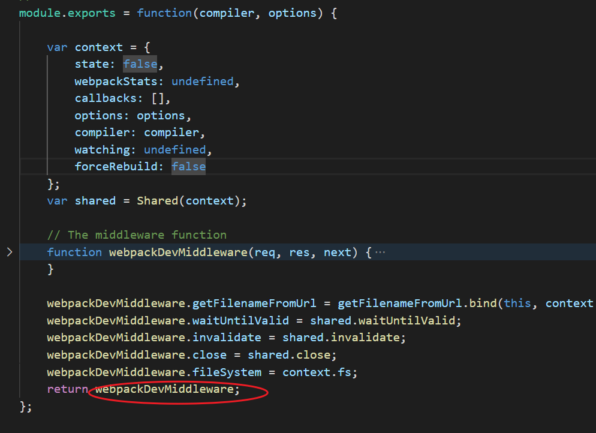

### vue-cli核心源码解析

## webpack-dev-middleware 源码解读

Webpack 的使用目前已经是前端开发工程师必备技能之一。若是想在本地环境启动一个开发服务，大家只需在 webpack 的配置中，增加 devServer 的配置来启动。而 devServer 配置的本质是 webpack-dev-server 这个包提供的功能，而 webpack-dev-middleware 则是这个包的底层依赖。
截至本文发表前，webpack-dev-middleware 的最新版本为 webpack-dev-middleware@3.7.2，本文的源码来自于此版本。本文会讲解 webpack-dev-middleware 的核心模块实现，相信大家把这篇文章看完，再去阅读源码，会容易理解很多。
webpack-dev-middleware 是什么？
要回答这个问题，我们先来看看如何使用这个包：
```js
const wdm = require('webpack-dev-middleware');
const express = require('express');
const webpack = require('webpack');
const webpackConf = require('./webapck.conf.js');
const compiler = webpack(webpackConf);
const app = express();
app.use(wdm(compiler));
app.listen(8080);
```
通过启动一个 express 服务，将 wdm(compiler) 的结果通过 app.use 方法注册为 express 服务的中间函数。从这里，我们不难看出 wdm(compiler) 的执行结果返回的是一个 express 的中间件。它作为一个容器，将 webpack 编译后的文件存储到内存中，然后在用户访问 express 服务时，将内存中对应的资源输出返回。
为什么要使用 webpack-dev-middleware
熟悉 webpack 的同学都知道，webpack 可以通过 watch mode 方式启动，那为何我们不直接使用此方式来监听资源变化呢？答案就是，webpack 的 watch mode 虽然能监听文件的变更，并且自动打包，但是每次打包后的结果将会存储到本地硬盘中，而 IO 操作是非常耗资源时间的，无法满足本地开发调试需求。
而 webpack-dev-middleware 拥有以下几点特性：

以 watch mode 启动 webpack，监听的资源一旦发生变更，便会自动编译，生产最新的 bundle
在编译期间，停止提供旧版的 bundle 并且将请求延迟到最新的编译结果完成之后
webpack 编译后的资源会存储在内存中，当用户请求资源时，直接于内存中查找对应资源，减少去硬盘中查找的 IO 操作耗时

middleware.js 
此文件返回的是一个 express 中间件函数的包装函数，其核心处理逻辑主要针对 request 请求，根据各种条件判断，最终返回对应的文件内容：


```js
function goNext() {
  if (!context.options.serverSideRender) {
    return next();
  }
  return new Promise((resolve) => {
    ready(
      context,
      () => {
        // eslint-disable-next-line no-param-reassign
        res.locals.webpackStats = context.webpackStats;
        // eslint-disable-next-line no-param-reassign
        res.locals.fs = context.fs;
        resolve(next());
      },
      req
    );
  });
}
```
首先，middleware 中定义了一个 goNext() 方法，该方法判断是否是服务端渲染。如果是，则调用 ready() 方法（此方法即为 ready.js 文件，作用为根据 context.state 状态判断直接执行回调还是将回调存储 callbacks 队列中）。如果不是，则直接调用 next() 方法，流转至下一个 express 中间件。
```js
const acceptedMethods = context.options.methods || ['GET', 'HEAD'];
if (acceptedMethods.indexOf(req.method) === -1) {
  return goNext();
}
```
接着，判断 HTTP 协议的请求的类型，若请求不包含于配置中（默认 GET、HEAD 请求），则直接调用 goNext() 方法处理请求：
```js
let filename = getFilenameFromUrl(
  context.options.publicPath,
  context.compiler,
  req.url
);
if (filename === false) {
  return goNext();
}
```
然后，根据请求的 req.url 地址，在 compiler 的内存文件系统中查找对应的文件，若查找不到，则直接调用 goNext() 方法处理请求：
```js
return new Promise((resolve) => {
  // eslint-disable-next-line consistent-return
  function processRequest() {
    ...
  }
  ...
  ready(context, processRequest, req);
});
```
最后，中间件返回一个 Promise 实例，而在实例中，先是定义一个 processRequest 方法，此方法的作用是根据上文中找到的 filename 路径获取到对应的文件内容，并构造 response 对象返回，随后调用 ready(context, processRequest, req) 函数，去执行 processRequest 方法。这里我们着重看下 ready 方法的内容：
```js
if (context.state) {
  return fn(context.webpackStats);
}
context.log.info(`wait until bundle finished: ${req.url || fn.name}`);
context.callbacks.push(fn);
```
非常简单的方法，判断 context.state 的状态，将直接执行回调函数 fn，或在 context.callbacks 中添加回调函数 fn。这也解释了上文提到的另一个特性 “在编译期间，停止提供旧版的 bundle 并且将请求延迟到最新的编译结果完成之后”。若 webpack 还处于编译状态，context.state 会被设置为 false，所以当用户发起请求时，并不会直接返回对应的文件内容，而是会将回调函数 processRequest 添加至 context.callbacks 中，而上文中我们说到在 compile.hooks.done 上注册了回调函数 done，等编译完成之后，将会执行这个函数，并循环调用 context.callbacks。


## HMR 的工作原理图解

上图是webpack 配合 webpack-dev-server 进行应用开发的模块热更新流程图。

上图底部红色框内是服务端，而上面的橙色框是浏览器端。
绿色的方框是 webpack 代码控制的区域。蓝色方框是 webpack-dev-server 代码控制的区域，洋红色的方框是文件系统，文件修改后的变化就发生在这，而青色的方框是应用本身。
上图显示了我们修改代码到模块热更新完成的一个周期，通过深绿色的阿拉伯数字符号已经将 HMR 的整个过程标识了出来。

- 第一步，在 webpack 的 watch 模式下，文件系统中某一个文件发生修改，webpack 监听到文件变化，根据配置文件对模块重新编译打包，并将打包后的代码通过简单的 JavaScript 对象保存在内存中。
- 第二步是 webpack-dev-server 和 webpack 之间的接口交互，而在这一步，主要是 dev-server 的中间件 webpack-dev-middleware 和 webpack 之间的交互，webpack-dev-middleware 调用 webpack 暴露的 API对代码变化进行监控，并且告诉 webpack，将代码打包到内存中。
- 第三步是 webpack-dev-server 对文件变化的一个监控，这一步不同于第一步，并不是监控代码变化重新打包。当我们在配置文件中配置了devServer.watchContentBase 为 true 的时候，Server 会监听这些配置文件夹中静态文件的变化，变化后会通知浏览器端对应用进行 live reload。注意，这儿是浏览器刷新，和 HMR 是两个概念。
- 第四步也是 webpack-dev-server 代码的工作，该步骤主要是通过 sockjs（webpack-dev-server 的依赖）在浏览器端和服务端之间建立一个 websocket 长连接，将 webpack 编译打包的各个阶段的状态信息告知浏览器端，同时也包括第三步中 Server 监听静态文件变化的信息。浏览器端根据这些 socket 消息进行不同的操作。当然服务端传递的最主要信息还是新模块的 hash 值，后面的步骤根据这一 hash 值来进行模块热替换。
- webpack-dev-server/client 端并不能够请求更新的代码，也不会执行热更模块操作，而把这些工作又交回给了 webpack，webpack/hot/dev-server 的工作就是根据 webpack-dev-server/client 传给它的信息以及 dev-server 的配置决定是刷新浏览器呢还是进行模块热更新。当然如果仅仅是刷新浏览器，也就没有后面那些步骤了。
- HotModuleReplacement.runtime 是客户端 HMR 的中枢，它接收到上一步传递给他的新模块的 hash 值，它通过 JsonpMainTemplate.runtime 向 server 端发送 Ajax 请求，服务端返回一个 json，该 json 包含了所有要更新的模块的 hash 值，获取到更新列表后，该模块再次通过 jsonp 请求，获取到最新的模块代码。这就是上图中 7、8、9 步骤。
- 而第 10 步是决定 HMR 成功与否的关键步骤，在该步骤中，HotModulePlugin 将会对新旧模块进行对比，决定是否更新模块，在决定更新模块后，检查模块之间的依赖关系，更新模块的同时更新模块间的依赖引用。
- 最后一步，当 HMR 失败后，回退到 live reload 操作，也就是进行浏览器刷新来获取最新打包代码。

## hotMiddleware 源码解析
让我们来看看 hotMiddleware 的 README 是如何解释它的工作原理的：

> The middleware installs itself as a webpack plugin, and listens for compiler events. Each connected client gets a Server Sent Events connection, the server will publish notifications to connected clients on compiler events. When the client receives a message, it will check to see if the local code is up to date. If it isn't up to date, it will trigger webpack hot module reloading.

我们可以通过上面的说明将 hotMiddleware 的工作原理进行以下划分：首先在服务端，它作为中间件回复、处理特定请求，并开启 Server Sent Events（SSEs）服务，然后注册 Webpack 的编译钩子以便在文件变动时向客户端发送通知（notifications）；接着在客户端，它会订阅这个 SSEs 服务，并在服务端有事件通知发出时调用 HMR API 进行检查并更新模块。

这就有点神奇了！hotMiddleware 是怎么做到既在服务端作为中间件，又在客户端监听事件的呢？这和我们平时使用的中间件是截然不同的，下面我先介绍让这一切能够发生的 SSEs 技术

### Server-sent Events
我们在生活中经常会遇到诸如消息动态实时更新的场景，在早些时候要实现类似这样服务端事件同步更新到客户端的操作，通常会选择“长轮询”（Long polling），也就是由客户端发起一个请求，查询服务端是否有新的事件发生，有则返回，无则由服务端挂起（hanging）这个请求直到发生事件然后返回给客户端。但是这是一种“hack”级别的方法，它不是技术上的一种标准并且也只是结果上实现了事件”同步“，这就意味着无论如何它都不会特别高效，离真正的事件同步有一定的距离。

> Server-sent Events（SSEs）从底层就被设计为一个高效且节省资源的单向同步技术，它基于现有的 HTTP 协议，这意味着我们无需从头创建一个基于像 WebSocket 协议那样的服务器。在服务端，我们以Content-Type: text/event-stream头部开启一个 SSEs 服务并可以在任何时候通过发送符合标准的格式化数据向客户端更新事件（event）；在客户端，我们创建一个EventSource对象以订阅（subscribe）这个 SSEs 服务并添加回调函数从而实时地处理相应事件。

一个 SSEs 的简单例子：
```js
// server.js
//...
const app = new Koa();
const router = new Router();
const { PassThrough } = require('stream');

router.get('/event-test', async ctx => {
  const stream = new PassThrough();
  ctx.set('Content-Type', 'text/event-stream');
  setInterval(() => {
    // 一次事件以 \n\n 为结束标识
    stream.write('data: hello\n\n');
  }, 1000);
  ctx.body = stream;
});
app.use(router.routes());
app.use(router.allowedMethods());
app.listen(8080);
```
在客户端我们订阅这个 SSEs 服务：
```js
//client.js
//...
// 注意只能是在同一域名下订阅 SSEs 服务，否则会有跨域请求问题
const event = new EventSource('/event-test');
event.onmessage((e) => {
  console.log(e.data)// hello
});
event.onerror((e) => {
  event.close();
});
```
在上面的例子中，服务端每 1 秒会发出一次事件以模拟实时消息，在客户端我们创建了一个EventSource对象去订阅这个服务，这样每次服务端发出通知时我们的回调函数就会被调用。

更多关于 SSEs 的内容可以参考 Stream Updates with Server-Sent Events，虽然这是一篇英文文章但作者以一种浅显易懂的方式介绍了这个技术。

那么对于 hotMiddleware 来说就应该需要服务端和客户端的代码来让这一切工作起来：服务端负责在特定的时候发送事件，客户端在收到事件时检查并更新模块，接下来我们从源码的角度看看它是如何工作
```js
// middleware.js

module.exports = webpackHotMiddleware;
var helpers = require('./helpers');
var pathMatch = helpers.pathMatch;

function webpackHotMiddleware(compiler, opts) {
  opts = opts || {};
  opts.path = opts.path || '/__webpack_hmr';
  opts.heartbeat = opts.heartbeat || 10 * 1000;

  // 创建负责 SSEs 相关工作的对象
  var eventStream = createEventStream(opts.heartbeat);
  var latestStats = null;
  var closed = false;

  // 注册编译钩子以在代码变动时向 client 发送通知
  compiler.hooks.invalid.tap('webpack-hot-middleware', onInvalid);
  compiler.hooks.done.tap('webpack-hot-middleware', onDone);
  //...

  // eventStream.publish 会向客户端发生事件
  function onInvalid() {
    if (closed) return;
    latestStats = null;
    eventStream.publish({ action: 'building' });
  }
  function onDone(statsResult) {
    if (closed) return;
    // Keep hold of latest stats so they can be propagated to new clients
    latestStats = statsResult;
    // publishStats 内部调用了 eventStream.publish
    // built 事件会让 client 打印额外的信息，并且最终会 fallthrough 到 sync 事件检查更新
    publishStats('built', latestStats, eventStream, opts.log);
  }

  // 中间件主体
  var middleware = function(req, res, next) {
    // 如果不是 client 发出的建立 EventSource 的请求，则 next
    if (closed) return next();
    if (!pathMatch(req.url, opts.path)) return next();

    // 处理 client 请求
    eventStream.handler(req, res);
    if (latestStats) {
      // 这就是整个中间件的关键
      // sync 事件通知 client 检查更新模块
      publishStats('sync', latestStats, eventStream);
    }
  };
  //...
  // 我们可以在外部手动关闭 hotMiddleware，虽然一般不这么做
  middleware.close = function() {
    if (closed) return;
    // Can't remove compiler plugins, so we just set a flag and noop if closed
    // https://github.com/webpack/tapable/issues/32#issuecomment-350644466
    closed = true;
    eventStream.close();
    eventStream = null;
  };
  return middleware;
}

//...

// 发送事件并附加一些额外的打包信息
// 主要会用到 module hash、module id
function publishStats(action, statsResult, eventStream, log) {
  var stats = statsResult.toJson({
    all: false,
    cached: true,
    children: true,
    modules: true,
    timings: true,
    hash: true,
  });
  // For multi-compiler, stats will be an object with a 'children' array of stats
  var bundles = extractBundles(stats);
  bundles.forEach(function(stats) {
    var name = stats.name || '';
    //...
    eventStream.publish({
      name: name,
      action: action,
      time: stats.time,
      hash: stats.hash,
      warnings: stats.warnings || [],
      errors: stats.errors || [],
      modules: buildModuleMap(stats.modules),
    });
  });
}

function extractBundles(stats) {
  // Stats has modules, single bundle
  if (stats.modules) return [stats];
  //...
  // Not sure, assume single
  return [stats];
}

function buildModuleMap(modules) {
  var map = {};
  modules.forEach(function(module) {
    map[module.id] = module.name;
  });
  return map;
}
```
总结一下 hotMiddleware 工厂函数所做的： 创建一个负责 SSEs 相关工作的eventStream对象（目前我们只需要知道eventStream.publish方法会向 client 发送事件通知），并注册了complier编译钩子以在合适的时机发送事件；middleware的主体部分调用eventStream.handle处理且只处理 client 的相关请求。之后调用publishStats函数通知 client 进行一次代码检查。hotMiddleware 还为我们提供了一些接口可以手动关闭 SSEs 服务，虽然一般不会这么做。

然后让我们来简单看看createEventStream内部做了什么工作：
```js
// middleware.js
//...

// heartbeat 定义发送维持连接信息的间隔时间
function createEventStream(heartbeat) {
  var clientId = 0;
  var clients = {};
  // 向每一个连接的 client 执行 fn
  function everyClient(fn) {
    Object.keys(clients).forEach(function(id) {
      fn(clients[id]);
    });
  }
  // 维持每个 SSEs 链接防止 client 判断超时 timeout
  var interval = setInterval(function heartbeatTick() {
    everyClient(function(client) {
      client.write('data: \uD83D\uDC93\n\n');
    });
  }, heartbeat).unref();

  return {
    // 手动关闭 SSEs 服务
    close: function() {
      clearInterval(interval);
      everyClient(function(client) {
        if (!client.finished) client.end();
      });
      clients = {};
    },
    // 处理 client 请求
    handler: function(req, res) {
      var headers = {
        'Content-Type': 'text/event-stream;charset=utf-8',
        //...
      };
      //...
      res.writeHead(200, headers);
      res.write('\n');
      var id = clientId++;
      clients[id] = res;
      req.on('close', function() {
        if (!res.finished) res.end();
        delete clients[id];
      });
    },
    // 向每一个 client 发送通知并附加 payload 数据
    publish: function(payload) {
      everyClient(function(client) {
        client.write('data: ' + JSON.stringify(payload) + '\n\n');
      });
    },
  };
}
```
由createEventStream工厂函数创建的eventStream对象会用Content-Type: event-stream头回复请求以创建 SSEs 服务，publish方法会向所有连接的 client 发送事件通知并附加一些额外的信息。这样在 client 收到通知后就可以调用回调函数检查更新模块了。在这期间它还会不断发送维持信息data: \uD83D\uDC93\n\n让 client 知道服务还在继续并没有中断。

以上就是 hotMiddleware 作为服务端中间件的源码内容了，我们可以发现它只是做了发送事件通知 client 的工作，对我们的应用并没有什么作用，关键还是要看运行在客户端的 client 会在事件发生时做什么。接下来我们看看它是如何影响我们的应用的。
### client
我们从webpack-hot-middleware/client.js看起（我会把一些非重点的代码忽略掉）：
```js


// client.js
// 运行在浏览器环境中
/*eslint-env browser*/
/*global __resourceQuery __webpack_public_path__*/

var options = {
  path: '/__webpack_hmr',
  timeout: 20 * 1000,
  log: true,
  warn: true,
  reload: false,
  name: '',
  autoConnect: true,
  //...
};
//...

if (typeof window === 'undefined') {
  // do nothing
} else if (typeof window.EventSource === 'undefined') {
  console.warn(
    "webpack-hot-middleware's client requires EventSource to work. " +
      'You should include a polyfill if you want to support this browser: ' +
      'https://developer.mozilla.org/en-US/docs/Web/API/Server-sent_events#Tools'
  );
} else {
  // 开启链接
  if (options.autoConnect) {
    connect();
  }
}
//...
// SSEs 相关接口
function EventSourceWrapper() {
  var source;
  var lastActivity = new Date();
  var listeners = [];
  init();
  // 检查服务是否中断
  var timer = setInterval(function() {
    if (new Date() - lastActivity > options.timeout) {
      handleDisconnect();
    }
  }, options.timeout / 2);

  // 设置回调函数
  function init() {
    source = new window.EventSource(options.path);
    source.onopen = handleOnline;
    source.onerror = handleDisconnect;
    source.onmessage = handleMessage;
  }

  function handleOnline() {
    if (options.log) console.log('[HMR] connected');
    lastActivity = new Date();
  }
  // 调用所有传入的 listeners
  function handleMessage(event) {
    lastActivity = new Date();
    for (var i = 0; i < listeners.length; i++) {
      listeners[i](event);
    }
  }
  function handleDisconnect() {
    clearInterval(timer);
    source.close();
    setTimeout(init, options.timeout);
  }

  return {
    addMessageListener: function(fn) {
      listeners.push(fn);
    },
  };
}

// EventSource 的包装函数，在多入口的配置中可以公用链接
function getEventSourceWrapper() {
  if (!window.__whmEventSourceWrapper) {
    window.__whmEventSourceWrapper = {};
  }
  if (!window.__whmEventSourceWrapper[options.path]) {
    // cache the wrapper for other entries loaded on
    // the same page with the same options.path
    window.__whmEventSourceWrapper[options.path] = EventSourceWrapper();
  }
  return window.__whmEventSourceWrapper[options.path];
}

// 订阅 SSEs 服务并设置事件的回调函数
function connect() {
  getEventSourceWrapper().addMessageListener(handleMessage);

  function handleMessage(event) {
    // 服务端发送的维持信息
    if (event.data == '\uD83D\uDC93') {
      return;
    }
    try {
      processMessage(JSON.parse(event.data));
    } catch (ex) {
      if (options.warn) {
        console.warn('Invalid HMR message: ' + event.data + '\n' + ex);
      }
    }
  }
}

//...

// processUpdate 调用了 HMR API 检查更新模块，我们之后再看它
var processUpdate = require('./process-update');

var customHandler;
function processMessage(obj) {
  // 用 payload 中的 action 代表事件
  switch (obj.action) {
    case 'building':
      if (options.log) {
        console.log(
          '[HMR] bundle ' +
            (obj.name ? "'" + obj.name + "' " : '') +
            'rebuilding'
        );
      }
      break;
    case 'built':
      if (options.log) {
        console.log(
          '[HMR] bundle ' +
            (obj.name ? "'" + obj.name + "' " : '') +
            'rebuilt in ' +
            obj.time +
            'ms'
        );
      }
    // fall through
    // sync 事件真正让 client 去检查和更新模块
    case 'sync':
      //...
      var applyUpdate = true;
      //... 
      // 中间一系列的 if-else 会检查服务端是否出现了错误
      // 有则输出问题并设置 applyUpdate 的值
      if (applyUpdate) {
        processUpdate(obj.hash, obj.modules, options);
      }
      break;
    default:
      if (customHandler) {
        customHandler(obj);
      }
  }
  //...
}

// 供外部调用的 api，一般情况我们不会使用
if (module) {
  module.exports = {
    subscribe: function subscribe(handler) {
      customHandler = handler;
    },
    //...
  };
}
```
和我们想的一样，client 内部订阅了 SSEs 服务并传入了processMessage回调函数处理服务端发送的事件，其中根据事件的不同它会选择输出构建信息或者检查更新模块，需要注意的是processMessage处理完built事件后会 fallthrough 到sync事件，而在sync事件中它会调用processUpdate方法，这就是 client 最终调用 HMR API 检查和更新模块的地方。

processUpdate函数代码在webpack-hot-middleware/process-update.js中：
```js
// process-update.js
/* global window __webpack_hash__ */

// HMR API 由 webpack.HotModuleReplacementPlugin 插件提供
if (!module.hot) {
  throw new Error('[HMR] Hot Module Replacement is disabled.');
}
var lastHash;
var failureStatuses = { abort: 1, fail: 1 };
var applyOptions = {
  //...
  // hot.apply 使用的 options
  // 包含一些失败情况下的处理方法，不需要考虑细节
};

// __webpack_hash__ 是 webpack 设置的全局变量，唯一地标识本地代码
// 所以这里 client 通过对比 hash 值判断是否需要更新模块
function upToDate(hash) {
  if (hash) lastHash = hash;
  return lastHash == __webpack_hash__;
}

// 从这里的函数头就可以看出在服务端发送的 payload 数据里
// 我们主要会用到 module hash、module id
module.exports = function(hash, moduleMap, options) {
  var reload = options.reload;
  // 本地模块变动或进程正在等待调用 check（idle 状态）
  if (!upToDate(hash) && module.hot.status() == 'idle') {
    if (options.log) console.log('[HMR] Checking for updates on the server...');
    check();
  }

  // 执行检查更新
  function check() {
    var cb = function(err, updatedModules) {
      if (err) return handleError(err);
      //...
      // 在更新过程中检查是否发生错误或者本地代码是否又发生了变动
      var applyCallback = function(applyErr, renewedModules) {
        if (applyErr) return handleError(applyErr);
        if (!upToDate()) check();
        logUpdates(updatedModules, renewedModules);
      };

      // HMR API hot.apply 接口（继续更新进程）
      module.hot.apply(applyOptions, applyCallback);
      //...省略了处理 webpack2 的 apply promise
    };

    // 这里就是关键了—— HMR API check 接口
    // 它会测试所有加载的模块以进行更新，如果有更新，则应用它们。
    module.hot.check(false, cb);
    //...省略了处理 webpack2 check promise
  }

  function logUpdates(updatedModules, renewedModules) {
    //...
    // 在调试器里输出一些构建信息，可忽略
  }

  function handleError(err) {
    if (module.hot.status() in failureStatuses) {
      if (options.warn) {
        console.warn('[HMR] Cannot check for update (Full reload needed)');
        console.warn('[HMR] ' + (err.stack || err.message));
      }
      performReload();
      return;
    }
    if (options.warn) {
      console.warn('[HMR] Update check failed: ' + (err.stack || err.message));
    }
  }

  // 在一些失败的情况下刷新浏览器
  function performReload() {
    if (reload) {
      if (options.warn) console.warn('[HMR] Reloading page');
      window.location.reload();
    }
  }
};
```
我们可以清楚地看到：首先processUpdate通过对比 Webpack 设置的全局变量__webpack_hash__判断本地代码是否发生了变动，有则调用check函数进行更新；在check函数中我们调用了 HMR API——hot.check和hot.apply做了模块更新和一些额外的检查。

最后我简单总结一下 client 源码的内容：client 订阅了 middleware 的 SSEs 服务然后传入processMessage作为事件回调，它会根据不同的事件执行不同代码。其中sync事件最终会让processMessage调用processUpdate函数进行模块的检查和更新。


通过上面的源码分析我们可以清楚地看到 client 是如何工作的，但还有一个问题——它是什么时候被添加到我们的客户端代码中的？我们并没有在应用里引用client.js啊？

还记得我们之前对 Webpack 客户端配置做的修改吗？“将webpack-hot-middleware/client加入客户端 Webpack 配置的入口配置（entry）数组中”，在实际操作中我们会这么做：
```js
const clientConfig = require('./webpack.client.js');

// hotMiddleware下不能使用[name].[chunkhash]
clientConfig.output.filename = '[name].js';
client.entry = ['webpack-hot-middleware/client', client.entry.app];
```
以上的操作意味着 Webpack 会将webpack-hot-middleware/client.js作为一个入口文件并将它打包进我们的客户端代码中。

为了验证这一点我们先将下面的代码添加到我们的 Webpack 客户端配置里：
```js
optimization: {
  // spliteChunks 相当于 CommonsChunkPlugins vendor
  splitChunks: {
    chunks: 'all'
  },
}
```
Webpack4 的splitChunks配置相当于以前的CommonsChunkPlugins插件，它会将第三方公用代码抽离出我们的用户代码方便浏览器进行缓存。也就是说webpack-hot-middleware/client的代码被打包进vender里了。这样我们就可以很容易地在浏览器的资源管理器中找到它：
开发模式下 hotMiddleware client 就是这样随着我们的客户端代码一起运行的。
