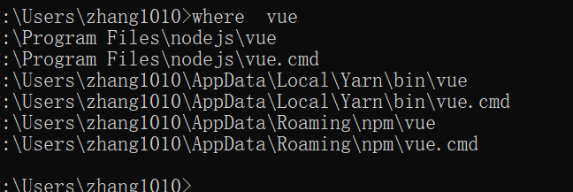
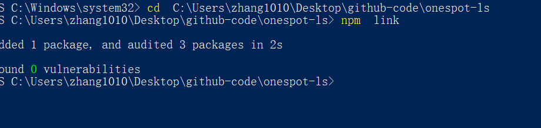
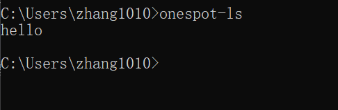

## 脚手架的执行原理
脚手架的执行原理如下：

终端输入vue create vue-test-app
终端解析出vue主命令
终端在环境变量中找到vue命令
终端根据vue命令链接到实际可执行文件vue.js
终端利用node执行vue.js
vue.js解析command和option
vue.js执行command
执行完毕，退出执行

- vue命令的实际执行文件在哪里:
终端上执行命令》： where  vue

which指令会在PATH环境变量指定的路径中，搜索某个系统命令的位置，并且返回第一个搜索结果。

windows下找到vue.cmd操作系统会直接运行，使用node启动其指向的vue.js文件，执行node vue.js [command][options]，vue.js会解析command和options完成后续过程

等价于
```js
node .\node_modules\@vue\cli\bin\vue.js create demo -f
```
mac系统下找到vue软连接，直接执行vue.js文件，vue.js文件不是可执行文件,所以需要在js文件中声明
```
#!/usr/bin/env node
/usr/bin/env 可以打印所有环境变量，意思为环境变量中查找node，并且用node运行vue.js文件
```

- vue.cmd 或 vue 软连接是在哪里定义的怎么生成的？
在脚手架开发时可以在package.json中定义
```
"bin":{
    "vue":"bin/vue.js"
}
```
- 可以通过手动更改 .cmd文件或软连接嵌套更改
- npm安装包后会解析package.json 文件如果发现存在bin字段那么会自动生成其对应的软连接

## 脚手架开发流程

### 脚手架开发流程详解
- 创建npm项目 npm init -y
- 创建脚手架入口文件，最上方添加：
```js
   #!/usr/bin/env node
```
- 配置package.json,添加bin属性
- 编写脚手架代码
- 将脚手架发布到npm上

## 脚手架快速开发与搭建
- 创建npm项目 npm init -y
- 创建入口文件 bin/index  添加 #!/usr/bin/env node
```js
#!/usr/bin/env node
console.log('hello')
```
- 配置package.json,添加bin属性
```js
  "bin": {
   "onespot-ls": "./bin/index.js"
  },

```
- 链接到本地脚手架 
```js
npm link
```


- 本地测试
```js
输入 onespot-ls
```


