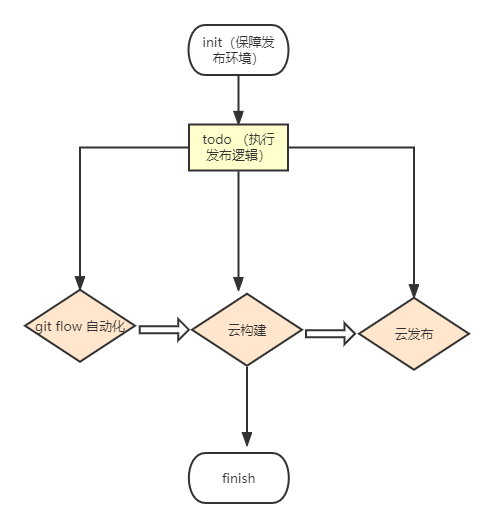
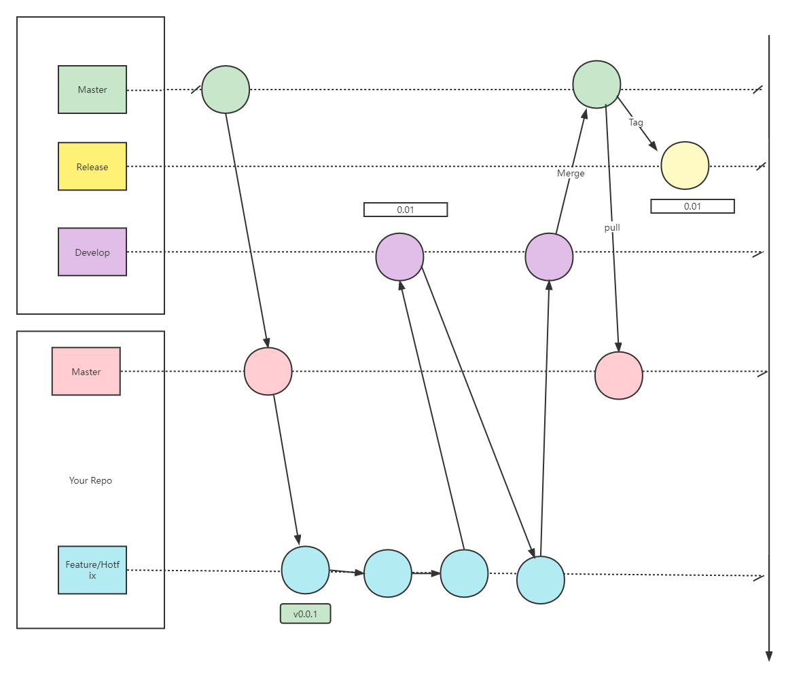
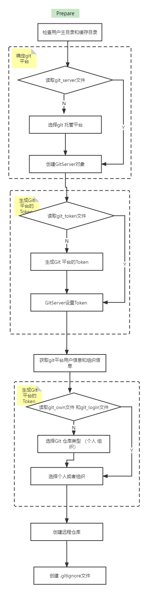
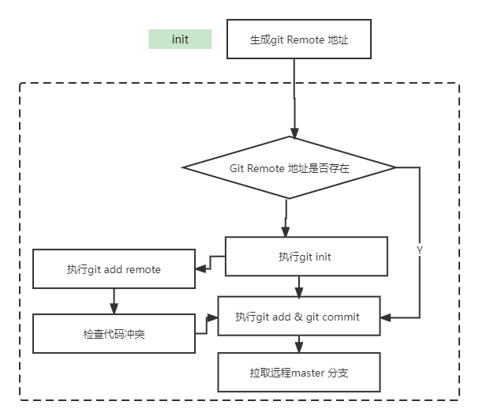

### 前端发布脚手架

## 项目发布流程架构设计

## git flow 基础流程

### master 分支
使用注意：
- 代码库必须有且只有一个 master 分支，所有发布版本都在这个分支上发布。
- 对 master 分支使用gitlab的分支保护，仅管理者有权限。
- 每次发布打tag，便于处理线上bug，拉取bug分支。
- 除了从pre-release 或生产环境Bug修复分支进行merge，不接受任何其它修改。
- 禁止将 master 分支merge到其他分支。

### develop 分支
开发环境的稳定分支，公共开发环境基于该分支构建。

注意点：
- develop 分支来源于 master 分支，之后就跟 master 无关了。
- develop 分支一定是大于等于 master 分支的。
- 严禁 master 分支合并到 develop 分支的操作。

### release 分支
预发布分支，又叫测试分支，是一个临时分支。通常用于合并到 master 之前拉一个预发布分支用于测试。

注意点：
- 通常用release-*命名
- 预发布分支是从 develop 分支拉取的。
- 预发布分支的bug，在该分支处理，处理完同步到 develop 上。
- 预发布分支测试完成，合并到 develop 和 master 分支上。

## 脚手架git flow prepare阶段架构设计

## 脚手架git flow init 阶段架构设计

