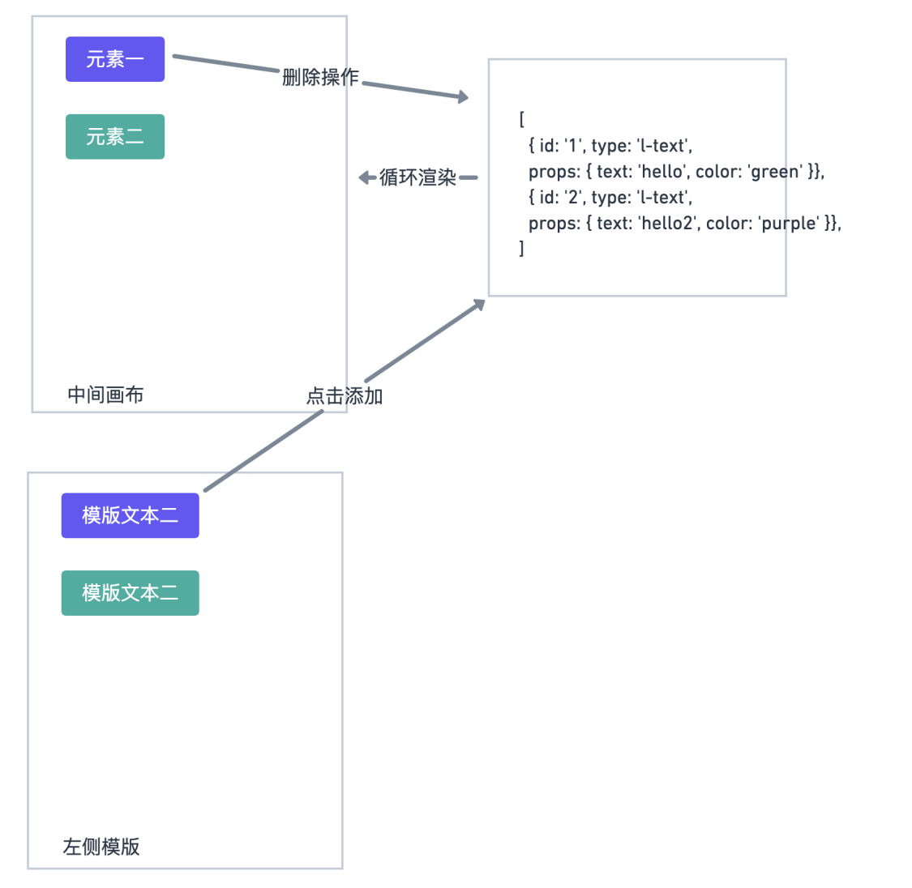
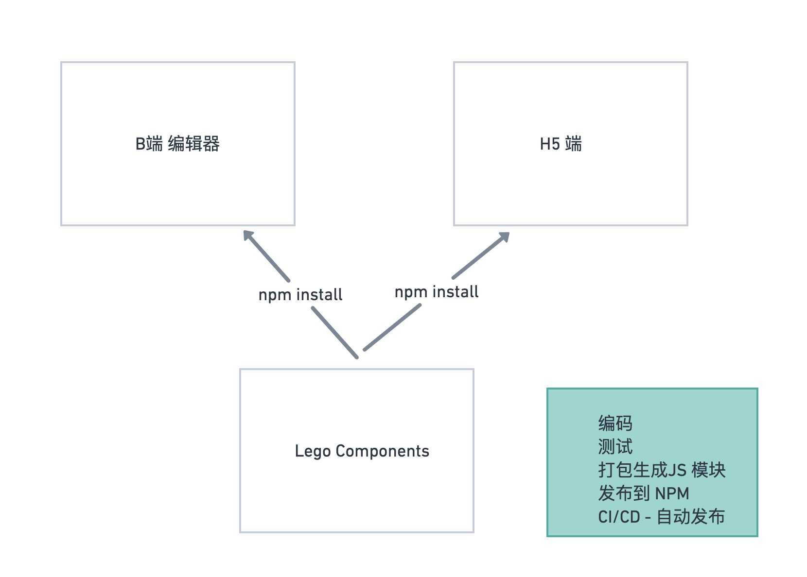
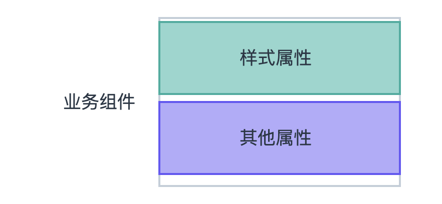
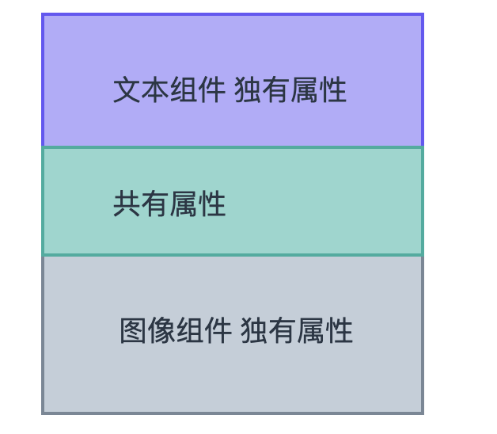

# 第7周 B端项目需求分析 和 架构设计
架构原型：https://whimsical.com/RTJphPrwzksyotCdA32LQU
## 将收获什么
- 做怎样的项目完成瓶颈期的突破
- 怎样从需求中寻找关键难点
- 怎样写技术解决方案
- 怎样进行基础的技术选型
## 关键词
- 挖掘难点-找到项目中的痛点
- 技术解决方案-以文档的形式创造可追溯的思考模型
- 业务组件库-多项目复用的业务组件库.
- 编辑器-界面到数据的映射
- Typescript, Vue3, React
## 学习方法
- 改变思维模式-磨刀不误砍柴工
- 抽象思维，不要关注具体框架和细节，整体把控
- 发散性思维-- -个问题对应多种解决方案
## 问题
- 一个是我现在在公司里面一直都做同样的业务，工作就是Ctrl+C， CtrI+V, 感觉陷入泥潭，没有提高。请问怎么办?
- 第二个是需求:现在公司的工作太简单了，没法提升个人的实力，不能匹配期望的大厂的需
求，老师赶快出一一个复杂项目，让我好好升级一下!
这两个问题其实总结起来就是现在的工作没法和个人提升的意愿相匹配，需要一个更复杂更高级
的项目来提升自己。那么这种积极上进的态度是很好的，那么我个人认为什么是复杂的项目呢?
## 复杂项目
### 业务复杂度
- 交互的复杂性
- 数据结构和状态的复杂性
- 多项目互相依赖的复杂性
- 打包
- 性能优化
- 第三方库的使用、调研以及二次开发
### 流程的复杂度
- git flow
- lint工具
- 单元测试
- commint 信息
- PR review
- CI/CD
## 技术解决方案
复杂项目，在需求分析之后，是技术解决方案的编写。技术方案的编写，可以理清思路，预先解决项目中可能存在的难题。解决这些难点就是技术方案设计的归宿。分析项目中的难点继而成为架构师的必要能力。
总览的技术设计文档，要站在一定的高度，指引项目的大体流程。至于项目具体功能的具体解决方案，届时在写具体的设计文档。
技术方案的内容是，怎样实现需求中的功能，没有固定格式。


# 第9周 项目整体搭建

# 第10周 编辑器基本布局，及业务组件库初步开发
业务组件库初步开发，业务组件属性的展示和更新
> 编辑器页面主要有三个部分，为左中右结构，左侧为组件模板库，中间为画布，右侧是设置面板
    - 左侧是预设各种组件模板并进行添加
    - 中间是使用交互的手段更新元素的值
    - 右侧是使用表单的手段更新元素的值

不难看出我们的编辑器其实就是围绕着中间画布的元素来进行一些列操作，那么自然而然是一系列的元素组成的，我们应把它抽象成一系列拥有特定数据结构的数组

## 主要内容
    - 完成第一个业务组件LText的书写
    - 完成业务组件属性和表单组件的显示和实时更新
    - 代码升级︰支持vNode的在vue template 中的展示
## 将收获什么
    - 渐进式的开发方式
    - 组件属性和重用性的设计和实现
    - Typescript结合实际项目的高度实战
    - vue template和JSX写法的异同和优劣
## 学习方法
    - 渐进式的开发方法∶小步快跑，一步步完善最终的需求。
    - 对比学习:多种方法完成一个任务，更能了解它们的优劣。
    - 流程图:以流程图的方式来描述代码的逻辑过程或者数据流动。
    - 技术文档:以技术文档为指引。

## 编辑器store数据结构编写
```js
import { Module } from "vuex";
import { GlobalDataProps } from "./index";
import { v4 as uuidv4 } from "uuid";

export interface EditorProps {
  // 供中间编辑器渲染的数组
  components: ComponentData[];
  // 一系列和其他状态相关的信息，应该有很多
  // 当前编辑的是哪个元素，uuid
  currentElement: string;
}
export interface ComponentData {
  // 每个元素 props 所有属性
  // 我们上节课已经分析过了，是 css 属性和其他属性的混合体
  // 并且我们会把这些属性完全平铺开来，其实在编辑器分析过后，你就能更感受到平铺的一个好处
  props: { [key: string]: any };
  // id，uuid v4 生成
  id: string;
  // 业务组件库名称 l-text，l-image 等等
  name: string;
}

export const testComponents: ComponentData[] = [
  {
    id: uuidv4(),
    name: "l-text",
    props: {
      text: "hello",
      fontSize: "20px",
      color: "#000000",
      lineHeight: "1",
      textAlign: "left",
      fontFamily: "",
    },
  },
  {
    id: uuidv4(),
    name: "l-text",
    props: {
      text: "hello2",
      fontSize: "10px",
      fontWeight: "bold",
      lineHeight: "2",
      textAlign: "left",
      fontFamily: "",
    },
  },
  {
    id: uuidv4(),
    name: "l-text",
    props: {
      text: "hello3",
      fontSize: "15px",
      actionType: "url",
      url: "https://www.baidu.com",
      lineHeight: "3",
      textAlign: "left",
      fontFamily: "",
    },
  },
];

const editor: Module<EditorProps, GlobalDataProps> = {
  state: {
    components: testComponents,
    currentElement: "",
  },
};

export default editor;

```

## LText 组件开发
LText 组件初步实现
```js
<!--  -->
<template>
  <!-- 可以使用 is attribute 来创建常规的 HTML 元素。 -->
  <component :is="tag" :style="styleProps" class="l-text-component">
    {{ text }}
  </component>
</template>
<script lang="ts">
import { computed, defineComponent } from "vue";
import { pick } from "lodash-es";
export default defineComponent({
  name: "l-text",
  props: {
    text: {
      type: String,
    },
    fontSize: {
      type: String,
    },
    tag: {
      type: String,
      default: "div",
    },
  },
  setup(props) {
    // 重用并且简化 属性提取
    // 抽离并且获得 styleProps
    //pick 创建一个从 object 中选中的属性的对象。
    const styleProps = computed(() => pick(props, ["fontSize"]));
    return {
      styleProps,
    };
  },
});
</script>
<style lang="scss" scoped>
h2.l-text-component,
p.l-text-component {
  margin-bottom: 0;
}
button.l-text-component {
  padding: 5px 10px;
  cursor: pointer;
}
.l-text-component {
  box-sizing: border-box;
  white-space: pre-wrap;
  position: relative !important;
}
</style>
```

调用
```js
<component
  v-for="component in components"
  :key="component.id"
  :is="component.name"
  v-bind="component.props"
/>

import LText from "@/components/LText.vue";

components: {
  LText,
},
```

LText 添加通用属性
- 定义props属性文件，并且给予默认值，处理通用属性
```js
import { mapValues, without } from "lodash-es";
export interface CommonComponentProps {
  // actions 行为
  actionType: string;
  url: string;
  // size 大小边距
  height: string;
  width: string;
  paddingLeft: string;
  paddingRight: string;
  paddingTop: string;
  paddingBottom: string;
  // border type 边框
  borderStyle: string;
  borderColor: string;
  borderWidth: string;
  borderRadius: string;
  // shadow and opacity
  boxShadow: string;
  opacity: string;
  // position and x,y 定位
  position: string;
  left: string;
  top: string;
  right: string;
}

export const commonDefaultProps: CommonComponentProps = {
  // actions
  actionType: "",
  url: "",
  // size
  height: "",
  width: "373px",
  paddingLeft: "0px",
  paddingRight: "0px",
  paddingTop: "0px",
  paddingBottom: "0px",
  // border type
  borderStyle: "none",
  borderColor: "#000",
  borderWidth: "0",
  borderRadius: "0",
  // shadow and opacity
  boxShadow: "0 0 0 #000000",
  opacity: "1",
  // position and x,y
  position: "absolute",
  left: "0",
  top: "0",
  right: "0",
};

export interface TextComponentProps extends CommonComponentProps {
  text: string;
  fontSize: string;
  fontFamily: string;
  fontWeight: string;
  fontStyle: string;
  textDecoration: string;
  lineHeight: string;
  textAlign: string;
  color: string;
  backgroundColor: string;
}

export interface ImageComponentProps extends CommonComponentProps {
  src: string;
}

export const textDefaultProps: TextComponentProps = {
  // basic props - font styles
  text: "正文内容",
  fontSize: "14px",
  fontFamily: "",
  fontWeight: "normal",
  fontStyle: "normal",
  textDecoration: "none",
  lineHeight: "1",
  textAlign: "left",
  color: "#000000",
  backgroundColor: "",
  ...commonDefaultProps,
};

export const imageDefaultProps: ImageComponentProps = {
  src: "test.url",
  ...commonDefaultProps,
};

/**
 * 剔除一些属性，只保留样式属性
 * without 创建一个剔除所有给定值的新数组，剔除值的时候，使用SameValueZero做相等比较,返回一个新数组
 */
export const textStylePropNames = without(
  Object.keys(textDefaultProps),
  "actionType",
  "url",
  "text"
);
export const imageStylePropsNames = without(
  Object.keys(imageDefaultProps),
  "src"
);

/**
 * 将component默认数据转换为vue props的格式
 * {
 *    type: String,
 *    default: item
 * }
 */
export const transformToComponentProps = (props: { [key: string]: any }) => {
  // 创建一个对象，这个对象的key与object对象相同，值是通过 iteratee 运行 object 中每个自身可枚举属性名字符串产生的。
  return mapValues(props, (item) => {
    return {
      type: (item as any).constructor as StringConstructor,
      default: item,
    };
  });
};

```

在LText组件中引用
```js
<script lang="ts">
import { computed, defineComponent } from "vue";
import { pick } from "lodash-es";
import {
  transformToComponentProps,
  textDefaultProps,
  textStylePropNames,
} from "@/defaultProps";
const defaultProps = transformToComponentProps(textDefaultProps);
export default defineComponent({
  name: "l-text",
  props: {
    tag: {
      type: String,
      default: "div",
    },
    ...defaultProps,
  },
  setup(props) {
    // 重用并且简化 属性提取
    // 抽离并且获得 styleProps
    //pick 创建一个从 object 中选中的属性的对象。
    const styleProps = computed(() => pick(props, textStylePropNames));
    return {
      styleProps,
    };
  },
});
</script>
```
我们很好的处理了通用的Props传值，不需要重复写props定义，但是目前defaultProps不能很好的获得类型提醒，在页面上引用props属性时，无法识别

一个函数想获得它传入的属性的类型，并且对应的返回，那么我们就要使用泛型来修改我们的转换函数

### 通过泛型修改transformComponentProps返回对应的属性值
```js
/**
 * 将component默认数据转换为vue props的格式
 * {
 *    type: String,
 *    default: item
 * }
 */
export const transformToComponentProps = <T extends { [key: string]: any }>(
  props: T
) => {
  // 创建一个对象，这个对象的key与object对象相同，值是通过 iteratee 运行 object 中每个自身可枚举属性名字符串产生的。
  return mapValues(props, (item) => {
    return {
      type: (item as any).constructor as StringConstructor,
      default: item,
    };
  });
};

/**
export const transformToComponentProps = (props: { [key: string]: any }) => {
  // 创建一个对象，这个对象的key与object对象相同，值是通过 iteratee 运行 object 中每个自身可枚举属性名字符串产生的。
  return mapValues(props, (item) => {
    return {
      type: (item as any).constructor as StringConstructor,
      default: item,
    };
  });
};
 */
```

### LText 使用 hooks 重用逻辑
```js
import { computed } from "vue";
import { pick } from "lodash-es";
import { TextComponentProps } from "@/defaultProps";
const useComponentCommon = (
  props: Readonly<Partial<TextComponentProps>>,
  picks: string[]
) => {
  // 抽离页面样式函数
  const styleProps = computed(() => pick(props, picks));
  // 点击事件的处理
  const handleClick = () => {
    if (props.actionType === "url" && props.url) {
      window.location.href = props.url;
    }
  };
  return {
    styleProps,
    handleClick,
  };
};

export default useComponentCommon;
```

引用

```vue
<!--  -->
<template>
  <!-- 可以使用 is attribute 来创建常规的 HTML 元素。 -->
  <component
    :is="tag"
    :style="styleProps"
    class="l-text-component"
    @click="handleClick"
  >
    {{ text }}
  </component>
</template>
<script lang="ts">
import { computed, defineComponent } from "vue";
import useComponentCommon from "@/hooks/useComponentCommon";
import {
  transformToComponentProps,
  textDefaultProps,
  textStylePropNames,
} from "@/defaultProps";
const defaultProps = transformToComponentProps(textDefaultProps);
export default defineComponent({
  name: "l-text",
  props: {
    tag: {
      type: String,
      default: "div",
    },
    ...defaultProps,
  },
  setup(props) {
    const { styleProps, handleClick } = useComponentCommon(
      props,
      textStylePropNames
    );
    return {
      styleProps,
      handleClick,
    };
  },
});
</script>
```

## 业务组件需求V1.0

原则
业务组件库大多数都是展示型组件，其实就是把对应的template加_上属性(大部分是css属性)展示出来，少有的组件会有一些行为，比如音频播放等，而且这些组件会在多个不同的端进行展示，所以业务组件库就是从简的原则，必须避免和编辑器编辑流程的耦合，难点在于这些组体属性在编辑器中的编辑。
组件分类
基础组件
    1. 文本
    2. 图片(用户主动上传的图片，支持gif)
    3. 形状
通用属性
这些组件都拥有的属性，分为几组
- 尺寸
    - 长度-输入数字(同下面5项)
    - 宽度
    - 左边距
    - 右边距
    - 上边距
    - 下边居
- 边框
    - 边框类型 - 无 ｜ 实线 ｜ 破折线 ｜ 点状线 ｜ 下拉菜单
    - 边框颜色-颜色选择
    - 边框宽度-滑动选择
    - 边框圆角-滑动选择
- 阴影与透明度
    - 透明度一滑动选择  100-0 倒排
    - 阴影-滑动选择
- 位置
    - X坐标 - 输入数字
    - Y坐标 - 输入数字
- 事件功能
    - 事件类型 -无 ｜ 跳转URL 下拉菜单 
    - url 地址 - 输入框
特有属性
- 文本
    - 文字内容-多行输入框
    - 字号-输入数字
    - 字体-宋体|黑体| 楷体|仿宋... 下拉菜单
    - 加粗--  特殊checkbox
    - 斜体-同上
    - 下划线-同上
    - 行高 - slider
    - 对齐 - 左|中|右 radio group
    - 文字颜色 - 颜色选择
    - 背景颜色 - 颜色选择
- 图片
    - 上传图片 - 上传控件
- 形状
    - 背景颜色 - 颜色选择
高级组件
日期显示
- 特有属性
- 样式 - 下拉菜单 1 | 2
- 时间 - 默认为当前日期日期选择器
- 字体颜色-颜色选择器

## 业务组件库实现方案

单独代码库
在不同的项目中重用这些组件，所以把这些组件自然而然的抽取成一个代码库。降低和任何一个项目的耦合性，单独代码库让业务组件有独立的标准开发流程:：
    编码
    测试
    打包生成通用JS模块
    发布至NPM

    原则
业务组件库大多数都是展示型组件，其实就是把对应的template加上属性(大部分是css属性)展示出来，会有少量行为，比如点击跳转等，而且这些组件会在多个不同的端进行展示，所以业务组件库就是从简的原则，必须避免和编辑器编辑流程的耦合。
组件命名
使用一个字母(L 代表乐高)加组件的名称:比如LText或者l-text
组件属性设计
从需求可以得知，组件的属性和这些可以编辑的属性很自然的一一对应的结果。对于每一个组件，它们需求中的属性其实可以分为两大类。

```js
// 方案一：把css作为统一的对象传入
<LText
	css={{color: '#fff'}}
  text='nihao'
/>
    
<p style={props.css}><p/>    
  
// 方案二：将所有的属性全部平铺传入
<LText
		text='nihao',
    color='#fff',
    ...
/>

const styles = stylePick(props)
<p style={styles}><p/>    
```   
方案一：
内部实现比较简单
编辑器的整体状态里要多保存一层结构(css)，服务端存储有可能也要多保存一层结构
我们在表单更新数据的时候，我们需要先知道这个值是样式还是其他属性，样式需要多处理一层。
方案二：
内部实现比较复杂
保存的时候直接把这些属性进行保存，我们更新数据的时候不需要做辨别
所以我觉得第二种解决方案是更好的，当然你也可能总结出更好的方案，就看大家自己怎样分析这个问题了。
这些组件目前有一些共有的属性，称之为公共属性。提到公共属性我们就要注意代码重用的问题。

```js
// 比如 在 Ltext 和 LImage 中都点击跳转的功能，属于公共属性的行为
// 抽象出一些通用的函数，在组件中完成通用的功能
import useClick from 'useClick'
useClick(props)

//这里只是分析可能遇到的问题，并不会写具体的代码，都用伪代码代替。
```
//这里只是分析可能遇到的问题，并不会写具体的代码，都用伪代码代替。

## 点击模板列表添加到画布的功能

模板数据
```js

export const defaultTextTemplates = [
  {
    text: '大标题',
    fontSize: '30px',
    fontWeight: 'bold',
    tag: 'h2'
  },
  {
    text: '正文内容',
    tag: 'p'
  },
  {
    text: '链接内容',
    color: '#1890ff',
    textDecoration: 'underline',
    tag: 'p'
  },
  {
    text: '按钮内容',
    color: '#ffffff',
    backgroundColor: '#1890ff',
    borderWidth: '1px',
    borderColor: '#1890ff',
    borderStyle: 'solid',
    borderRadius: '2px',
    paddingLeft: '10px',
    paddingRight: '10px',
    paddingTop: '5px',
    paddingBottom: '5px',
    width: '100px',
    tag: 'button',
    textAlign: 'center'
  }
]
```

定义ComponentsList.vue
```js
<!--  -->
<template>
  <div class='create-component-list'>
    <!-- wrapper -->
    <div
      v-for='(item, index) in list'
      :key='index'
      class='component-item'
      @click='onItemClick(item)'
    >
      <LText v-bind='item' />
    </div>
  </div>
</template>
<script lang="ts">
import { defineComponent } from "vue";
import LText from "@/components/LText.vue";

export default defineComponent({
  name: "components-list",
  components: {
    LText,
  },
  props: {
    list: {
      type: Array,
      required: true,
    },
  },
  emits: ["on-item-click"],
  setup(props, context) {
    const onItemClick = (data: any) => {
      context.emit("on-item-click", data);
    };
    return {
      onItemClick,
    };
  },
});
</script>
<style lang="scss" scoped>
.component-item {
  width: 100px;
  margin: 0 auto;
  margin-bottom: 15px;
}
</style>
```

引用ComponentsList.vue
```js
<div class='sidebar-container'>
  <ComponentsList :list='defaultTextTemplates' @onItemClick='addItem'/>
</div>

const addItem = (props:any) =>{
  store.commit('addComponent', props)
}
```

vuex中editor模块添加组件数据方法更新画布视图
```js
mutations: {
    // 添加組件
    addComponent(state, props) {
      const newComponent: ComponentData = {
        id: uuidv4(),
        name: "l-text",
        props,
      };
      console.log(newComponent);

      state.components.push(newComponent);
    },
  },
```
为业务组件属性添加类型的利弊
● 为业务组件可以获得更好的类型检查，并且可以提前规避一些错误
```js
export interface ComponentData {
  // 每个元素 props 所有属性
  // 我们上节课已经分析过了，是 css 属性和其他属性的混合体
  // 并且我们会把这些属性完全平铺开来，其实在编辑器分析过后，你就能更感受到平铺的一个好处
  props: Partial<TextComponentProps & ImageComponentProps>;
  // id，uuid v4 生成
  id: string;
  // 业务组件库名称 l-text，l-image 等等
  name: string;
}


mutations: {
  // 添加組件
  addComponent(state, component: ComponentData) {
    state.components.push(component);
  },
},
```

### componentList.vue
```js
const onItemClick = (props: TextComponentProps) => {
  const newComponent: ComponentData = {
    id: uuidv4(),
    name: "l-text",
    props,
  };
  context.emit("on-item-click", newComponent);
};
```

editor.vue
```js
const addItem = (props:TextComponentProps) =>{
  store.commit('addComponent', props)
}
```