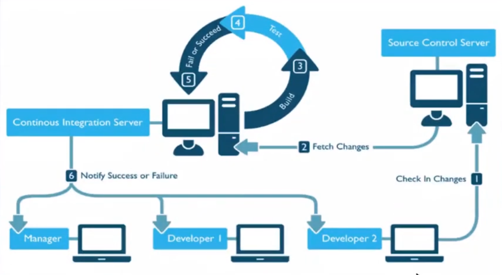
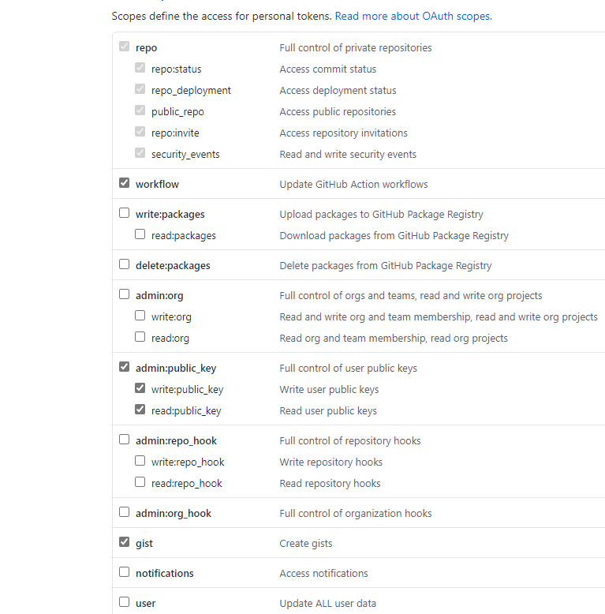
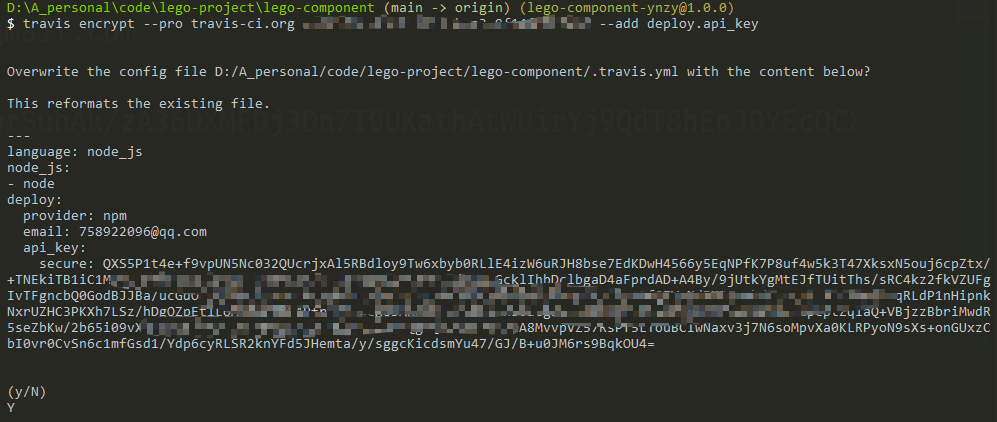

# 业务组件库打包、发布，添加 CI/CD

目前的组件库是和主项目混在一起的，这不是完美的形态，业务组件库作为要为两个项目所服务的公共组件。是时候将它抽取出来发布成至npm，让两个项目可以共享。组件库打包有很多新的知识点，让我们来一起学习。
主要内容
- javascript 模块以及打包工具
  - AMD -> Common.js -> ES modules
  - Webpack vs Rollup
  - Snowpack
- 创建业务组件库代码
- 添加 Rollup 配置以及完成打包
  - Rollup 配置文件
  - Rollup插件使用
  - Rollup 插件简单原理
  - Element Plus打包过程分析
- 发布到NPM以及使用Travis Cl完成CI/CD
  - NPM 简介和发布
  - 发布前验证代码质量
  - Travis完成Cl和CD两个流程
### 关键词
  Module -模块Bundler -打包工具
  Rollup
  NPM
  CI/CD
  Travis Cl
### 学习方法
实践出真知，这节课知识点众多，并且涉及的工具较多，请大家一定要动起手来，只有实践以后才能加深理解掌握。

## 1. JavaScript 模块发展历史
模块（modules）是什么
```js
import function from package 
```

```js
package main
import (
  "fmt"
)
```

模块化的优点
  - 可维护性
  - 可复用性

ES6 之前没有模块的年代
```js
//使用backbone. js的方法
<script src="spec/ support/ jquery. js"></ script>
<script src=" spec / support/ underscore.js"></ script>
<script src=" spec/ support/backbone. js"></ script>
<script src= "backbone. localStorage. js"></script>
<script src="todos. js"></ script></ script>
```

#### 全局变量 + 命名空间(namespace)
```js
// IIFE 自执行函数，创建-一个封闭的作用域，赋值给一个全局变量
var namesColleqtion = (function( ) {
  // private members
  var objects=[];
  // Public Method
  function addObject(object) {
    objects.push(object) ;
    printMessage(object) ;
  }
  // Private Method .
  function printMessage(object) {
  	console. log( "Object successfully added: "，object) ;
  }
  // public members, exposed with return s tatement
  return {
  	addName: addObject,
  };
})();
namesCollection.addName('viking')
```

缺点
  - 依赖全局变量，污染全局作用域，不安全
  - 依赖约定命名空间来避免冲突，可靠性不高
  - 需要手动管理依赖并控制执行顺序，容易出错
  - 需要在最终上线前手动合并所有用到的模块
  
#### Common.js
```js
const bar = require('./bar')
module.exports = function(){

}
```
> 没法再浏览器里直接运行

#### AMD - (Asynchronous module definition)
- 采用异步方式加载模块
- 仅仅需要在全局环境定义require与define， 不需要其他的全局变量
- 通过文件路径或模块自己声明的模块名定位模块
- 提供了打包工具自动分析依赖并合并
- 配合特定的AMD加载器使用，RequireJS
- 同时还诞生了很多类似的模块标准CMD

```js
define(function(require) {
  //通过相对路径获取依赖模块
  const bar = require( ' . /bar' )
  //模块产出
  return function() {
    
  }
})
```

#### ES6
```js
/ /通过相对路径获取依赖模块
import bar from './bar'
//模块产出
export default function ( ) {
}
```

- 引入和暴露的方式更加多样
- 支持复杂的静态分析

## 2. 打包工具的根本作用 - Bundler

Bundler
诞生原因
使用 import export 这种同步加载的方式在大多数浏览器中无法使用。
Bundler - 打包工具
将浏览器不支持的模块进行编译，转换，合并最后生成的代码可以在浏览器端良好的运行的工具。
大家最熟悉的 - Webpack
- 对于web应用来说:一般采用单Javascript文件入口
- https://www.webpackjs.com/
```js
npx webpack main.js
```
- 大型SPA项目的模块化构建，也就是我们常说的web应用。
- 通过各种Loader处理各种各样的静态资源
- 通过各种插件Plugins 对整体文件进行一些处理。
- Code splitting 将公共模块进行提取。
- 提供一个webpack-dev-server，进行本地开发。
- 支持HMR模块热替换。

后起之秀 - Rollup
- https://rollupjs.orglguide/en/
```js
npx rollup main.js --file dist/bundle.js --format iife
```

Es module 的规则
  - import只能作为模块顶层的语句出现，不能出现在function里面或是if里面。
  - ES import的模块名只能是字符串常量。
  - 不管 import的语句出现的位置在哪里，在模块初始化的时候所有的import都必须已经导入完成。
  - Tree shaking机制-摇树!让死了的叶子掉下来。
  - 目的就是将es modules打包生产特定的JS模块文件，并减小它的体积。
webpack vs Rollup
通过以上的对比可以得出，构建App应用时, webpack比较合适，如果是类库(纯js项目), rollup更加适合。
webpack 的优势
  - 强大的生态插件
  - 面向开发应用的特性支持HMR，按需加载，公共模块提取
  - 简化 Web开发的环节，图片自动转base64，资源的缓存（添加chunkld)
Rollup 的优势
  - 构建高性能的模块文件，这正是类库所需要的。
  - 编译出来的代码可读性好，内容更小，执行效率更高。
  - 配置比较简单。
打包什么类型的文件？
  - Commonjs, es6 modules -需要特殊的module bundler
  - 支持AMD已经有点过时了–需要使用特殊的Loader - require.js
  - 浏览器中直接使用-UMD (Universal Module Definition)
    - 通用的一种Javascript格式
    - 兼容common.js, AMD,浏览器
    - https:/lgithub.com/umdjs/umd
    - Vue和React都提供了这样的格式
    - 不是一种推荐的格式，太大了!不支持tree shaking
  - 首要格式- ES modules，并且提供支持typescript 的type文件。
  - 备选方案–UMD


另辟蹊径 - 简介 Snowpack
Bundler 的问题
  - 当资源越来越多的时候，打包速度越来越慢。
  - 大中型项目，启动时间可能达到好几分钟。
Snowpack
  - https://www.snowpack.dev/
  - 利用新版浏览器支持es modules的特性。
  - 不会被打包。
  - 每个文件编译一次，永久被缓存。
  - 当一个文件修改的时候，只需要重新build那一个文件。


处理 Node_modules 中的模块
  - 它扫描node_modules 中的模块。找到使用的模块。
  - 将每个模块都分别转换成单个js 文件。
  - 这些单个文件都是esm模块，可以被最新的浏览器直接使用。

```js
node_modules/react/**/*   ->
http://localhost:3000/web_modules/react.js
node_modules/react-dom/**/*   ->
http://localhost:300o/web_modules/react-dom.js
```

为生产环节 Build 代码
默认情况下，和开发环境生成的代码是几乎—致的。
> You should be able to use a bundler because you want to, and notbecause you need to
> 当你想用一个bundler你可以自己选择去用，而不是你必须要用。
提供了插件，生成bundle以后全浏览器兼容的代码。


## 3. Vue3 的插件系统
一段代码给vue应用实例添加全局功能。它的格式是一个 object 暴露出一个 install() 方法，或者一个 function 它没有严格的限制，一般有以下几种功能
  - 添加全局方法或者属性
  - 添加全局资源: 指令，过滤器等
  - 通过全局混入来添加一些一些组件选项
  - 通过config.globalProperties来添加app 实例方法


```js
import { App } from "vue";
import HelloWorld from "@/components/HelloWorld.vue";
const plugins = {
  install: (app: App) => {
    app.config.globalProperties.$echo = () => {
      console.log("a plugin");
    };
    app.component("HelloWorld", HelloWorld);
    app.provide("test", { message: "from plugin" });
  },
};

export default plugins;
```

LText.vue 组件
```js
<!--  -->
<template>
  <!-- 可以使用 is attribute 来创建常规的 HTML 元素。 -->
  <component
    :is="tag"
    :style="styleProps"
    class="l-text-component"
    @click="handleClick"
  >
    {{ text }}
  </component>
</template>
<script lang="ts">
import { computed, defineComponent } from "vue";
import useComponentCommon from "@/hooks/useComponentCommon";
import {
  transformToComponentProps,
  textDefaultProps,
  textStylePropNames,
} from "@/defaultProps";
const defaultProps = transformToComponentProps(textDefaultProps);
export default defineComponent({
  name: "l-text",
  props: {
    tag: {
      type: String,
      default: "div",
    },
    ...defaultProps,
  },
  setup(props) {
    const { styleProps, handleClick } = useComponentCommon(
      props,
      textStylePropNames
    );
    return {
      styleProps,
      handleClick,
    };
  },
});
</script>
<style lang="scss" scoped>
h2.l-text-component,
p.l-text-component {
  margin-bottom: 0;
}
button.l-text-component {
  padding: 5px 10px;
  cursor: pointer;
}
.l-text-component {
  box-sizing: border-box;
  white-space: pre-wrap;
  position: relative !important;
}
</style>
```

单个组件注册
```js
import { App } from "vue";
import LText from "./LText.vue";

LText.install = (app: App) => {
  app.component(LText.name, LText);
};

export default LText;
```


全局组件注册
```js
import { App } from "vue";
import LText from "./components/LText";
const components = [LText];

const install = (app: App) => {
  components.forEach((component) => {
    app.component(component.name, component);
  });
};

export { install, LText };

export default {
  install,
};
```

## 4. Rollup 配置文件和插件
### rollup-plugin-vue（解析 vue3 的代码）
```js
import vue from 'rollup-plugin-vue';
import { name } from "../package.json";
const file = type => `dist/${name}.${type}.js`

export default {
  input: 'src/index.ts',
  output: {
    name,
    file: file('esm'),
    format: 'es'
  },
  plugins: [
    vue(),
  ]
}
```

### rollup-plugin-postcss (解析 css编译器 的代码)
比如解析sass
```js
import postcss from 'rollup-plugin-postcss'
import autoprefixer from 'autoprefixer';

export default {
  plugins: [
    postcss({
      extract: 'bundle.css',
      plugins: [
        autoprefixer({ overrideBrowserslist: ['> 0.15% in CN'] }) // 自动添加css前缀
      ]
    })
  ]
}
```

### rollup-plugin-typescript2（解析 typescript 文件
```js
import typescript from 'rollup-plugin-typescript2';

// tsconfig
/* const overrides = {
  compilerOptions: { 
    declaration: true, // 设置生成ts声明文件
  },
  exclude: [ // 不需要解析的文件
    "node_modules",
    "src/App.vue",
    "src/main.ts"
  ]
} */
const overrides = {
  compilerOptions: { declaration: true, },
  // 如果不包含"src/App.vue","src/main.ts",打包的時候会包一层src
  exclude: [ "node_modules",'tests/**/*.ts', 'tests/**/*.tsx' ]
}
export default {
  plugins: [
    typescript({tsconfigOverride:overrides}),
  ]
}
```

### npm 依赖的分类
  - dependencies
    - 运行项目业务逻辑需要依赖的第三方库
    - npm install '模块名称'的时候都会被解析，下载
  - devDependencies
    - 开发模式工作流下依赖的第三方库
    - 单元测试，语法转换，lint工具，程序构建，本地开发等等
  - peerDependencies
    - 需要核心依赖库，不能脱离依赖库单独使用。
rollup external 字段
https://rollupjs.org/guide/en/#external
### 调整package.json
由于把vue库放在了peerDependencies，
我们开发的时候又需要vue库，我们可以放到devDependencies中来进行本地开发
```js
{
  "name": "lego-component",
  "version": "0.1.0",
  "private": true,
  "scripts": {
    "serve": "vue-cli-service serve",
    "build": "vue-cli-service build",
    "test:unit": "vue-cli-service test:unit",
    "lint": "vue-cli-service lint",
    "build:esm": "rollup --config build/rollup.config.js"
  },
  "dependencies": {
    "core-js": "^3.6.5",
    "lodash-es": "^4.17.21"
  },
  "peerDependencies": {
    "vue": "^3.0.0"
  },
  "devDependencies": {
    "@rollup/plugin-node-resolve": "^13.0.4",
    "@types/jest": "^24.0.19",
    "@types/lodash-es": "^4.17.4",
    "@typescript-eslint/eslint-plugin": "^4.18.0",
    "@typescript-eslint/parser": "^4.18.0",
    "@vue/cli-plugin-babel": "~4.5.0",
    "@vue/cli-plugin-eslint": "~4.5.0",
    "@vue/cli-plugin-typescript": "~4.5.0",
    "@vue/cli-plugin-unit-jest": "~4.5.0",
    "@vue/cli-service": "~4.5.0",
    "@vue/compiler-sfc": "^3.0.0",
    "@vue/eslint-config-typescript": "^7.0.0",
    "@vue/test-utils": "^2.0.0-0",
    "autoprefixer": "8.0.0",
    "eslint": "^6.7.2",
    "eslint-plugin-vue": "^7.0.0",
    "rollup": "^2.28.2",
    "rollup-plugin-css-only": "^2.1.0",
    "rollup-plugin-exclude-dependencies-from-bundle": "^1.1.13",
    "rollup-plugin-postcss": "^4.0.0",
    "rollup-plugin-typescript2": "^0.29.0",
    "rollup-plugin-vue": "^6.0.0-beta.10",
    "sass": "^1.26.5",
    "sass-loader": "^8.0.2",
    "typescript": "~4.1.5",
    "vue-jest": "^5.0.0-0",
    "vue": "^3.0.0"
  }
}
```


### 以上步骤完成的rollup-config.js
```js
import vue from 'rollup-plugin-vue';
import postcss from 'rollup-plugin-postcss'
import typescript from 'rollup-plugin-typescript2';
import { nodeResolve } from "@rollup/plugin-node-resolve";
import { name } from "../package.json";
import autoprefixer from 'autoprefixer';
const file = type => `dist/${name}.${type}.js`

// tsconfig
const overrides = {
  compilerOptions: { 
    declaration: true, // 设置生成ts声明文件
  },
  exclude: [
    'node_modules',
  ],
}

export default {
  input: 'src/index.ts',
  output: {
    name,
    file: file('esm'),
    format: 'es'
  },
  plugins: [
    nodeResolve(),
    typescript({tsconfigOverride:overrides}),
    vue(),
    postcss({
      extract: 'bundle.css',
      plugins: [
        autoprefixer({ overrideBrowserslist: ['> 0.15% in CN'] }) // 自动添加css前缀
      ]
    })
  ],
  external: ['vue', 'lodash-es'],
  /* external: (id) => {
    // id是库文件名称
    return /^vue/.test(id)
  } */
}
```

### 生成两种格式的模块文件
```js
import basicConfig,{name,file} from './rollup.config'

export default {
  ...basicConfig,
  output: {
    name,
    file: file('esm'),
    format: 'es'
  }
}
```

```js
import basicConfig,{name,file} from './rollup.config'

export default {
  ...basicConfig,
  output: {
    name: 'LegoComponents',
    file: file('umd'),
    format: 'umd',
    globals: { // 全局变量对应的包名
      'vue': 'Vue',
      'lodash-es': '_'
    },
    exports: 'named'
  },
}
```

### npm link 本地测试组件

```js
npm run link
npm run link lego-component
```

## 5. NPM简介以及 package.json 的信息更新

### NPM 的功能
  - 从npm服务器下载别人编写的第三方包到本地，比如vue
  - 从npm服务器下载并安装别人编写的命令行程序到本地使用，比如vue-cli
  - 允许用户将自己编写的包或命令行程序上传到npm服务器供别人使用


### 语义化版本 - semver
说明网址：https://semver.org/lang/zh-CN/
  - 版本格式:主版本号.次版本号.修订号(1.0.0)，版本号递增规则如下: 
    ○ 主版本号: 当你做了不兼容的API修改,
    ○ 次版本号: 当你做了向下兼容的功能性新增,
    ○ 修订号: 当你做了向下兼容的问题修正。


### npm files 字段
  - 默认忽略掉gitingore中的内容
  - 指示npm publish 的时候需要上传的内容
  - package.json / README.md / CHANGLOG.md / LICENSE都会包含在其中


### npm scripts
我们在执行 publish 之前，需要手动打包，有什么方式可以进行自动打包呢
https://docs.npmjs.com/cli/v7/using-npm/scripts


### Pre & Post Scripts 自定义的scripts
你script的名称前面加上pre或者post,那么当运行这个命令的时候，pre 和post会自动在这个命令之前或者之后运行。
```js
{
  "scripts": {
    "precompress": "{{ executes BEFORE the `compress` script }}",
    "compress": "{{ run command to compress files }}",
    "postcompress": "{{ executes AFTER `compress` script }}"
  }
}
```


### Life Cycle Scripts 生命周期下的scripts
  - prepare
  - prepublish (即将废弃)
  - prePublishOnly

添加脚本命令
```js
"prepublishOnly": "npm run build"
```

我们执行 npm publish 时，会先执行 prepublishOnly 中的脚本命令
```js
{
  "name": "lego-component-ynzy",
  "version": "1.0.0",
  "private": false,
  "main": "dist/lego-component.umd.js",
  "module": "dist/lego-component.esm.js",
  "types": "dist/index.d.ts",
  "author": "ynzy",
  "license": "MIT",
  "repository": {
    "type": "git",
    "url": "https://github.com/ynzy/lego-component.git"
  },
  "homepage": "",
  "keywords": [
    "Component",
    "UI",
    "Vue3"
  ],
  "files": [
    "dist"
  ],
  "scripts": {
    "serve": "vue-cli-service serve",
    "build": "npm run clean && npm run build:esm && npm run build:umd",
    "test:unit": "vue-cli-service test:unit",
    "lint": "vue-cli-service lint",
    "build:esm": "rollup --config build/rollup.esm.config.js",
    "build:umd": "rollup --config build/rollup.umd.config.js",
    "clean": "rimraf ./dist",
    "prepublishOnly": "npm run build"
  },
  "dependencies": {
    "core-js": "^3.6.5",
    "lodash-es": "^4.17.21"
  },
  "peerDependencies": {
    "vue": "^3.0.0"
  },
  "devDependencies": {
    "@rollup/plugin-node-resolve": "^13.0.4",
    "@types/jest": "^24.0.19",
    "@types/lodash-es": "^4.17.4",
    "@typescript-eslint/eslint-plugin": "^4.18.0",
    "@typescript-eslint/parser": "^4.18.0",
    "@vue/cli-plugin-babel": "~4.5.0",
    "@vue/cli-plugin-eslint": "~4.5.0",
    "@vue/cli-plugin-typescript": "~4.5.0",
    "@vue/cli-plugin-unit-jest": "~4.5.0",
    "@vue/cli-service": "~4.5.0",
    "@vue/compiler-sfc": "^3.0.0",
    "@vue/eslint-config-typescript": "^7.0.0",
    "@vue/test-utils": "^2.0.0-0",
    "autoprefixer": "8.0.0",
    "eslint": "^6.7.2",
    "eslint-plugin-vue": "^7.0.0",
    "postcss": "^8.3.6",
    "rimraf": "^3.0.2",
    "rollup": "^2.28.2",
    "rollup-plugin-css-only": "^2.1.0",
    "rollup-plugin-exclude-dependencies-from-bundle": "^1.1.13",
    "rollup-plugin-postcss": "^4.0.0",
    "rollup-plugin-typescript2": "^0.29.0",
    "rollup-plugin-vue": "^6.0.0-beta.10",
    "sass": "^1.26.5",
    "sass-loader": "^8.0.2",
    "tslib": "^2.3.0",
    "typescript": "^4.3.5",
    "vue": "^3.0.0",
    "vue-jest": "^5.0.0-0"
  }
}
```

### 发布及使用
先查看我们是否登录npm，没有登录先登录
```js
npm whoami
npm publish
```

安装，打印详细信息

```js
npm install lego-component-ynzy --save --loglevel verbose
```

### 6. 给业务组件库添加测试用例
业务组件
```js
<template>
  <component :is="tag" :style="styleProps" class="l-text-component" @click="handleClick">
    {{text}}
  </component>
</template>
<script lang="ts">
import { defineComponent } from 'vue'
import useComponentCommon from '../../hooks/useComponentCommon'
import { transformToComponentProps, textDefaultProps, textStylePropNames } from '../../defaultProps'
const defaultProps = transformToComponentProps(textDefaultProps)
// array that contains style props
export default defineComponent({
  name: 'l-text',
  props: {
    tag: {
      type: String,
      default: 'div'
    },
    ...defaultProps
  },
  setup (props) {
    // 重用并且简化
    // 抽离并且获得 styleProps
    const { styleProps, handleClick} = useComponentCommon(props, textStylePropNames)
    return {
       styleProps,
       handleClick
    }
  }
})
</script>

<style scoped>
h2.l-text-component, p.l-text-component {
  margin-bottom: 0;
}
button.l-text-component {
  padding: 5px 10px;
  cursor: pointer;
}
.l-text-component {
  box-sizing: border-box;
  white-space: pre-wrap;
  position: relative !important;
}
</style>
```

测试用例
```js
import { shallowMount } from "@vue/test-utils";
import LText from "@/components/LText";
import { textDefaultProps } from "../../src/defaultProps";

describe("LText.vue", () => {
  const { location } = window;
  beforeEach(() => {
    // 换掉浏览器原生属性方法
    Object.defineProperty(window, "location", {
      writable: true,
      value: {
        href: "",
      },
    });
  });
  afterEach(() => {
    window.location = location;
  });

  // 测试基本样式
  it("default LText render", () => {
    const msg = "new message";
    const wrapper = shallowMount(LText, {
      props: {
        ...textDefaultProps,
        text: msg,
      },
    });
    // should have the right text
    expect(wrapper.text()).toBe(msg);
    // should be default div tag
    expect(wrapper.element.tagName).toBe("DIV");
    // should have certian CSS attr
    const style = wrapper.attributes().style;
    expect(style.includes("font-size")).toBeTruthy();
    // should not have prop has been filtered
    expect(style.includes("actionType")).toBeFalsy();
  });
  // 测试点击跳转
  it("LText with actionType and URL should trigger location href change", async () => {
    const props = {
      ...textDefaultProps,
      actionType: "url",
      url: "http://dummy.url",
      tag: "h2",
    };
    const wrapper = shallowMount(LText, { props });
    expect(wrapper.element.tagName).toBe("H2");
    await wrapper.trigger("click");
    expect(window.location.href).toBe("http://dummy.url");
  });
  // 测试点击不跳转
  it("LText with isEditing should not trigger location change", async () => {
    const props = {
      ...textDefaultProps,
      actionType: "url",
      url: "http://dummy.url",
      tag: "h2",
      isEditing: true,
    };
    const wrapper = shallowMount(LText, { props });
    await wrapper.trigger("click");
    expect(window.location.href).not.toBe("http://dummy.url");
  });
});

```

## 7. 发布或者提交前检查代码质量
prepublishOnly
配置脚本命令，完成发布前进行代码检查和测试
```js
"scripts": {
  "serve": "vue-cli-service serve",
  "build": "npm run clean && npm run build:esm && npm run build:umd",
  "test:watch": "vue-cli-service test:unit --watch",
  "test": "vue-cli-service test:unit",
  "lint": "vue-cli-service lint --max-warnings 5",
  "build:esm": "rollup --config build/rollup.esm.config.js",
  "build:umd": "rollup --config build/rollup.umd.config.js",
  "clean": "rimraf ./dist",
  "prepublishOnly": "npm run lint && npm run test && npm run build"
},
```

husky
配置 git-hooks 来完成代码 commit 前的代码检查和测试
如果想使用最新版 husky，参考链接：https://zhuanlan.zhihu.com/p/366786798

```js
yarn add husky@4.3.8
```

package.json中加入配置
```js
"husky": {
  "hooks": {
    "pre-commit": "npm run lint && npm run test"
  }
},
```

## 8. CI/CD 的概念
业务组件库的开发和发布是随着一系列任务进化的
  - 本地commit钩子函数完成commit验证
  - 代码push到远端以后
  - 跑特定的test (不仅仅 是本机的unit test，也可能有时间很长的E2E test)
  - test通过以后检查是否有新的tag，假如有就自动publish一个新的版本
  - 甚至还有更多，自动部署文档站点等等。
这些任务如果手动操作，费时费力，不是很好的解决方案

CI (Continuous integration) - 持续集成
持续集成指的是，频繁地(一天多次)将代码集成到主干。一旦开发人员对应用所做的更改被合并，系统就会通过自动构建应用并运行不同级别的自动化测试(通常是单元测试和集成测试)来验证这些更改，确保这些更改没有对应用造成破坏。

  - 快速发现错误
  - 防止分支大幅偏离主干。
  - 持续集成的目的，就是让产品可以快速迭代，同时还能保持高质量


### CD (Continuous Delivery) - 持续交付
持续交付(Continuous delivery)指的是，频繁地将软件的新版本，交付给质量团队或者用户，以供评审。
### CD (Continuous Deployment) -持续部署
持续部署(continuous deployment)是持续交付的下一步，指的是代码通过评审以后，自动部署到生产环境。
两大服务
  - Github Actions：https://github.com/features/actions
  - Travis： https://www.travis-ci.com/


## 9. 使用 travis 完成 CI/CD
参考地址：
https://www.cnblogs.com/star91/p/ji-yutravis-hegit-tag-shi-xiannpm-zi-dong-hua-fa-b.html
https://juejin.cn/post/6844904084743389192
https://juejin.cn/post/6847902218218110984

### 授权 github 账户使用 travis
在官网 使用 github 注册账号，并且完成授权，可以获取到我们的代码仓库。
在项目根目录下创建 .travis.yml , push 到代码仓库中，下次 push 时，配置会生效

### 初步配置 travis 完成 CI
完成自动打包工作
https://docs.travis-ci.com/user/languages/javascript-with-nodejs/
设置使用 node 语言
```js
language: node_js # 使用的语言
node_js: # 采用 nvm 管理 node 版本，这里写稳定版本即可
  - node
# cache: # 缓存依赖，默认是开启的
# npm: false
```
提交之后会进行 build

### 进一步配置 travis 完成 CD 自动发布到 npm
https://docs.travis-ci.com/user/deployment/npm/
我们需要获取到 npm 的 authToken 
```js
cat ~/.npmrc
```
查找到我们的 //registry.npmjs.org/:_authToken=xxxxx , _authToken 就是我们需要的 token

### ravis login --pro 登录
https://www.thinbug.com/q/36608870
我们需要在本地安装 travis，就需要先安装 gem 命令
> https://www.yuque.com/ynzy/ruanjian/zirwhh

有了 gem 命令之后，安装 travis
```js
gem install travis
```

踩坑：
运行travis encrypt --pro npm_token --add deploy.api_key 命令会提示 not logged in, please run travis login --pro，意思是需要先执行travis login --pro完成登录，但在执行travis login --pro输入github用户名和密码时会报如下错误： 
```js
$ travis login --pro

We need your GitHub login to identify you.
This information will not be sent to Travis CI, only to api.github.com.
The password will not be displayed.

Try running with --github-token or --auto if you don't want to enter your password anyway.

Username: ynzy
Password for ynzy: ********
Not Found
for a full error report, run travis report --pro
```

解决办法
使用`travis login --pro --github-token your_token`完成登录，your_token在自己github中配置获取。
设置token链接：https://help.github.com/en/articles/creating-a-personal-access-token-for-the-command-line
我们需要勾选一些配置项，不然token是无效的(我是瞎勾的)


对我们的token进行加密
问题解决：https://github.com/travis-ci/travis-ci/issues/2334
```js
# 此处的--add参数表示自动添加脚本到.travis.yml文件中

travis encrypt --pro YOUR_AUTH_TOKEN --add deploy.api_key
```


### 重新配置 .travis.yml
```js
language: node_js # 使用的语言
node_js: # 采用 nvm 管理 node 版本，这里写稳定版本即可
  - node
# cache: # 缓存依赖，默认是开启的
# npm: false
deploy: # 发布 npm 包
  provider: npm
  email: "758922096@qq.com"
  api_key: # travis encrypt --pro travis-ci.org YOUR_AUTH_TOKEN --add deploy.api_key
    secure: ”加密过的key“
  skip_cleanup: true # 不进行清空操作，不然会把我们打包的dist清掉
  on:
    tags: true # 只有在打 tags 时才会进行发布
```

```js
git add .
git commit -m '发布包'
git tag -a v.1.0.1 -m"version 1.0.1"
git push --tags # 推送tag
```

如果无法进行自动发布，可能是使用的 travis 网站不对
参考：https://juejin.cn/post/6847902218218110984


