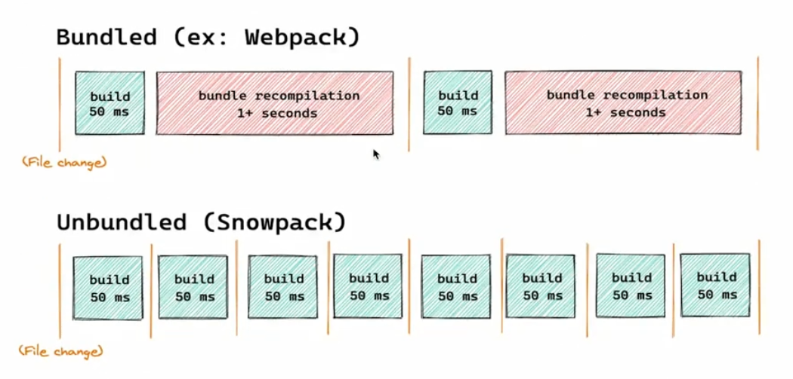

# 业务组件库打包、发布，添加 CI/CD

目前的组件库是和主项目混在一起的，这不是完美的形态，业务组件库作为要为两个项目所服务的公共组件。是时候将它抽取出来发布成至npm，让两个项目可以共享。组件库打包有很多新的知识点，让我们来一起学习。
主要内容
- javascript 模块以及打包工具
  - AMD -> Common.js -> ES modules
  - Webpack vs Rollup
  - Snowpack
- 创建业务组件库代码
- 添加 Rollup 配置以及完成打包
  - Rollup 配置文件
  - Rollup插件使用
  - Rollup 插件简单原理
  - Element Plus打包过程分析
- 发布到NPM以及使用Travis Cl完成CI/CD
  - NPM 简介和发布
  - 发布前验证代码质量
  - Travis完成Cl和CD两个流程
### 关键词
  Module -模块Bundler -打包工具
  Rollup
  NPM
  CI/CD
  Travis Cl
### 学习方法
实践出真知，这节课知识点众多，并且涉及的工具较多，请大家一定要动起手来，只有实践以后才能加深理解掌握。

## 1. JavaScript 模块发展历史
模块（modules）是什么
```js
import function from package 
```

```js
package main
import (
  "fmt"
)
```

模块化的优点
  - 可维护性
  - 可复用性

ES6 之前没有模块的年代
```js
//使用backbone. js的方法
<script src="spec/ support/ jquery. js"></ script>
<script src=" spec / support/ underscore.js"></ script>
<script src=" spec/ support/backbone. js"></ script>
<script src= "backbone. localStorage. js"></script>
<script src="todos. js"></ script></ script>
```

#### 全局变量 + 命名空间(namespace)
```js
// IIFE 自执行函数，创建-一个封闭的作用域，赋值给一个全局变量
var namesColleqtion = (function( ) {
  // private members
  var objects=[];
  // Public Method
  function addObject(object) {
    objects.push(object) ;
    printMessage(object) ;
  }
  // Private Method .
  function printMessage(object) {
  	console. log( "Object successfully added: "，object) ;
  }
  // public members, exposed with return s tatement
  return {
  	addName: addObject,
  };
})();
namesCollection.addName('viking')
```

缺点
  - 依赖全局变量，污染全局作用域，不安全
  - 依赖约定命名空间来避免冲突，可靠性不高
  - 需要手动管理依赖并控制执行顺序，容易出错
  - 需要在最终上线前手动合并所有用到的模块
  
#### Common.js
```js
const bar = require('./bar')
module.exports = function(){

}
```
> 没法再浏览器里直接运行

#### AMD - (Asynchronous module definition)
- 采用异步方式加载模块
- 仅仅需要在全局环境定义require与define， 不需要其他的全局变量
- 通过文件路径或模块自己声明的模块名定位模块
- 提供了打包工具自动分析依赖并合并
- 配合特定的AMD加载器使用，RequireJS
- 同时还诞生了很多类似的模块标准CMD

```js
define(function(require) {
  //通过相对路径获取依赖模块
  const bar = require( ' . /bar' )
  //模块产出
  return function() {
    
  }
})
```

#### ES6
```js
/ /通过相对路径获取依赖模块
import bar from './bar'
//模块产出
export default function ( ) {
}
```

- 引入和暴露的方式更加多样
- 支持复杂的静态分析

## 2. 打包工具的根本作用 - Bundler

Bundler
诞生原因
使用 import export 这种同步加载的方式在大多数浏览器中无法使用。
Bundler - 打包工具
将浏览器不支持的模块进行编译，转换，合并最后生成的代码可以在浏览器端良好的运行的工具。
大家最熟悉的 - Webpack
- 对于web应用来说:一般采用单Javascript文件入口
- https://www.webpackjs.com/
```js
npx webpack main.js
```
- 大型SPA项目的模块化构建，也就是我们常说的web应用。
- 通过各种Loader处理各种各样的静态资源
- 通过各种插件Plugins 对整体文件进行一些处理。
- Code splitting 将公共模块进行提取。
- 提供一个webpack-dev-server，进行本地开发。
- 支持HMR模块热替换。

后起之秀 - Rollup
- https://rollupjs.orglguide/en/
```js
npx rollup main.js --file dist/bundle.js --format iife
```

Es module 的规则
  - import只能作为模块顶层的语句出现，不能出现在function里面或是if里面。
  - ES import的模块名只能是字符串常量。
  - 不管 import的语句出现的位置在哪里，在模块初始化的时候所有的import都必须已经导入完成。
  - Tree shaking机制-摇树!让死了的叶子掉下来。
  - 目的就是将es modules打包生产特定的JS模块文件，并减小它的体积。
webpack vs Rollup
通过以上的对比可以得出，构建App应用时, webpack比较合适，如果是类库(纯js项目), rollup更加适合。
webpack 的优势
  - 强大的生态插件
  - 面向开发应用的特性支持HMR，按需加载，公共模块提取
  - 简化 Web开发的环节，图片自动转base64，资源的缓存（添加chunkld)
Rollup 的优势
  - 构建高性能的模块文件，这正是类库所需要的。
  - 编译出来的代码可读性好，内容更小，执行效率更高。
  - 配置比较简单。
打包什么类型的文件？
  - Commonjs, es6 modules -需要特殊的module bundler
  - 支持AMD已经有点过时了–需要使用特殊的Loader - require.js
  - 浏览器中直接使用-UMD (Universal Module Definition)
    - 通用的一种Javascript格式
    - 兼容common.js, AMD,浏览器
    - https:/lgithub.com/umdjs/umd
    - Vue和React都提供了这样的格式
    - 不是一种推荐的格式，太大了!不支持tree shaking
  - 首要格式- ES modules，并且提供支持typescript 的type文件。
  - 备选方案–UMD


另辟蹊径 - 简介 Snowpack
Bundler 的问题
  - 当资源越来越多的时候，打包速度越来越慢。
  - 大中型项目，启动时间可能达到好几分钟。
Snowpack
  - https://www.snowpack.dev/
  - 利用新版浏览器支持es modules的特性。
  - 不会被打包。
  - 每个文件编译一次，永久被缓存。
  - 当一个文件修改的时候，只需要重新build那一个文件。




处理 Node_modules 中的模块
  - 它扫描node_modules 中的模块。找到使用的模块。
  - 将每个模块都分别转换成单个js 文件。
  - 这些单个文件都是esm模块，可以被最新的浏览器直接使用。

```js
node_modules/react/**/*   ->
http://localhost:3000/web_modules/react.js
node_modules/react-dom/**/*   ->
http://localhost:300o/web_modules/react-dom.js
```

为生产环节 Build 代码
默认情况下，和开发环境生成的代码是几乎—致的。
> You should be able to use a bundler because you want to, and notbecause you need to
> 当你想用一个bundler你可以自己选择去用，而不是你必须要用。
提供了插件，生成bundle以后全浏览器兼容的代码。