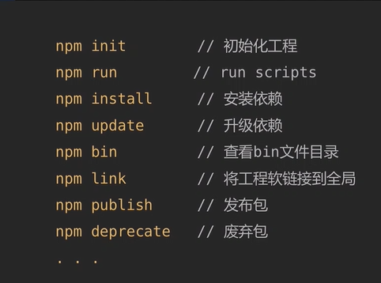

# 前端工程化

## 玩转npm  scripts
### 内部变量
#### 常用命令

#### 参数
利用透传参数

npm run demo  -- --port=300

#### 脚本钩子
prepublish：在npm publish命令之前运行

prepublishOnly: 在npm publish命令前执行

publish,postpublish： 在npm publish命令后执行

preinstall: 在npm install命令前执行

install、postinstall： 在npm install命令后执行

preuninstall，uninstall: 在npm uninstall命令前执行

postuninstall ： 在npm uninstall命令后执行

pretest， test， posttest： npm test命令执行前后

prestop， stop， poststop： npm stop命令执行前后

restart, start, poststart: npm start命令前后

pre restart， restart， poststart： npm restart命令执行前后。提示：假如scripts里没有写restart命令，npm默认会运行start、stop

